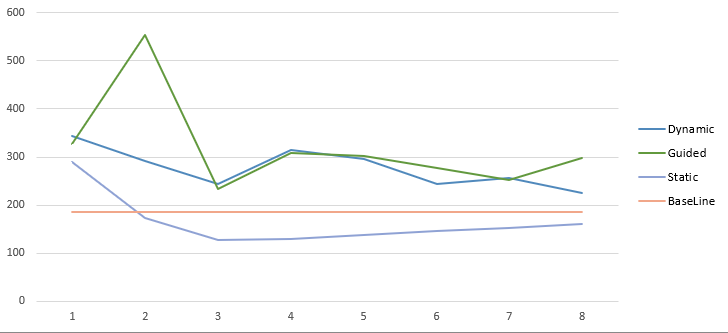

# Лабораторные по предмету Многопоточное программирование

## Лабораторная 1. OpenMP. Определитель матрицы

Аргументы программе передаются через командную строку: \
`omp1.exe <имя_входного_файла> <кол-во_потоков>`

Результаты.

Проводят примитивные бенчмарки пришли к заключению, что лучше всего себя показывает статик шедул. Скорее всего, это связано с тем, что задачи очень однотипные и вполне себе решаются статическим шедулом, а другие виды имею свои накладные расходы. Но при одном рабочем потоке оптимальным вариантом будет все же не использовать omp.
