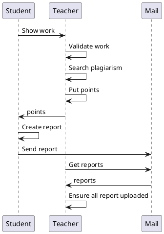
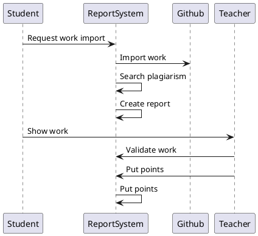
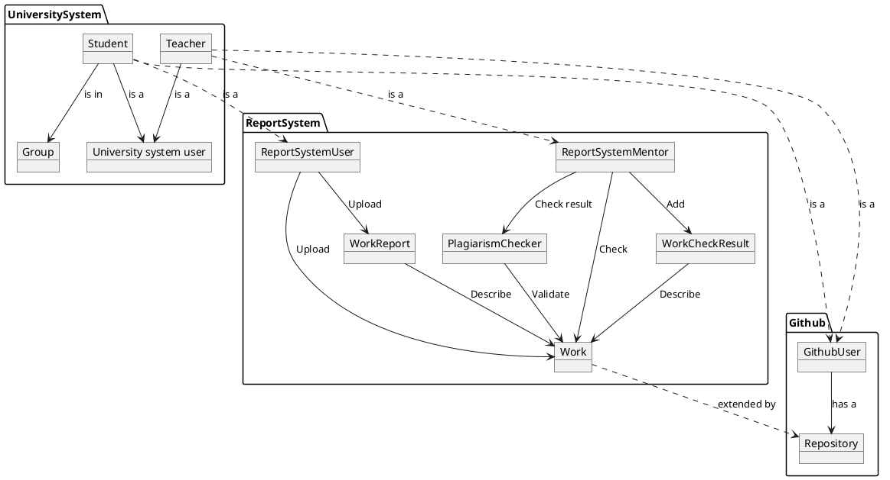
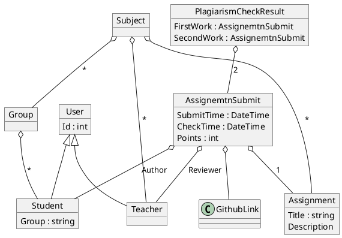

## As is / to be

As is:



To be:



## C4
#### Context

```plantuml
@startuml C4_Concept
!include https://raw.githubusercontent.com/plantuml-stdlib/C4-PlantUML/master/C4_Container.puml

Person(userStudent, "Student")
Person(userTeacher, "Teacher")

System(ReportSystem, "ReportSystem")
System_Ext(Github, "Github")

Rel(ReportSystem, Github, "Import data")

Rel(userStudent, Github, "Upload work")
Rel(userStudent, ReportSystem, "Import work")
Rel(userTeacher, ReportSystem, "Check work, upload feedback")
@enduml
```

#### Container

```plantuml
@startuml C4_Elements
!include https://raw.githubusercontent.com/plantuml-stdlib/C4-PlantUML/master/C4_Container.puml

Person(userStudent, "Student")
Person(userTeacher, "Teacher")

System_Boundary(bc_ReportSystem, "ReportSystem") {
    System(ReportSystemSpa, "ReportSystem SPA")
    System(ReportSystemApi, "ReportSystem API")
    ContainerDb(ReportSystemDb, "Database", "Microsoft SQL", "Holds groups, mark and invoice information", $sprite="msql_server")

    Rel(ReportSystemSpa, ReportSystemApi, "Use")
    Rel(ReportSystemApi, ReportSystemDb, "Read/Write")
}

System_Boundary(bc_university, "University system") {
    System_Ext(isuApi, "UniversitySystemUser")
}

System_Boundary(bc_google, "Github") {
    System_Ext(GithubView, "Github view")
    System_Ext(GithubApi, "Github API")
}

Rel(ReportSystemApi, isuApi, "Auth")
Rel(ReportSystemApi, GithubApi, "Receive data")

Rel(userTeacher, ReportSystemSpa, "Generate tables")
Rel(userTeacher, GithubView, "Set mark")

Rel(userStudent, ReportSystemSpa, "Check mark")
Rel(userStudent, GithubView, "Check mark")

@enduml
```

#### Concept


## Модель данных



## Функциональные требования

#### Добавление пользователей и сущностей

Предъявляются следующие требования:
1. Система должна позволять добавить новый учебный предмет
2. Система должна позволять добавить нового пользователя и назначить его ментором на предмет
   1. Должна быть возможность указать ФИО пользователя
   2. Должна быть возможность добавить ему пароль или сгенерировать случайны
3. Система должна позволять добавить список пользователей и привязать их к группе
4. Система должна позволять пользователю менять свой пароль

#### Добавление заданий

Предъявляются следующие требования:
1. Система должна позволять ментору добавить новое задание, которое состоит из:
   1. Названия
   2. Описания требуемой работы
   3. Номер задания в курсе
   4. Дедлайн
2. Система должна поддерживать добавление скрытых заданий - такие задания видны только менторам, пока его не сделают публичным
3. Система должна позволять изменять все атрибуты добавленного задания

#### Загрузка работы

Предъявляются следующие требования:
1. Система должна иметь интерфейс студента для добавления решений. При добавлении указывается
   1. Предмет, номер работы
   2. Комментарий по выполнению работы
   3. Ссылка на репозиторий
   4. Указать путь до папки, где в репозитории лежат необходимые данные
2. Система должна уметь по ссылке загружать данные и сохранять себе локально

Допущения:
1. Для упрощения работы с доступом, от студентов будет требоваться добавлять только те репозитории, которые находятся в организациях, к которым есть доступ из системы.


#### Проверка на плагиат

Предъявляются следующие требования:
1. При добавлении новых работ, система должна инициировать ее проверку на плагиат.
   1. Проверкой на плагиат будет называть попарное сравнивание всех работ с использованием различных алгоритмов оценки схожести.
   2. Результаты проверки должны сохраняться в системе и не проверяться повторно
2. Система должна позволять добавить результат ручной проверки пары
   1. Пару решений можно отметить как проверенную
   2. Пару решений можно отметить как плагиат
3. Система должна иметь интерфейс для отображения решения
   1. Должна отображаться информация о том, что работу пометили плагиатом
   2. Должны показываться схожие работы
   3. Для любой пары должна быть возможность открыть дифф
   4. Система должна предоставлять возможность скрыть проверенные схожие работы
4. Система должна позволять отметить решение как "Невалидное".
   1. С таким решением не должны сравниваться другие работы, а ранее сделанные сравнения должны быть удалены

#### Проверка работы

Предъявляются следующие требования:
1. Система должна предоставлять возможность выставить оценку за выполненную работу
   1. Работа не должна быть отмечена как плагиат
   2. При выставлении можно указать комментарии
   3. Работе может быть выставлен один из двух решений: апрув или реджект
2. Система должна держать активным только один сабмит по каждой лабораторной
   1. При загрузке второй работы по задания старое задание должно быть

#### Генерация отчета

Предъявляются следующие требования:
1. Система должна уметь генерировать отчеты после принятия работы
   1. Отчет генерируется из описания решения и файлов, которые приложены к решению
   2. Отчет генерируется в pdf
   3. Отчет сохраняется на google drive

