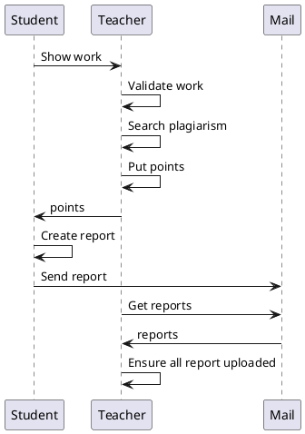
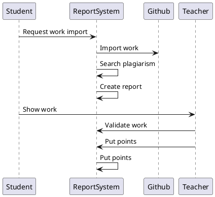
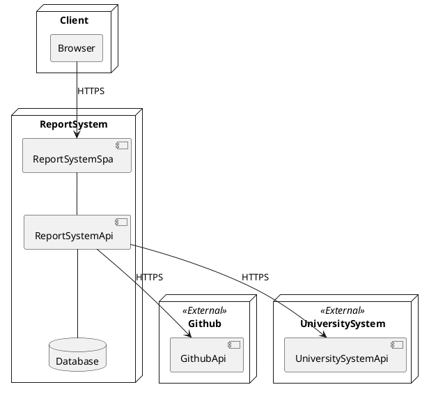
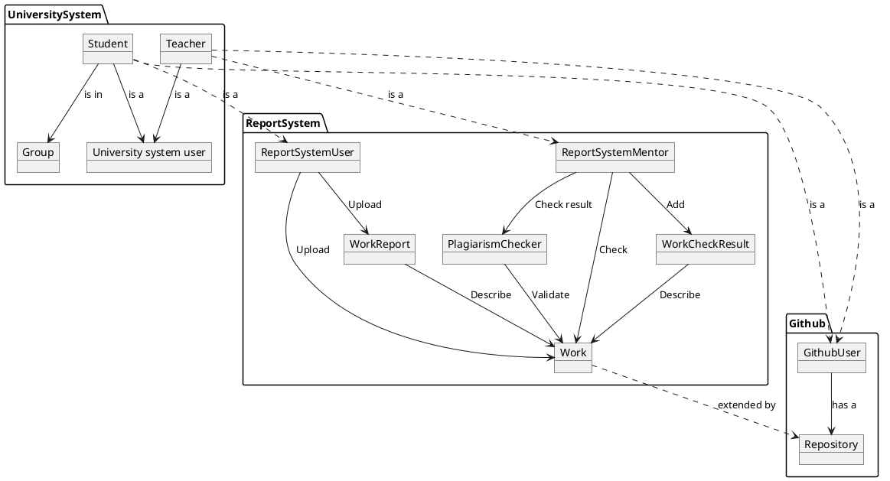

# Система автоматизации принятия отчетов в рамках учебных занятий

# 1. Общие положения

## Полное наименование системы и ее условное обозначение

Система автоматизации принятия отчетов в рамках учебных занятий.

## Наименования организации-заказчика и организаций-участников работ

> TODO:

## Плановые сроки начала и окончания работы по созданию системы

01.06.21 - 30.12.21

# 2. Назначение и цели создания системы

## Назначение системы

- Автоматизация процесса принятия работ в рамках учебного процесса
- Автоматизация процесса проверки работ на уникальность

## Цели создания системы

- снижение операционных расходов: уменьшить временные издержки создание отчетов пользователем за счет реализации шаблонного генератора
- повышение качества работы: уменьшить количество плагиата, который не находится при проверке

# 3. Характеристики объекта автоматизации

- организация-заказчик: кафедра "Информационные системы" Университета ИТМО
- Организационная структура:
  - 3 заместителя деканата, который отвечают за организацию учебного процесса
  - преподаватели, 20-30 человек
  - студенты, 600-800 человек

Объекты автоматизации:
- Рабочая программа дисциплины. Она включает в себя описание знаний, который студент должен усвоить в рамках дисциплины, а также список работ, которые должны быть выполнены.
- Лабораторная работа - описание задания и требований к выполнению по которым студент должен подготовить и предоставить отчет.
- Отчет о выполнении работы - документ, составленный студентом, которые описывает процесс выполнения лабораторной работы, полученные результаты.

Описание автоматизируемых объектов:
- Объектом автоматизации является процесс подготовки учебный процесс, а именно - процесс подготовки, сдачи, верфификации отчетов о выполненных работах студентов. Процесс состоит из нескольких этапов:
  - преподаватель определяет список заданий, которые нужно выполнить в рамках отведенного времени
  - студент выполняет поставленные задания, составляет

```plantuml
@startuml C4_Concept
!include https://raw.githubusercontent.com/plantuml-stdlib/C4-PlantUML/master/C4_Container.puml

Person(userStudent, "Student")
Person(userTeacher, "Teacher")

System(ReportSystem, "ReportSystem")
System_Ext(Github, "Github")

Rel(ReportSystem, Github, "Import data")

Rel(userStudent, Github, "Upload work")
Rel(userStudent, ReportSystem, "Import work")
Rel(userTeacher, ReportSystem, "Check work, upload feedback")
@enduml
```

As is:



To be:



# 4. Требования к системе

## 4.1 Требования к системе в целом

### Требования к структуре и функционированию системы

#### Перечень подсистем, их назначение и основные характеристики

Перечень подсистем:
- ReportSystem SPA - веб-приложение
- ReportSystem API - серверная часть
- Database - база для хранения данных системы
- University system - внешняя система университета, которая хранит все данные про студентов
- GithubApi - внешний интерфейс, который предоставляет доступ к работам студентов.

#### Требования к характеристикам взаимосвязей создаваемой системы со смежными системами, требования к ее совместимости, в том числе указания о способах обмена информацией

Система должна быть интегрирована с остальными системами через предоставленный API используя http запросы.

При интеграции с системой университета:
- Будет происходить авторизация пользователей
- Будут запрашиваться данные о группах, студентах
- Будут отправляться данные о баллах

При интеграции с Github
- Будет происходить авторизация пользователей
- Будут запрашиваться исходные коды, которые загружены и предоставлены на проверку

### Требования к показателям назначения

- количество одновременно работающих в системе пользователей: 300 пользователей;
- количество одновременно выполняемых запросов к серверу: 300 параллельных запросов;
- количество проводимых (регистрируемых) за единицу времени транзакций: 100 транзакций в секунду;
- объем хранимых данных (в частности, изображений и видеозаписей): 1-50 Гб при условии периодического архивирования;
- время подключения дополнительных вычислительных мощностей при достижении предельной нагрузки: 1 день;
- время подключения дополнительных мощностей при значительном увеличении объема хранимых данных: 1 день.

### Требования к надежности

Система не затрагивает критические бизнес процесс или такие, которые требуют постоянной активности. Для системы приемлемым коэффициентом активности является 90%.

### Требования к эргономике и технической эстетике

Интерфейс будет соответствовать разработанному позже дизайн-проекту.

### Требования к защите информации от несанкционированного доступа

Средства защиты, обеспечиваемые создаваемым программным продуктом:
1. Требование по наличию пароля для пользователей, особенно для пользователей с ролью администратора.
2. Реализация ролевой модели доступа.
3. Обеспечение регистрации событий и действий пользователей.

### Требования к аппаратному обеспечению

Схема развертывания:



Требования к программной части системы:
- .NET Core
- MS Sql Server
- MS Nano server

Исходя из программных требования можно сформулировать требования к аппаратной части:
- [.NET Core](https://docs.microsoft.com/ru-ru/dotnet/framework/get-started/system-requirements):
  - Процессор - 1ГГц
  - ОЗУ - 512МБ
  - Дисковое пространство - 4,5 ГБ
- [MS Sql Server](https://docs.microsoft.com/ru-ru/sql/sql-server/install/hardware-and-software-requirements-for-installing-sql-server?view=sql-server-ver15)
  - .NET Framework 4.6.2
  - Дисковое пространство - 6 ГБ
  - ОЗУ - 512МБ
  - Процессор - x64, 1.4 Ghz
- [MS Nano server](https://docs.microsoft.com/en-us/windows-server/get-started/system-requirements)
  - Процессор - x64, 1.4 Ghz
  - ОЗУ - 512МБ
  - Дисковое пространство - 32GB

Требования к клиентской стороне:
- Основным требованием к клиентской стороне - наличие браузера с поддержкой WebAssembly:
  - Chrome 57+
  - Edge 15+
  - Firefox52
- Поддерживаемые расширения устройств отображения - от 1366×768. Это обусловленно тем, что юз-кейсы системы не предполагают использование мобильных клиентов т.к. для пользователей будет не удобно просматривать код - выполнять основное действие в системе.

## 4.2 Требования к функциям (задачам), выполняемым системой

### Добавление пользователей и сущностей

Предъявляются следующие требования:
1. Система должна позволять добавить новый учебный предмет
2. Система должна позволять добавить нового пользователя и назначить его ментором на предмет
   1. Должна быть возможность указать ФИО пользователя
   2. Должна быть возможность добавить ему пароль или сгенерировать случайны
3. Система должна позволять добавить список пользователей и привязать их к группе
4. Система должна позволять пользователю менять свой пароль

### Добавление заданий

Предъявляются следующие требования:
1. Система должна позволять ментору добавить новое задание, которое состоит из:
   1. Названия
   2. Описания требуемой работы
   3. Номер задания в курсе
   4. Дедлайн
2. Система должна поддерживать добавление скрытых заданий - такие задания видны только менторам, пока его не сделают публичным
3. Система должна позволять изменять все атрибуты добавленного задания

### Загрузка работы

Предъявляются следующие требования:
1. Система должна иметь интерфейс студента для добавления решений. При добавлении указывается
   1. Предмет, номер работы
   2. Комментарий по выполнению работы
   3. Ссылка на репозиторий
   4. Указать путь до папки, где в репозитории лежат необходимые данные
2. Система должна уметь по ссылке загружать данные и сохранять себе локально

Допущения:
1. Для упрощения работы с доступом, от студентов будет требоваться добавлять только те репозитории, которые находятся в организациях, к которым есть доступ из системы.

### Проверка на плагиат

Предъявляются следующие требования:
1. При добавлении новых работ, система должна инициировать ее проверку на плагиат.
   1. Проверкой на плагиат будет называть попарное сравнивание всех работ с использованием различных алгоритмов оценки схожести.
   2. Результаты проверки должны сохраняться в системе и не проверяться повторно
2. Система должна позволять добавить результат ручной проверки пары
   1. Пару решений можно отметить как проверенную
   2. Пару решений можно отметить как плагиат
3. Система должна иметь интерфейс для отображения решения
   1. Должна отображаться информация о том, что работу пометили плагиатом
   2. Должны показываться схожие работы
   3. Для любой пары должна быть возможность открыть дифф
   4. Система должна предоставлять возможность скрыть проверенные схожие работы
4. Система должна позволять отметить решение как "Невалидное".
   1. С таким решением не должны сравниваться другие работы, а ранее сделанные сравнения должны быть удалены

### Проверка работы

Предъявляются следующие требования:
1. Система должна предоставлять возможность выставить оценку за выполненную работу
   1. Работа не должна быть отмечена как плагиат
   2. При выставлении можно указать комментарии
   3. Работе может быть выставлен один из двух решений: апрув или реджект
2. Система должна держать активным только один сабмит по каждой лабораторной
   1. При загрузке второй работы по задания старое задание должно быть

### Генерация отчета

Предъявляются следующие требования:
1. Система должна уметь генерировать отчеты после принятия работы
   1. Отчет генерируется из описания решения и файлов, которые приложены к решению
   2. Отчет генерируется в pdf
   3. Отчет сохраняется на google drive



# 5. Состав и содержание работ по созданию (развитию) системы

План разработки и внедрения:
- Составление технического задания
  - Содержание работ: согласование и разработка требования к системе;
  - Результат работ: ТЗ;
  - Сроки: 30 дней;
- Техническое проектирование
  - Содержание работ: разработка сценариев работы системы и макетов интерфейса веб-приложений;
  - Результат работы: утвержденное описание функционала;
  - Сроки: 15 дней;
- Разработка программной части
  - Содержание работ:
    - Разработка бизнес логики системы
    - Разработка серверного модуля, модуля хранения данных
    - Разработка веб-интерфейса
  - Результат работы: разработанные модули системы
  - Сроки: 150 дней
- Предварительные автономные испытания
  - Содержание работ: Проверка работоспособности системы, без взаимодействия со смежными (внешними) системами;
  - Результат работы: Утверждение протокола предварительных автономных испытаний;
  - Сроки: 14 дней;
- Интеграция со смежными системами
  - Содержание работ: согласование взаимодействия между разработанными модулями системы и теми, которые уже эксплуатируются
  - Результат работы: интеграция разработанных модулей в систему;
  - Сроки: 30 дней
- Опытная эксплуатация
  - Содержание работ: Эксплуатация с привлечением небольшого количества участников;
  - Результат работы: Протокол опытной эксплуатации (журнал ошибок и итогов их исправления);
  - Сроки: 30 дней


# 6. Порядок контроля и приемки системы

> TODO:

# 7. Требования к составу и содержанию работ по подготовке объекта автоматизации к вводу системы в действие

> TODO:

# 8. Требования к документированию

> TODO:

# 9. Источники разработки

link: https://habr.com/ru/post/432852/