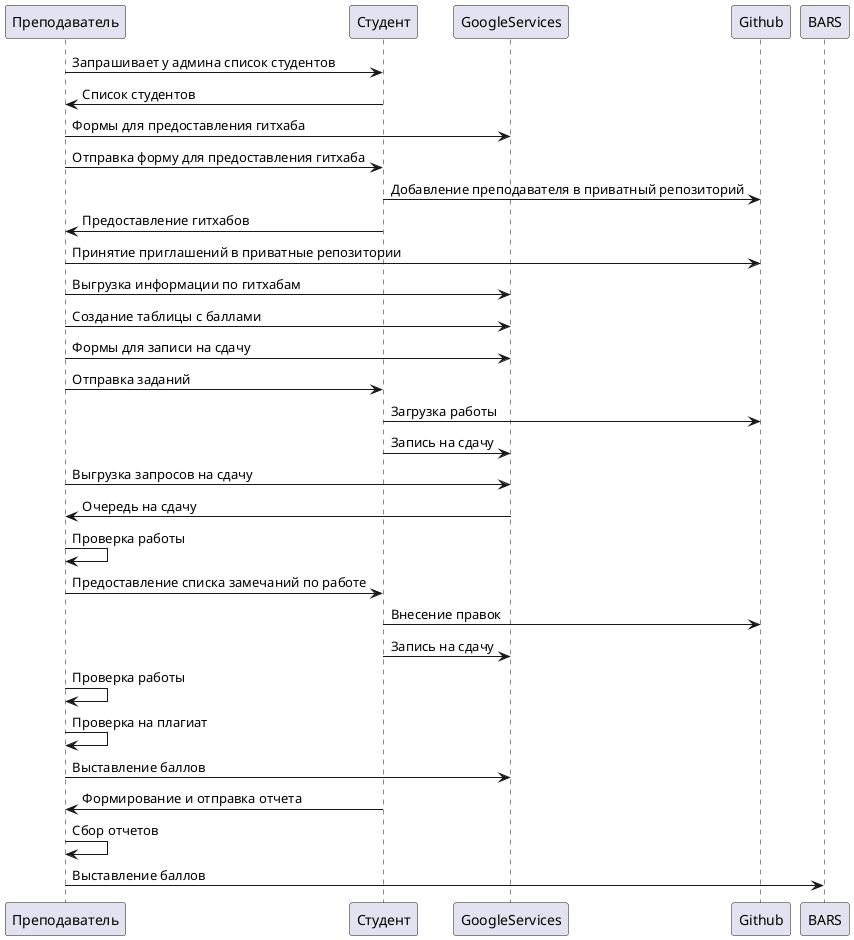
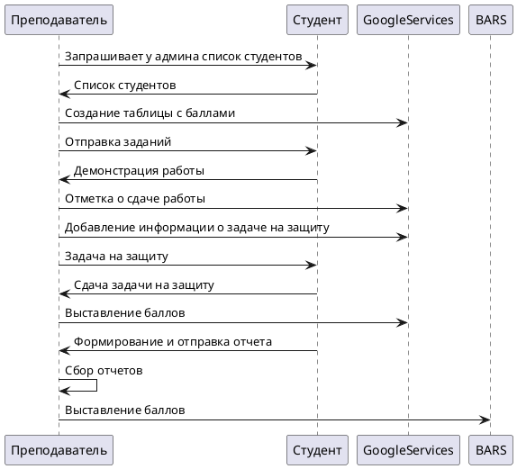

Вариант 1. Разработка конкретного проекта SLA

1. Сформулировать и утвердить вид ИТ-сервиса, для которого будет разрабатываться SLA.
Система управлением процессом оценивания работ студентов.

2. Описать текущую организацию предоставления подобных услуг на предприятии.
As is:

3. Определить круг потребителей данного вида услуг.
Пользователи системы:
- администрация образовательной программы, 5 человек. Отвечают за организацию учебных процессов процессов на макроуровне
- преподаватели, 40 человек. Реализуют образовательную деятельность
- студенты, 600 человек. Получают образовательные услуги

4. Составить анкету (анкеты) и провести интервьюирование потребителей для определения потребностей в 
этом ИТ-сервисе с позиции бизнес-процессов.

Анкета для администрации:
- Какие частые проблемы появляются в рамках взаимодействия администрации с учебным процессом?
- Какие основные цели преследуются при участии в процессах?
- Какие бывают проблемы при взаимодействии с преподавателями или студентами в рамках усвоения предметов?

Анкета для преподавателей:
- Опишите текущий уровень удовлетворённости процессом взаимодействия со студентами в рамках практик, сдачи работ?
- Какие инструменты и технологии применяются в рамках процесса (для коммуникации, управлением знаний и данными, трекинга процесса)?
- Какие проблемы можно выделить в текущем подходе?
- Какие организационные моменты требуется проговаривать со студентами? Насколько эти моменты удобными? Какое время тратится на организацию процесса?

Анкета для студентов:
- Опишите текущий уровень удовлетворённости процессом взаимодействия с преподавателями в рамках практик, сдачи работ?
- Какие проблемы появляются во время взаимодействия с преподавателями?
- Приведите пример удобно и не удобно выстроенного процесса взаимодействия с преподавателей. Укажите какие были критерии сравнения.

5. Проанализировать эти потребности и составить на их основе два предложения, использующие для 
удовлетворений потребностей различные технологические решения или одно и то же технологическое 
решение, но на разных уровнях поддержки (обеспечения).
6. Для каждого предложения составить SLA, в соответствии с требованиями и рекомендациями ITIL/ITSM. 
Предполагается, что предлагаемые варианты будут отличаться характеристиками сервиса с одной 
стороны и его стоимостью и гарантированными компенсациями за несоответствие характеристик с 
другой стороны
