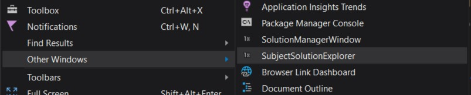
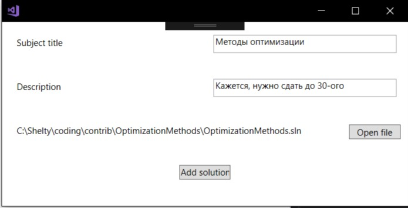

# ITMO-Devtools-5th-sem

Пример простого расширения для Visual Studio.

Кнопка для запуска расширения добавляется в тулбар:  

Окно расширения:  

При нажатии на кнопку "Add new" открывается окно внесения данных:  

Правый клик на элемент списка открывает окно взаимодействия:  

