<!-- Задачи, которые уйдут в будущие релизы:
1. RPC
2. Существующие решения: написать про сравнение с GraphQL
3. Описать про TCP и про безопасность
4. Написать про версионирование контрактов
5. Написать, что во View тоже умеет
6. добавлять библиотеки с которых брались идеи а-ля SqlKata?
7. Написать про UX - интерфейс модуля должен быть привычен пользователю, соотноситься с механизмом LINQ и Fluent interface.
8. Написать про Fluet интерфейсы, добавить референс на Скита (это же в у него было?) -->

## Дипломная работа студента M3405, Ивницкого Алексея на тему "Разработка библиотеки для реализации контрактно-ориентированной модели взаимодействия с базой данных в клиент-серверной системе"

## План
0. Определения
1. Введение
2. Описание предметной области
   1. Модель клиент-серверного взаимодействия в продукте Veeam Backup and Replication
   2. Функциональные и не функциональные требования
3. Проектирование архитектуры модуля 
   1. Компоненты модуля
   2. Формат описания запросов
   3. Контрактно-ориентированное взаимодействие
   4. Интеграция с инфраструктурой Veeam Cloud Connect
   5. Стек технологий
4. Реализация
   1. Инфраструктурные компоненты модуля
   2. Механизм построения запросов
   3. Формат описания запросов
5. Кодогенерация инфраструктуры
   1. Применение кодогенерации
   2. Использование метаинформация про базу данных для анализа схемы
   3. Кодогенерация на основе Roslyn
   4. Кодогенерация инфраструктурных компонент
6. Литература

# Раздел 0. Списки сокращений и определений

> TODO: Источник, указать нормально https://helpcenter.veeam.com/docs/backup/vsphere/backup_job.html?ver=100

VM (virtual machine) - виртуальная машина.
VBR (вбр, The Veeam Backup & Replication) - бекапное программное обеспечение разработанное для работы с VMWare и Microsoft Hyper-V. 
Backup job (бекапная джоба, джоба) - сценарий по которому выполняется создание бекапов указанных виртуальных машин.
VCC (Veeam Cloud Connect) - набор функционала в VBR, который предназначен для клиент-серверного взаимодействия в рамках работы с программой.
SP (Service provider, сервис-провайдер) - пользователь VBR, который предоставляет свою инфраструктуру для других пользователей с использованием функционала VCC.
Tenant (тенант) - пользователь, который использует ресурсы и инфраструктуру сервис-провайдера для запуска джоб.

# Введение

Несмотря на распространенность клиент-серверного подхода к проектированию систем, не существует общепринятого решения проблемы взаимодействия клиента и базы данных на сервере. Обрастая бизнес логикой, клиентская часть требует все более функционального интерфейса для получения данных - сущностей становится больше, с ложность фильтров повышается для минимизации потока передачи информации и нагрузки на передачу. Создаются ситуации, когда на клиенте нужно запросить какие-то данные, по определенным параметрам, но нужного API нет и все сводится к фильтрации на стороне клиента. Такая ситуация - результат ограничения, клиентская часть ограничена в функционале, она не может отправить оптимальный SQL запрос на сервер и получить нужные данные. Это обусловлено требованиями к безопасности - нельзя давать возможность присылать со стороны клиента произвольный SQL код. Если разрешить выполнять произвольный SQL-скрипт, то это создаст уязвимость системы, нарушение ее корректной работы, а также доступ к закрытым данным.

Из этого следует, что расширение бизнес логики ведет к увеличению количества методов в API. Это создается две проблемы - затруднение поддержки кодовой базы API и переусложненный процесс добавления функционала. Рассмотрим процесс добавления нового метода в типичную клиент-серверную архитектуру:
1. В условиях отсутствия ORM требуется добавить новую SQL-процедуру, которая реализует новую логику обращения к базе
2. Протаскивание вызова процедуры через слои абстракции сервера, добавление нового метода в API
3. Добавление логики обращения к новому методу API, его обработка 

# Раздел 1. Описание предметной области

## Раздел 1.1 Модель клиент-серверного взаимодействия в продукте Veeam Backup and Replication

Veeam Cloud Connect - одна из технологий Veeam Backup & Replication, которая дает возможность сервис-провайдерам создавать и предоставлять удаленные репозитории для бекапов, услуги бекап как сервис (BaaS)[VCC]. Veeam Cloud Connect имеет модульную архитектуру и состоит из различных компонентов. Основным является Veeam Backup & Replication server, который управляет всеми конфигурациями и сохраняет их в локальных базу Microsoft SQL Server. Cloud Gateways - компоненты системы, которые управляют подключениями пользователей и перебрасыванием данных к VBR по TCP используя защиту SSL-сертификатами. Для хранения бекапов в инфраструктуре также должны быть созданные репозитории. VBR поддерживает различные виды репозиториев: подключенные физические хранилища, сетевые репозитории, ExaGrid, StoreOnce. Особенным видом репозиториев являются клаудные репозитории - это репозитории, которые регестрируются у пользователей при подключении к SP. Данный тип репозиториев позволяют создавать бекапы клиентам на один из обычных репозиториев на стороне SP. 

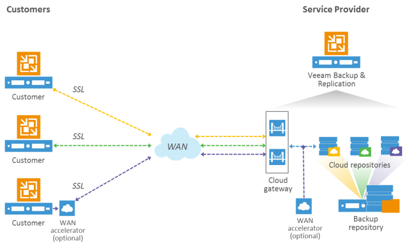

## 1.2 Функциональные и не функциональные требования

В описанной выше архитектуре можно выделить два сценария: создание бекапа локально с использованием своих ресурсов и на инфраструктуру сервис-провайдера. Алгоритмы прохода джобы в них не отличаются и большая часть функционала работает одинаково, за исключением того, что во втором сценарии часть операций выполняются локально, а часть - удаленно. Данные про бекапы также хранятся по-разному - в базе на локальной машине с VBR или на сервере сервис-провайдера. А значит все алгоритмы должны уметь запрашивать данные двумя способами. Ввиду ряда ограничений и исторически сложившийся архитектуру такая возможность реализована за счет сильного дублирования кода, количество которого требуется сократить в рамках разработки модуля взаимодействия с базой данных.

Можно выделить ряд проблем, которые планируется рассмотреть в рамках разработки модуля:
- Для каждого из сценариев нужно писать свою часть кода и добавление каждого нового запроса к данным в алгоритмы сопровождается протаскиванием новой логики во реализации.
- Расширение бизнес-логики чревато очень резким увеличением кол-ва SQL-процедур. Это затрудняет поддержку и выполнение тривиальных задач, например - добавление поля в таблицу.
- Система была заточена под конкретный тип баз данных - MSSQL, что затрудняет попытки перейти на разные тип баз данных хотя бы на уровне отдельных компонент.

Из этого следуют функциональные требование:
- возможность унифицировать код получения результата из базы данных для сценариев работы VBR с локальной базой данных, и работа VBR с базой данных, которая находится на стороне сервис-провайдера.

Ввиду того, что внедрение подобного механизма при условии поддержания типизации в уже существующей системе - это процесс, которые занимает очень много времени, к списку требований добавлен пункт на автоматизацию внедрения. Автоматизация заключается в реализации возможности кодогенерации всего нужного кода на основе уже существующей базы данных.

Проектирование нового способа работы с базой данных дает возможность начать подготовку к переходу на разные виды баз данных. Для продвижения в этом направлении разработанный модуль должен:
- уменьшить потребность в написании SQL-кода, который нужно будет переносить между базами
- разделить логику формирования обращения в коде и логику построения запроса таким образом, чтобы возможно было сменить синтаксис SQL-языка и работать с другой базой.

К нефункциональным требованиям можно отнести требование к безопасности. Это одна из причин по которой использование готовых реализаций ORM невозможен - результатом их работы является уже сформированный запрос, который нельзя передавать через API ввиду потенциальных SQL-инъекций.

# Раздел 2. Проектирование архитектуры модуля

## 2.1. Компоненты модуля

Для внедрения нового механизма в системе нужно реализовать ряд новых компонент:
- Описание всех таблиц и их столбцов в виде классов
- Механизм формирования запрос к данным
- Транслятор запроса в SQL-запрос
- Конвертор результатов выполнения SQL-запросов в сущности

Для реализации типобезопасного взаимодействия с базой данных требуется объектное описание всех компонентов в коде.

Самыми необходимым типами при работе с базой являются модели базы данных - классы, которые отображают в коде столбцы таблиц как переменные являясь дата-классами. Подобным функционалом, а именно - генерация дата-классов по схеме таблиц базы данных, обладает большинство современных ORM [@Троелсен, с. 843]. Помимо моделей, для таблицы должны быть введены дескрипторы - соответствующие классы, которые описывают:
- название таблицы в SQL
- Описание структуры таблицы - ее колонки
- Связи таблицы с другими таблицами - внешние ключи

Для формирования обращения к данным требуется специальный билдер, который позволяет в одном виде в коде описывать логику. Помимо этого требуется компонент, который будет конвертровать сгенерированный запрос в SQL и выполнять его. Смоделируем схему размещения описанных выше компонент:

С учетом новых компонентов смоделируем последовательность выполнения запроса:

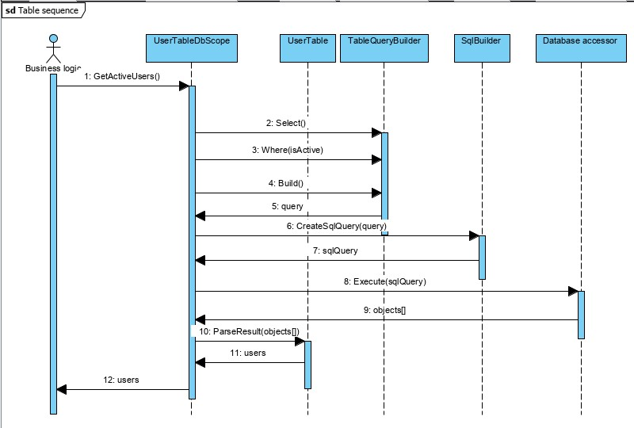

## 2.2 Контрактно-ориентированное взаимодействие

Описанный ранее способ работы с базой предполагает полный доступ к ее данным и отлично подходит для работы с локальной базы, но совершенно не применим для клиент-серверного взаимодействия. В этом сценарии пользователю нужно предоставить удобный интерфейс, где он работает не с таблицами, а с сущностями, которые могут быть сборными из разных таблиц.

Для реализации подобного механизма вводится дополнительный слой абстракции - контракты. Контракт представляет собой объектную модель описания какой-то бизнес сущности системы, которую можно собрать из данных исходной базы.

Основные сущности:
- Контракт - описание структуры определенной бизнес-сущности в системе, описание ее полей.
- Дескриптор контакта - аналог дескриптора таблицы, описание полей контракта, логики работы с ним.
- Поле контракта - описание объекта, который является частью контракта. Это может быть как простое значение записи из базы так и составное значение, которое собирается после считывания с бд.

Ключевым отличием от обычных оберток над таблицами являются поля контрактов. Их можно разделить на две категории:
- Простые. Это поля, которые соотносятся 1 на 1 к определенному столбцу в базе. Стоит отметить, что контракт, скорее всего, будет состоять из полей, которые ссылаются на столбцы разных таблиц.
- Сложные. Покрывают сценарий, когда для получения какого-то значения нужно после считывания выполнять какую-то пост-обработку. Например - подмена значения для совместимости со старым клиентом.
- Комплексные. Покрывают сценарий, когда для получения какого-то значения нужно вытаскивать несколько значений и их агреггировать.

Таким образом, для выполнения обращения с помощью контрактов на сервер должны выполняться такие шаги:
1. Построение запроса для работы с контрактом
2. Сериализация и отправка запроса на сервер
3. Считывание запроса на стороне сервера, десериализация и конвертация его в табличный запрос к данным. На данном этапе могут также выполняться различные модификации исходного запроса, которые определены сервером.
4. Формирование SQL-запроса, его выполнение, считывание ответа.
5. Сериализация полученного результата, отправка ответа клиенту.
6. Считывание ответа сервера, парсинг его в контрактную модель.

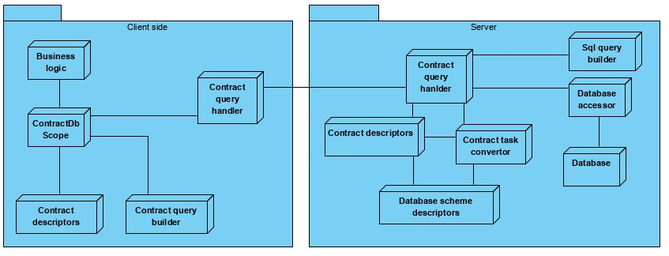

## 2.3  Интеграция с инфраструктурой Veeam Cloud Connect

Контрактно-ориентирование взаимодействие в таком виде подходит для реализации клиент-серверного общения, в том числе для Veeam Cloud Connect. Рассмотрим пример, Как это будет имплементировано в рамках выполнение Backup job в VCC:
1. На стороне тенант берется информация из базы о сервис-провайдере, который предоставляет ресурсы
2. Выполняется процессинг, генерируется информация про созданные бекапы и отправляется на инфраструктуру провайдера.
3. Синхронизируются данные о последнем проходе и другая нужная клиентской стороне информация.
 
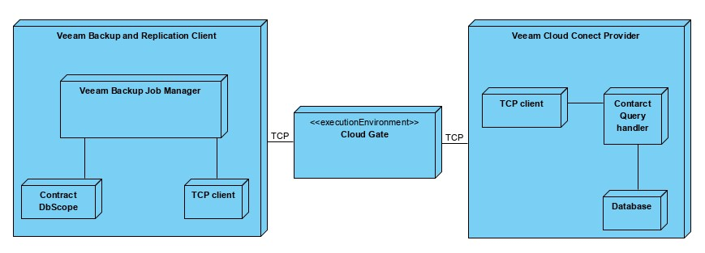
 
- Veeam Backup Job Manager - модуль в рамках VBR, который отвечает за бизнес логику, в том числе за выполнение бекапных джоб.
- Contract DbScope - часть разработанного компонента, которая на клиентской стороне отвечает на построение запроса.
- TCP-client - клиент для взаимодействия между тенантом и провайдером по средствам TCP.
- Cloud Gate - физический компонент экосистемы Veeam, который занимается перенаправлением запросов между клиентом и провайдером.
- Contract query handler- часть разработанного компонента, которая по полученному от тенанта описанию генерирует запрос к базе данных.
- Database - база данных на стороне сервис провайдера с котрой взаимодействует клиент во время бекапных джоб.

Одним из функциональных требований является возможность модифицировать на стороне сервис провайдера исходный запрос. В рамках VCC данный функционал необходим для того, чтобы гарантировать, что все запросы тенантов будут распространяться только на данные этого клиента и никакого другого:

1. Тенант подключается к серверу, устанавливается коннекция.
2. Тенант отправляет запрос к базе по средствам разработанного модуля
3. Сервис провайдер принимает запрос, по сессии смотрит идентификатор тенанта
4. Сервер изменяет запрос присоединяя нужную цепочку таблиц, чтобы по запрашиваемой сущности было понятно какому пользователю она принадлежит, добавляется условие WHERE по идентификатору пользователя
5. Выполняется запрос, возвращается результат.

## 2.4 Стек технологий

Ключевым аргументом при выборе стека является текущий стек разработки Veeam Backup and Replication посколько практическим применением результата данной работы является внедрение в существующее решение.  Он определен руководством на всем продукте, а поскольку весь продукт - это монолит, реализовать другие компоненты на другом стеке - довольн опроблематично.

Стек:
- Платформа .NET Framework 4.7.2, язык C#
- База данных SQL Server

Использованные библиотеки:
- Newtonjson - Библиотека для работы с JSON для C#. Имеет весь нужный функционал для сериализации и десерилазации объектов в системе.
- TSQL-Parser - Библиотека, которая умееет разбивать SQL синтаксис на токены для дальнейшего анализа.
- Microsoft.CodeAnalysis.CSharp - Компоненты Roslyn, которые позволяют собирать синтаксическое дерево и генерировать C# код.
- NUnit - Одна из самых распространенных баблиотек для написать unit-тестов 
- System.Data.SqlClient / System.Data.SQLite - библиотеки для работы с базами данными. SqlClient - библиотека для работы с базами данных SQL Server, SQLite - для работы с базой Sqlite, которая используется для unit-тестов.

# Раздел 3. Реализация

## 3.1 Инфраструктурные компоненты модуля

Как было указано ранее, для работы модуля требуется ряд инфорструктурных компонетов. В первую очередь это перенесение таблиц из базы с объектно-ориентированные сущности: дескрипторы таблицы и модели, которые получаются при обращении к таблице. В качестве примера взята таблица [dbo].[TombStones]. Ниже приведен скрипт ее создания:

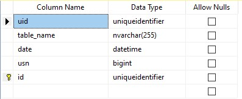

Модель получаемую из этой таблицы можно представить ввиде класса:
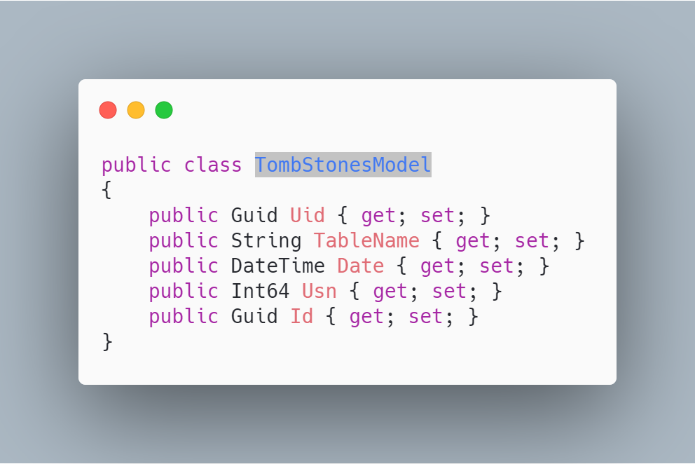

Помимо самой модели для таблицы нужно еще описать дескриптор. Он описывает информацию про идентификатор таблицы, ее название:
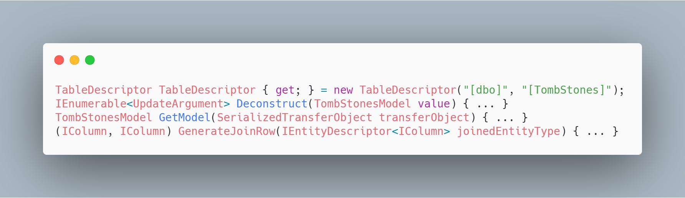

- TableDescriptor - описание таблицы в базе данных к которой привязан данных класс: схема и название
- GetModel() - метод, который описывает, как спарсить ответ базы данных в модель данной таблицы.

Также он описывает все столбцы, которые относятся к данной таблице:
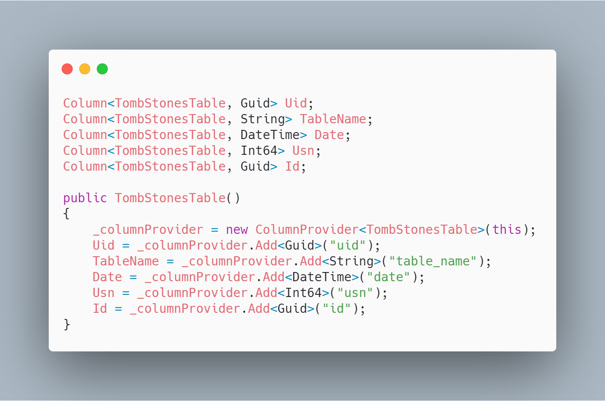

Еще одним компонентом дескриптора таблицы является метод Deconstruct(), который разбирается дата-класс **T** на набор значений, который описывает как разложить модель данной таблицы на список аргументов для Insert-запроса:
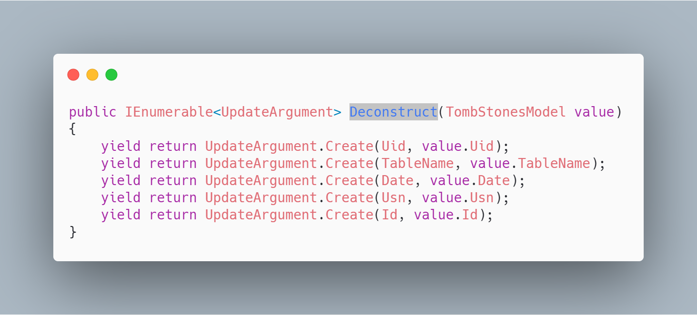

Последнее свойство, которое должно быть отображено - это наличие связи с другими таблицами, существование внешнего ключа между ними. Чтобы обозначить такую связь на уровне типа в языке C# было принято решение использовать интерфейсы. Введена абстракция (интерфейс) **IJoinable<T>**, из имплементации которой следует утверждение, что текущий тип (дескриптор) является связаным с другим типом, типом. По итогу имеем метод, который определяет какие два столбца должны быть использованы для оператора JOIN с указаной в параметре другой таблицей:
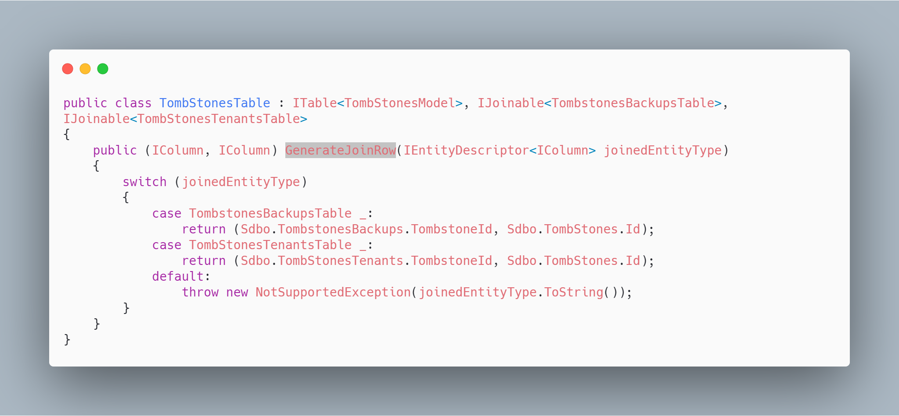

## 3.2 Механизм построения запросов

Для упрощения обращения к базе по средствам разрабатываемого механизм, процесс создания запроса реализован в соответствии паттерну Builder. Builder - порождающий паттерн. Основная его идея - разделить представление объекта и способ его создания. В зависимости от аргументов используемых при консттруированнии, по итогу получается разные представления. [@Тепляков, с. 160]

Для каждого из 4 типов запроса реализован свой билдер с нужным набором методов. В случае Select'а, это:
- конструктор, который инициализируется таблицей с которой будет начинаться запрос
- Join<T2>(T2 joinedEntity, JoinType joinType = JoinType.Inner) - метод, который указывает, что с запросе нужно выполнить Join с указаной таблицей
- Where - набор методов для указания различными способами как нужно отфильтровать данные, которые будут получены в результате запроса
- OrderBy<TOrderColumn>(TOrderColumn column, OrderType orderType = OrderType.Asc) - метод, который позволяет указывать по какому столбцу нужно отсортировать данные
- WithDistinctFilter() - метод, который указывает, что в результате нужно получить только уникальные данные. Сопоставляется с логикой ключевого слова DISTINCT в SQL.
- TopCount(Int32 count) - метод, который указывает на то, что в ответ нужно получить только какое-то количество первых элементов.

Для Update-запросов есть соответствующий UpdateBuidler с набором методов:
- конструктор, который инициализируется таблицей с которой будет начинаться запрос
- WithArgument<TValue>(IColumn<TValue> column, TValue value) - метод, который позволяет указать какое поле таблицы нужно обновить и каким значением
- Where - набор методов для указания различными способами как нужно отфильтровать данные, которые будут получены в результате запроса

Для Delete-запроса есть соответствующий DeleteBuidler с набором методов:
- конструктор, который инициализируется таблицей с которой будет начинаться запрос
- Where - набор методов для указания различными способами как нужно отфильтровать данные, которые будут получены в результате запроса

Для Insert-запросов есть соответствующий InsertBuidler с набором методов:
- конструктор, который инициализируется таблицей с которой будет начинаться запрос
- WithArgument<TValue>(TValue value) - метод, который принимает модель, которая будет разбираться на параметры и создаваться с базе.

## 3.3 Формат описания запросов

Одной из задач, которую должен решать модуль, является предоставление возможности разделить построение запроса с точки зрения бизнес-логики и его трасляцию в SQL-запрос. Для реализации внедрения нового механизма взаимодействия был сформирован специальный формат описания обращения к данным. Основные требования к спецификации:
- Должна концептуально быть схожа с SQL
- Должна уметь описывать основные элементы SQL запроса

Проанализировав самые простые SQL-запросы, было выделено ключевые элементы, которые должны быть отображены в описании:
1. Описание таблицы на которую нацелен запрос. 
2. Условия фильтрации запросов, указанные с помощью ключевого слово WHERE: описание столбца по которому фильтр идет, оператор сравнения и значение, с которым нужно сравнить.
3. Список столбцов, которые нужно достать из базы для выполнения операции SELECT.
4. Поддержка механизма JOIN - перечисление пар таблиц, которые нужно соединить и соответствующие столбцы, которые будут использованы.  
5. Для операций UPDATE и INSERT нужно хранить список пар столбцов и их значений для выполнения соответствующего запроса.

Запрос Delete

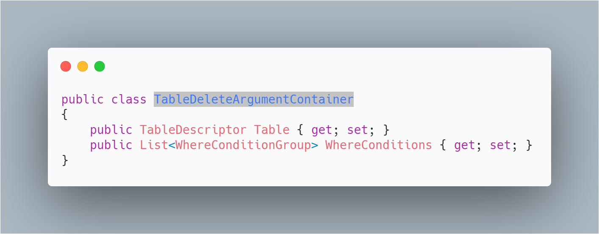

разворачиваются в

Запрос Insert

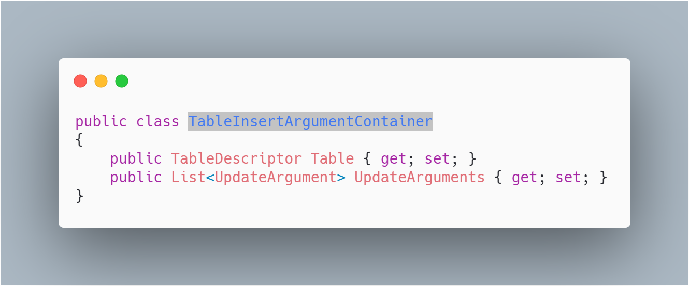

разворачиваются в

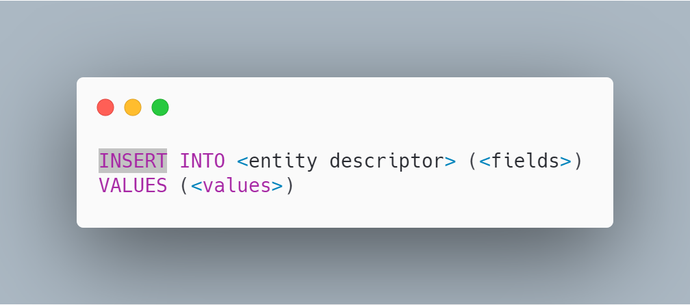

Запрос Select

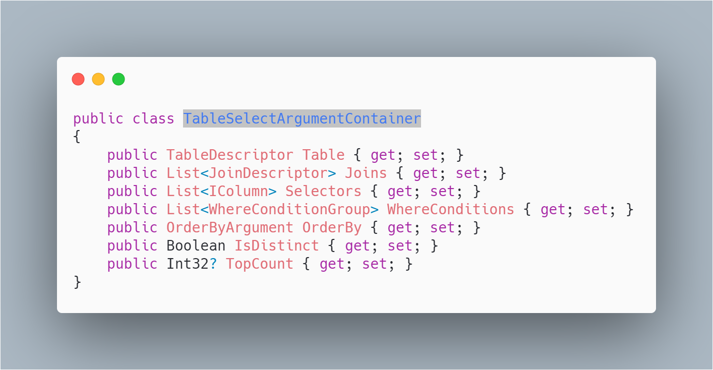

разворачиваются в

Запрос Update

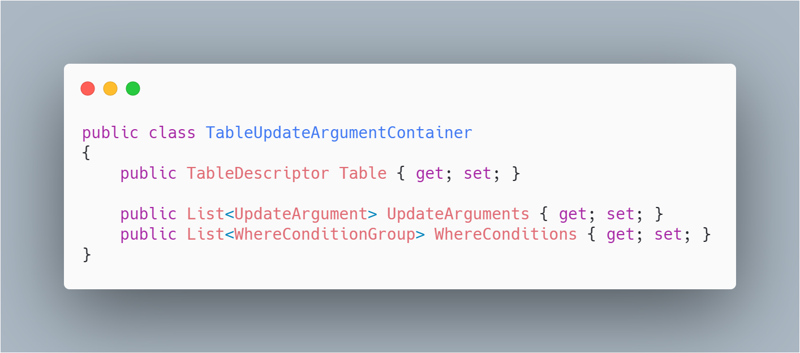

разворачиваются в

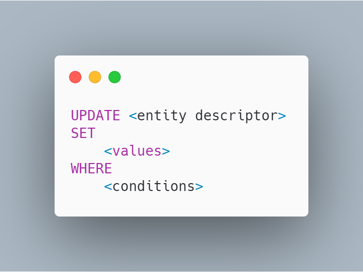

Алгоритм построения запросов является довольно очевидным. Более того, он не зависит от остальных компонентов системы, а просто строится на основании переданных параметров. Из этого можно сделать вывод, что при желании можно реализовать подобный генератор запросов не только для SQL Server, а и для других диалектов SQL.

# Раздел 4. Кодогенерация инфраструктуры

## 4.1. Применение кодогенерации

Одним из нефункциональным требованием является кодогенерация нужных для работы модуля компонентов. Довольно тривиальной проблемой при работе с базой данных является то, что табличные сущности (модели) нужно описывать дважды: в виде SQL-кода создания таблиц и на языке, который используется для бекенда, логика парсинга ответа от базы данных. Обычно, имеется два подхода.
Code first - подход, который заключается в том, чтобы описывать сущности на языке бекенда, а потом использовать различные инструменты для создания базы данных на их основе. Самым популярной реализацией данного подхода в .NET-стеке является EntityFramework. Это библиотека в которой реализовано много функционала для работы с базой данной и один из них - это как раз генерация SQL-запросов для создание таблиц на основании написанных классов-моделей. 

Противопоставить можно другой подход - Db first. Он заключается в том, что сначала описывается база данных, таблицы, а потом генерируются шаблонные модели. В отличии от Code first такой подход можно применить к уже готовой базе, которая ранее использовалась без ORM. Он подразумевает анализ схемы базы данных, выделение ее элементов и генерации соответствующих классов. 

Ввиду того, что одной из задач данного компонента является реализация нового подхода в качестве замены существующего функционала - ориентиром является именно существующая база, которая не будет изменятся.

## 4.2 Использование метаинформация про базу данных для анализа схемы

Для генерации кода работы с базой в первую очередь нужно получить информацию по всем таблицам и их столбцам. В случае MSSQL всю эту информацию можно получить из таблиц sys.objects, sys.columns, sys.types и sys.schemas. Рассмотрим пример запроса:
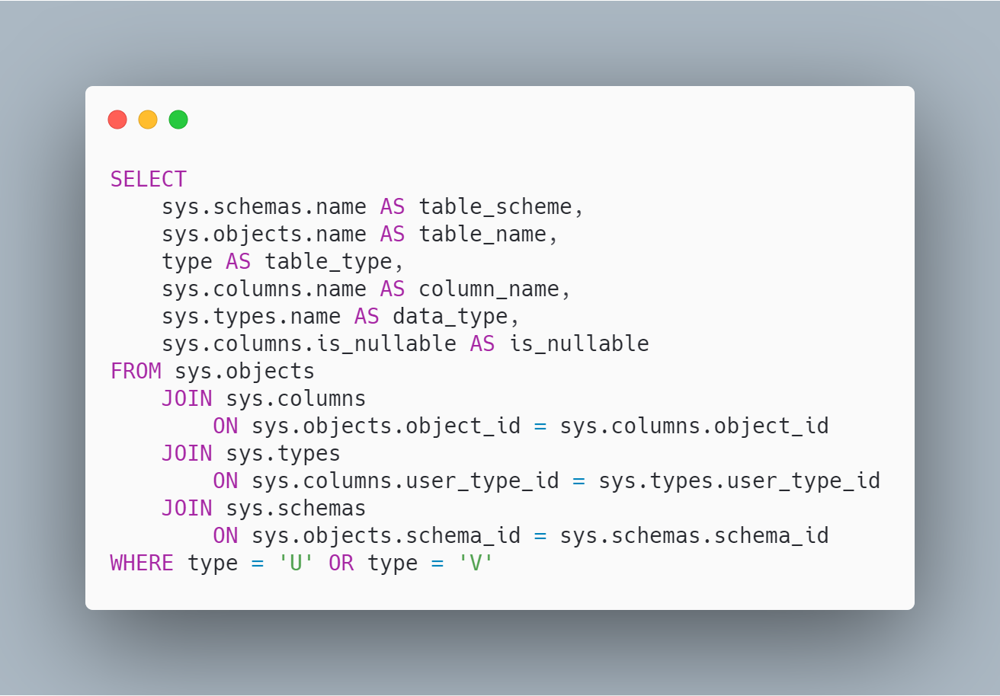

В результате сгенериуется ответ, который содержит:
- table_scheme - название схемы, в которой находится таблица
- table_name - название таблицы
- table_type - тип объекта, которому принадлежит столбец: таблица или view
- column_name - название столбца
- data_type - SQL-тип таблицы
- is_nullable - допускается ли NULL значение для данного столбца

Сгруппировав полученный результата по (TableScheme, TableName) можно получить список столбцов каждый отдельно взятой таблицы, и информацию про саму таблицу. Но для реалзиации связей между таблицами нужно также знать какие есть внешние ключи и какие таблицы можно соединять между собой. Информацию про внешние ключи можно получить по запросу:
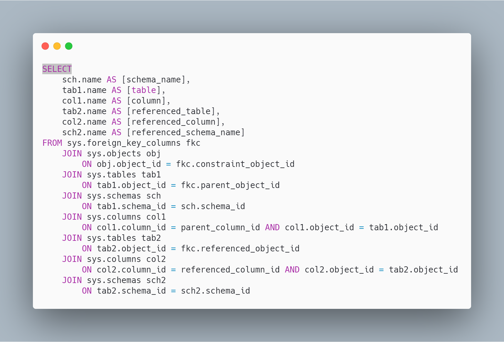

В после выполнения данного запроса SQL-сервер вернет таблицу:
- schema_name - название схемы в которой находится таблица с ключем
- table - название таблицы с ключем
- column - названик столбца на котором висит ключ
- referenced_table - название таблица на которую ссылается ключ
- referenced_column - название столбца на который ссылается ключ
- referenced_schema_name - название схемы в которой находится таблица на которую ссылается ключ

Спарсив данный результат и связав его с описанием таблицы из первого запроса можно получить достаточно информации о базе для кодогенерации.

## 4.3 Кодогенерация на основе Roslyn

> Указать ссылки

Roslyn - компилятор исходного кода .NET, который предоставляется как CaaP (Compiler-as-a-Platform). Является проектом Microsoft с открытым исходным кодом. Поддерживаемыми  языками являются C# и VB, который используют .NET в качестве среды выполнения. Основная идея проекта Roslyn заключается в раскрытии процесса компиляции, предоставление доступа пользователям к взаимодействию с различными его этапами.
Гибкость в плане расширений и возможность кастомизации дают возможность применять данный инструмент в качестве внешнего анализатора кода.

Архитектура Roslyn'а имеет ряд особенностей, которые объясняются набором функционал, который данное продукт реализует. В первую очередь, данное средство автоматизации является компилятором и именно логика процессов компиляции лежит в основании всей системы. Остальные компоненты являются функциональными расширениями процесса компиляции и являются зависимыми от компоненты "Compilers". Не смотря на то, что другие компонент группируются на основе какой-то функционала, они взаимодействуют между собой, переиспользуют структуры данных других модулей, используют их  зависимости и расширяют их. Этим обусловлена сильная связанность между ними. На диаграмме представлена модель системы, где элементами являются именно эти компоненты.

Раскрытие «черного ящика» компиляторов дает широкий ряд возможностей для улучшения условий работы с кодом. Программный компонент Roslyn, который является платформой предоставляющей функционал компилятора, как раз таки нацелена на интеграцию этих процессов, их управление и использование в процессе разработки. Часть этих компонент предоставляются как библиотеки для проектов с целью их расширения и имплементации на их основе нового функционала.
При анализе было отмечено, что программный компонент представляется на разных уровнях абстракции – с ним можно интегрироваться как на уровне добавления правил код-стайла, так и внедрить дополнительную логику разбора исходного кода.
Обобщив информацию полученную в ходе работы над Roslyn, можно прийти к заключению, что это современный инструмент, который значительно может упростить работы как с анализом кода, так и его написанием (например, кодогенерацией), а также дает возможность пользователям разрабатывать инструменты, которые решают непосредственно их задачу и настраивать уже существующие под себя.

Элементы Roslyn для кодогенерации представлены в виде NuGet-пакетов Microsoft.CodeAnalysis.CSharp.*. Используя набор этих библиотек можно описать основные элементы классов, которые должны быть сгененированы и получить синтаксически корректный исходный код с форматированием.

## 4.4 Кодогенерация инфраструктурных компонент

Рассмотрим генерацию моделей. Чтобы представить результат полученный с базы в C#-коде - его нужно спарсить в экземпляр какого-то класса. А значит для каждой таблицы нужно сгенерировать соответствующие дата-классы в которые будут читаться данные. Поля класса заполняются на основании названий столбцов таблицы и их типа:
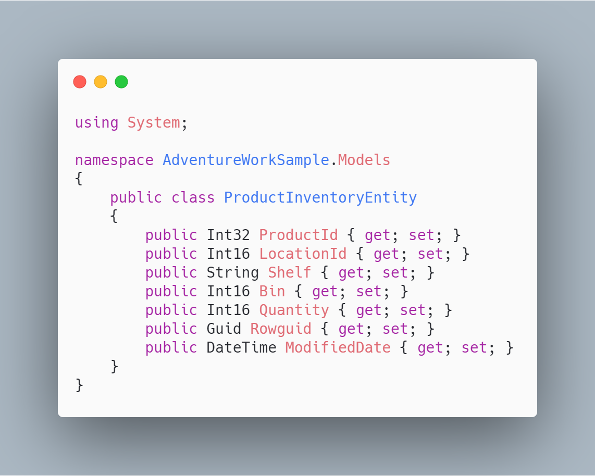

Можно выделить основные элементы этого кода:
- директива подклбчения пространства имен где описаны все примитивные типы
- Объявление пространства в котором находится класс
- Объявление класса
- Объеявление свойства.

Этапы генерации:
1. Сгенерировать свойство для каждого столбца таблицы. Имея описание стоблца и используя Roslyn (Microsoft.CodeAnalysis.CSharp) можно сгенерировать с помощью кода:
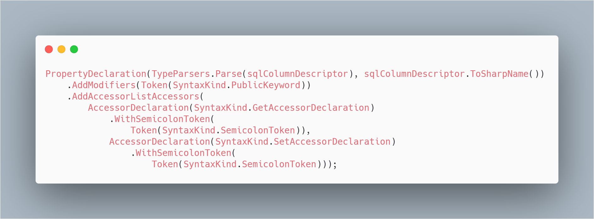

1. Сгенерирровать строку инициализации типа:
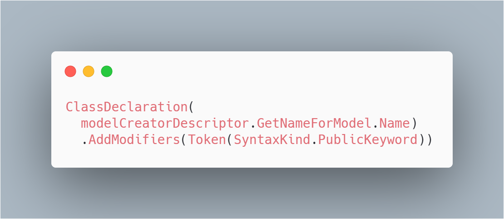
3. Обернуть тип в using и добавить нужные ссылки:
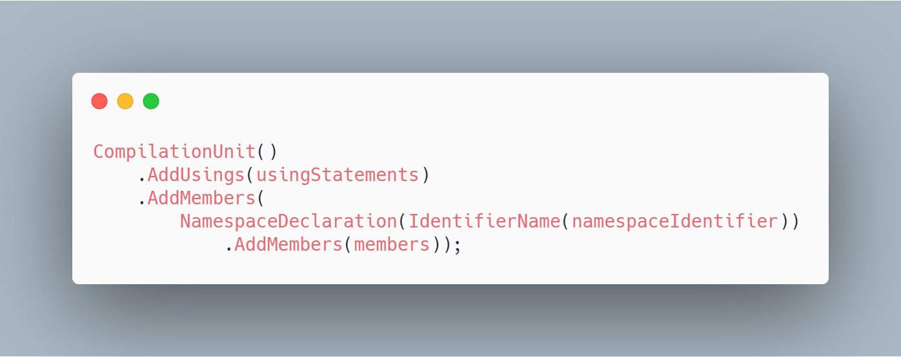

Рассмотрим ключеные методы генератора Roslyn, которые были использованы для генерации:
- PropertyDeclaration - метод, который создаем описание поля класса, принимаем в качестве аргумента тип и название
- AddModifiers - метод который выставляет модификатор доступа указаному члену класса
- AddAccessorListAccessors - метод, которые добавляет аксессоры свойства - get и set методы
- ClassDeclaration - метод, который создаем описание класса, принимает на вход название
- CompilationUnit - метод, который новый объект для описания компилируемого объекта
- AddUsings - метод, который добавляет директивы подключения библиотек
- NamespaceDeclaration - метод, который создает описание объявления пространства имен

Помимо моделей нужно генерировать описания таблиц. Рассмотрим пример одного дескриптора таблицы:
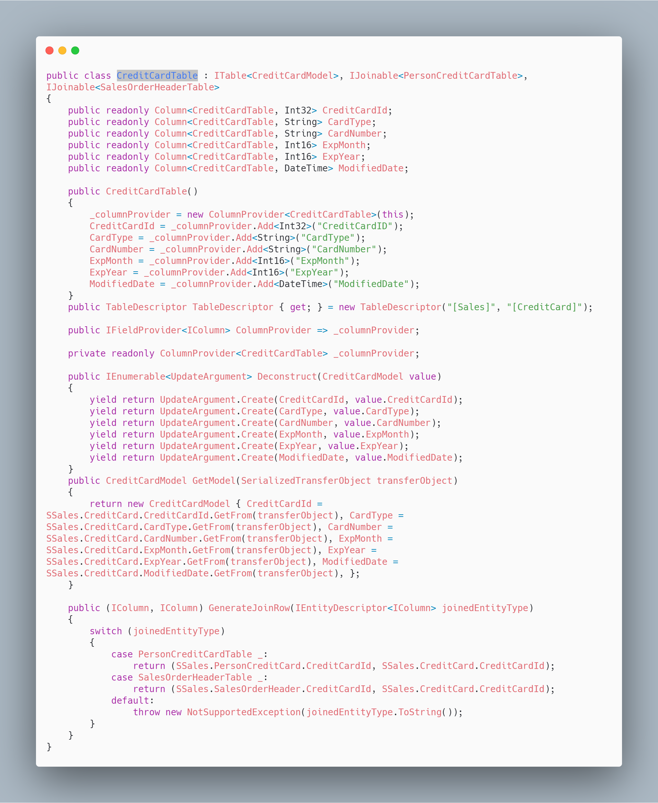

В первую очередь опишем генерацию объявления класса и указания интерфейсов. Каждый такой класс генерируется по информации полученной с базы данных, которая содержит название таблицы, список столбцов и внешних ключей. Имя иаблицы используется для названий класса с добавлением пстифкса Table. Все дескрипторы таблиц имплементируюи интерфейс ITable<TModel>. Поскольку классы моделей также генерируются с шаблонными именами - в качестве аргумента для обобщенного типа TModel используется название таблицы с постфиксом Model. Для описания мплементации интерфейса в Roslyn'е используется метод SyntaxFactory.SimpleBaseType:

Помимо реализации ITable, дескрипторы таблиц также имплементируют интерфейс IJoinable для каждой таблиц к которой от этой есть внешний ключ с базе. Это значит, что для генерации используется информация о внешних ключах и для каждого нужно сгенерировать синтаксис имплементации интерфейса:
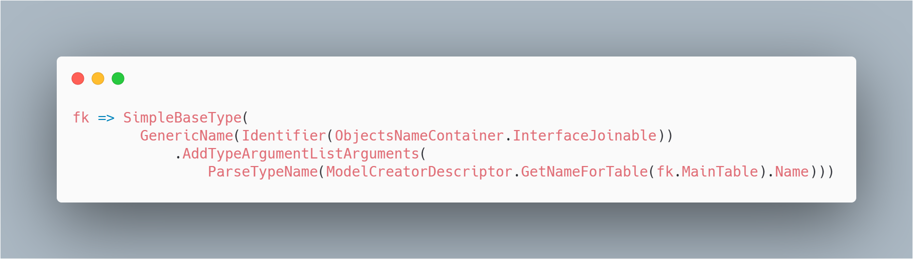

Одним из важных элементов дескрипторов таблиц является строготипизированное описание столбцов. Они представлены ввиде свойств класса и для их генерации используется инормация о столбцах полученная из базы:
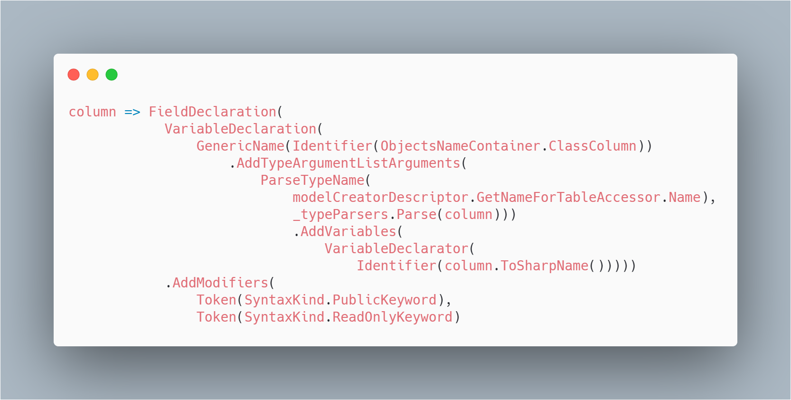

Помимо объявления нужно также сгенерировать инициализацию каждого свойства для столбца. Для этого нужно указать для каждого конкретного экземпляра тип столбца, связанную таблицу и название столбца:
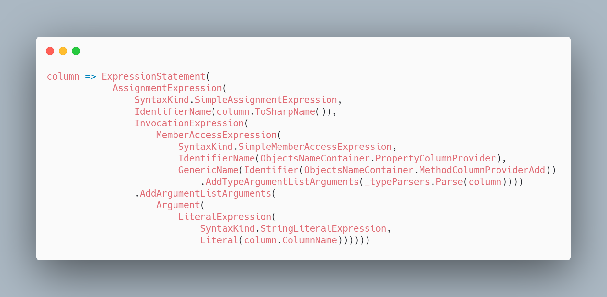

Для реализации возможности создавать Insert-запросы передавая модель таблицы, в интерфейсе ITable добавлен метод Deconstruct(TEntity value). Его логика заключается в разборе полей модели на параметры SQL-запроса. Поскольку названия свойств в дескрипторе и свойств в модели генерируются по одному правилу и совпадают - задача сводится к вызову метода UpdateArgument.Create который и создает нужный параметр.
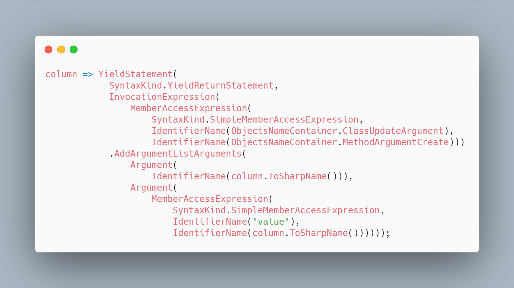

## Заключение

В ходе разработки модуля для клиент-серверного взаимодействия с базой данных было проанализировано текущее решение такой проблемы в рамках программного продукта Veeam Backup and Replication. Было выделено несколько ключевых функциональных требований для решения который были реализованы такие компоненты:
- набор типизированный обеток на д компонентами баз данных а также инструменты для взаимодествия с ними
- Специальные билдеры запосов, которые дают возможность в коде описывать запросы для которых ранее писались хранимые процедуры
- Унифицированный формат для описания запроса, который позволяет безопасно передать запрос к серверу не допуская SQL-инъекций.
- Модуль, который отвечает за генерацию SQL-запроса по указаному формату, в котором можно легко изменить синтаксис SQL для работы с разными базами.
- Механизмы для работы с абстракцией "контракт", которые возволяют реализовывать клиент-серверное взаимодествие с возможность модифицировать или ограничевать уровень доступа к данным на стороне сервера тем самым разделя данные пользователя в рамках одной базы.

Для проверки работоспособности разработанного модуля было написано ряд тестов на корректность генерации запросов с использованием функционала билдеров. В качестве проверки на возможность интегрировать такое решение в инфраструктуру Veeam Backup and replication была проведена попытка частичной замены существующей раелизации взаимодейтвия на работу через модуль. В ходе запусков бекапных джоб было выяснено, что такой подход может быть использован, но для полноценного перехода необходимо сделать миграцию старой кодовой базы хранимых процедур. Реализованого механизма генерации CRUD-запросов для таблиц оказалось недостаточно - больша часть хранимых процедур делает запросы по комбинации различных параметров и сгенерировать заранее их все невозможно. Таким образом, дальнейший вектор развития данного модуля будет заключаться в том числе в создании анализатор хранимых процедур и кодогенератора их представлений в коде.

Помимо этого, была разработана логика генерации SQL-запроса для таких типов баз данных как SQLite и Postgres, написаны юнит тесты для базовых SELECT-запросов. Из этого следует, что модуль поддерживает абстрагируемость от конретного синтаксиса SQL и переход на него упростить в дальнейшем миграцию на другие виды баз данных.

# Список использованных источников

1. CSharp 7 и Net Core. Кроссплатформенная разработка / Дж. Прайс [ПР]
2. Язык программирования C# 7 и платформа .NET / Троелсен
3. Паттерны проектирования наплатформе .NET / Тепляков
4. https://vccbook.io/ [VCC]
5. helpcenter.veeam.com/docs/backup/vsphere
6. Roslyn Succinctly / Alessandro Del Sole. – 2016 г.
7. Roslyn Cookbook / Manish Vasani. – 2017 г.
<!-- 8. The .NET Compiler Platform SDK [Электронный ресурс] - https://docs.microsoft.com/en-us/dotnet/csharp/roslyn-sdk/work-with-syntax -->