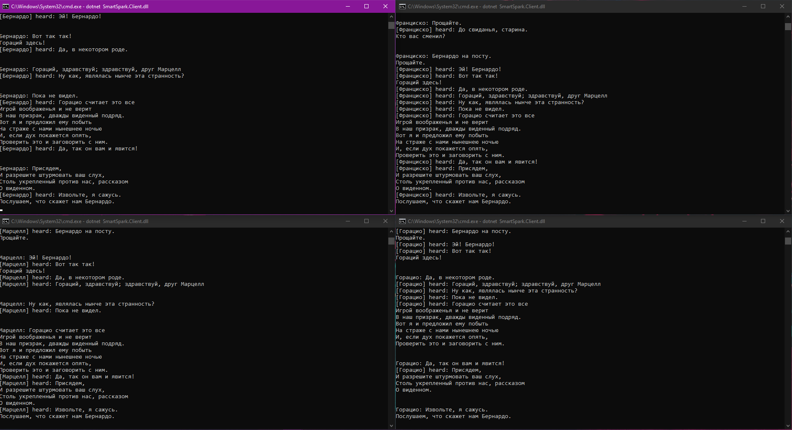

# Smapt Sparsql

Реализация задания "Интеллектуальное приложение".

### Server side

Реализовано интеллектуальное пространство - сервер, имеент эндпоинт для принятия реквестов в ввиде триплета (Subject, Predicate, Object). При получении реквеста, информация сохраняется в датасет в формате RDF-триплета:
```csharp
public void Create(Uri graph, string subject, string predicate, string obj)
{
    var subjectNode = _dataset[graph].CreateLiteralNode(subject);
    var predicateNode = _dataset[graph].CreateLiteralNode(predicate);
    var objNod = _dataset[graph].CreateLiteralNode(obj);

    _dataset[graph].Assert(new Triple(subjectNode, predicateNode, objNod));
}
```

Для проверки также реализован метод получения всех сохраненных трилпетов с информацией о том, что агент что-то говорил:
```csharp
public List<Triple> GetAll(Uri graph)
{
    return _dataset[graph]
        .GetTriplesWithPredicate(_dataset[graph].CreateLiteralNode("say"))
        .ToList();
}
```

Помимо этого, происходит рассылка информации о полученном триплете всем подписанным клиентам.

### Client side

Для работа с сервером создан клиент. При запуске инициализируется подключение, клиент подписывается на нотификации сервера. Если сервер получает сообщение и вызвается рассылку нотификаций, то клиент получает триплет, пишет об этом и реагирует (о чем будет далее):
```csharp
public Task OnMessage(TripletDto message)
{
    // ...
    Console.WriteLine($"[{Name}] heard: {message.Object}");
    // ...
}
```

Также реализован метод для отправки триплета:
```csharp
public void Send(string predicate, string message)
{
    _httpClient.GetAsync($"http://localhost:51798/Rdf/create?subject={Name}&predicate={predicate}&obj={HttpUtility.UrlEncode(message)}");
}
```

Для демонстрации работы был взят кусок пьесы в ролях, у всех клиентов есть ее текст, каждый клиент при старте выбирает свою роль. Когда агент получает сообщение - он смотрит должен ли он сейчас говорить. Если должен - достает нужную реплику и говорит - отправляет ее в интеллектуальное пространство. По цепочке начинает говорить следующий агент.

