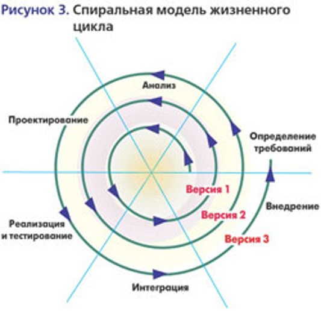
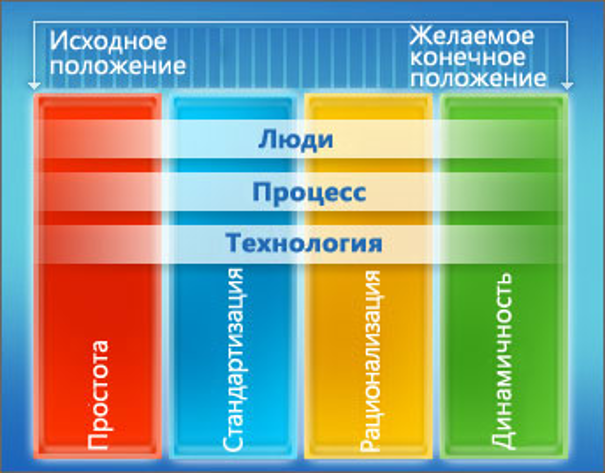
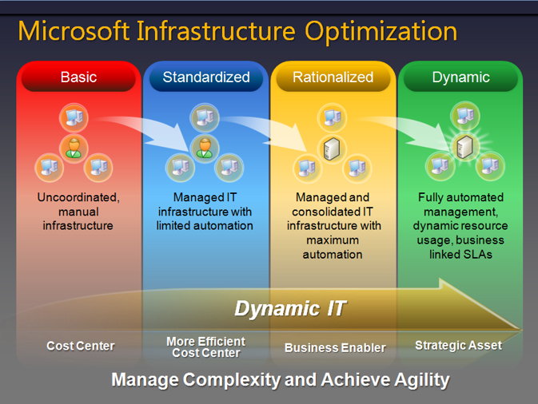
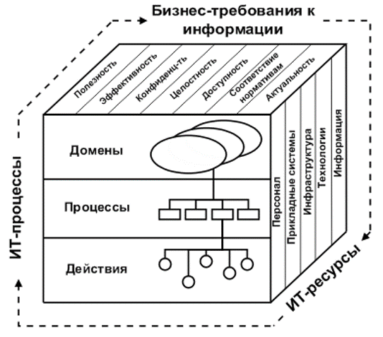
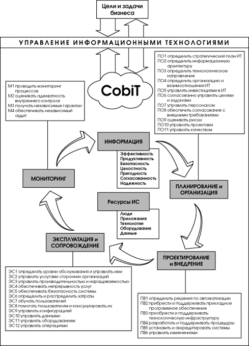
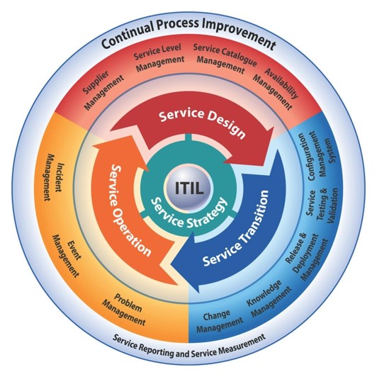
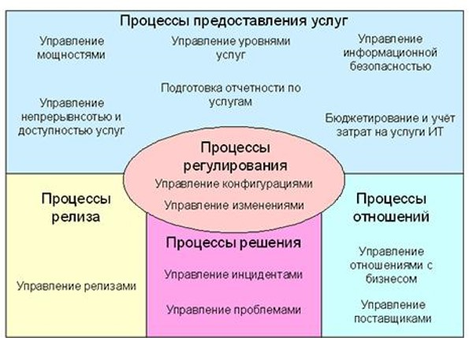
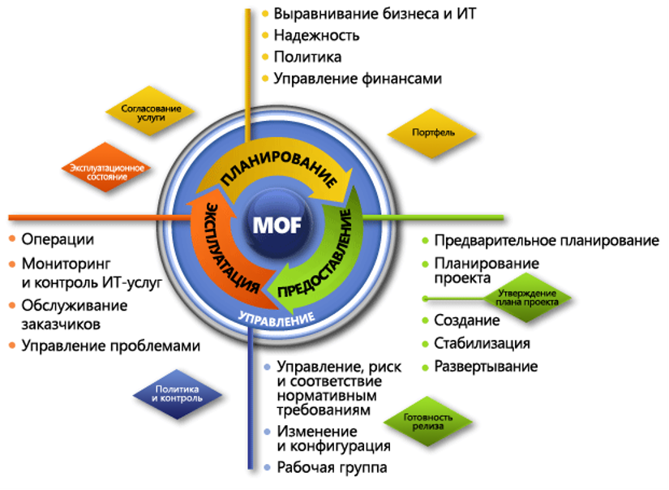

# Лекция 1, 12.09.18

**Структуреые свойства системы:**
- **целостность** - первичность целого по отношению к частям
- **неаддитивность** - несводимость свойств системы к сумме ее свойств состовляющих ее компонентов
- **иерархичность** - каждый компонент может рассматриваться как систему более широкой глобальной системы

**Функциональные свойства:**
- **Синергичность** — целенаправленность действий компонентов усиливает эффективность функционирования системы. Приоритет интересов системы более широкого (глобального) уровня перед интересами её компонентов.
- **Эмерджентность** — цели (функции) компонентов системы не всегда совпадают с целями (функциями) системы.
- **Мультипликативность** — и позитивные, и негативные эффекты функционирования компонентов в системе обладают свойством умножения, а не сложения.
- **Адаптивность** — стремление к состоянию устойчивого равновесия, которое предполагает адаптацию параметров системы к изменяющимся параметрам внешней среды (однако «неустойчивость» не во всех случаях является дисфункциональной для системы, она может выступать и в качестве условия динамического развития).

### Модели жизненного цикла ИС

### Модель Microsoft Infrastructure Optimization

## COBIT
Control Objectives for Information and Related Technology 

**COBIT** – подход к управлению информационными технологиями, созданный Ассоциацией контроля и аудита систем (Information Systems Audit and Control Association - ISACA) и Институтом руководства ИТ (IT Governance Institute - ITGI) в 1992 году. Он предоставляет менеджерам, аудиторам и ИТ пользователям набор утверждённых метрик, процессов и лучших практик с целью помочь им в извлечении максимальной выгоды от использования информационных технологий и для разработки соответствующего руководства и контроля ИТ в компании. 

### Идеология:
**Цель:** Исследовать, разрабатывать, рекламировать и продвигать авторитетный современный международный набор общепринятых документов для целей управления и контроля для ежедневного использования менеджерами и аудиторами.

**CobiT** – процессно-ориентированный стандарт, ориентированный скорее на управление/аудит процессов ИТ, чем на управление/аудит конкретных функций или приложений. 

Методология основана на показателях (модели зрелости, показатели эффективности для ИТ)

Стандарт Cobit ориентирован прежде всего на руководителей предприятий, ИТ менеджеров, и владельцев бизнес-процессов.

### Ключевые области управления ИТ:
- **Соответствие стратегии** делает акцент на связи между планами бизнеса и ИТ; выявлении, поддержке и контроле за ценностным предложением ИТ; а также на соответствии ИТ и бизнес операций.
- **Полезность** представляет собой реализацию ценностного предложения, контроль за тем, чтобы ИТ обеспечивали определенные стратегией преимущества, сосредоточение на оптимизации затрат и подтверждение подлинной ценности ИТ.
- **Управление ресурсами** посвящено вопросам, связанным с управлением критичными ИТ ресурсами, а именно, оптимизацией инвестиций и должному руководству приложениями, информацией, инфраструктурой и персоналом. Ключевые вопросы касаются оптимизации знаний и инфраструктуры.
- **Управление рисками** требует осведомленности высшего руководства в области рисков, четкого понимания корпоративного подхода в их отношении, соответствия требованиям прозрачности в отношении существенных рисков, включения функции или системы управления рисками в практику организации.
- **Оценка эффективности** представляет собой контроль за реализацией стратегии, результатами проектов, использованием ресурсов, эффективностью процессов и сервисным обслуживанием. Для этого применяются, в частности, системы сбалансированных показателей, которые преобразуют стратегию в последовательность действий, результаты которых измеряются иными, по сравнению с бухгалтерским учетом, методами.

### Основные домены
- Планирование и организация
- Приобретение и внедрение
- Предоставление и поддержка
- Мониторинг и оценка

### Куб COBIT

### Cobit

## ITIL
**ITIL** - IT Infrastructure Library (библиотека инфраструктуры информационных технологий) — библиотека описывающая лучшие из применяемых на практике способов организации работы подразделений или компаний, занимающихся предоставлением услуг в области информационных технологий.

Библиотека ITIL разработанная во второй половине 80-х годов по указанию Британского правительства, на сегодняшний день стала стандартом де-факто в сфере управления ИТ, обобщив в себе лучший международный опыт накопленный ведущими компаниями мировой ИТ-индустрии.

ITIL служит основой для организации сервисного подхода в руководстве информационными технологиями. Концепция ITIL делает акцент на необходимости непрерывного измерения и усовершенствования качества предоставляемых сервисов, как с точки зрения бизнеса, так и с точки зрения клиентов. Этот акцент на постоянном измерении считается главным фактором международного успеха ITIL.

Организациям применение методов и процессов ITIL дает неоспоримые **преимущества**:
- Повышение удовлетворенности пользователей и клиентов услугами ИТ;
- Улучшение доступности сервисов, ведущее косвенно или явно к увеличению прибыли и доходов бизнеса;
- Финансовая экономия за счет улучшения использования и управления ресурсами; уменьшения потерянного времени и количества переделок;
- Уменьшение времени вывода на рынок новых продуктов и услуг;
Совершенствование процесса принятия решений и оптимизации рисков.

### ITIL v3
В 2007 вторая версия ITIL была заменена расширенной и консолидированной третьей версией ITIL (ITIL V3). В ITIL V3 упор сделан не на отдельные процессы, а на их создание, поддержку, развитие и усовершенствование, т.е. на весь жизненный цикл. Ядро новой версии состоит из пяти книг, описывающих жизненный цикл сервисов:
- «Service Strategy» («Стратегия сервиса»);
- «Service Design» («Проектирование сервиса»);
- «Service Transition» («Внедрение сервиса»);
- «Service Operation» («Эксплуатация сервиса»);
- «Continual Service Improvement» («Непрерывное улучшение сервиса»).

Третья версия также включает книгу «Introduction to ITIL Service Management Practices» («Введение в практику управления сервисами»).

## ISO 20000:2011
**ISO 20000** - первый международный стандарт для управления и обслуживания IT сервисов. 
Ключевым новшеством ISO 20000-1:2011 можно считать появление понятия — service  management  system  (система  управления услугами). 

**Service management system (SMS)** — это система управления, направляющая и контролирующая действия по управлению услугами сервис-провайдера. 

Причем четко разделяются понятия система управления услугами, процессы управления услугами и сами услуги. 
Важно понимать, что система управления услугами — это следующий уровень управления, расположенный выше процессов администрирования  и  управления технологическими  компонентами  ИТ-инфраструктуры.  
Это отдельная группа процессов, как операционных, так и тактических которые определяют, как  будут  управляться  услуги  и  как  сделать  эти  услуги  надежными,  качественными  и предсказуемыми. 

## MOF
**Модель Microsoft® Operations Framework (MOF)** состоит из набора взаимосвязанных «рекомендованных практик», основополагающих принципов и процедур, которые вместе предоставляют полные руководства по достижению надежности ИТ-решений и услуг.

MOF состоит из инструкций в форме вопросов, помогающих определить, что необходимо ИТ-подразделению сегодня, а также мероприятия, которые позволят ему эффективно и результативно работать в будущем.
Инструкции в Microsoft Operations Framework охватывают все действия и процессы управления ИТ-услугами: планирование, разработка, использование, обслуживание и вывод из эксплуатации. 
В модели MOF эти действия и процессы упорядочены в виде функций управления ИТ-услугами (SMF-функций), которые группируются по этапам, отражающим жизненный цикл ИТ-услуги. 
Каждая SMF-функция относится к определенному этапу жизненного цикла и обладает уникальным набором целей и результатов, отвечающих предназначению этого этапа. 

Руководства написаны для разных целевых аудиторий: директоров по ИТ, руководителей ИТ-подразделений и ИТ-специалистов:
- Обзорные руководства предназначены для директоров по ИТ, которым необходимо получить «общую картину» модели.
- Функциональные руководства, содержащие обзорную информацию и описание рабочих процессов, помогут руководителям ИТ-подразделений изучить стратегии предоставления ИТ-услуг.
- Функциональные руководства, с подробным перечнем действий, рассчитаны на ИТ-специалистов, занимающихся применением модели MOF на практике.

## ITSM (IT Service Management)
**ITSM** – относительно новая концепция управления ИТ-подразделениями. Суть ITSM заключается в необходимости перехода от традиционной модели, где главная цель - это собственно поддержка ИТ инфраструктуры, к схеме, ориентированной на обслуживание основного бизнеса компании. 

**Важнейшая составляющая реализации ITSM** – разработка формализованных процессов ИТ отдела. Для каждого процесса определяется последовательность выполнения работ, необходимые ресурсы и затраты времени, средства автоматизации и контроля качества. Кроме того, если процесс чётко определен и документирован, включая входные параметры и результаты выполнения, можно измерить его производительность. Это особенно важно, когда перед ИТ отделом стоит задача реализации сервиса заданного качества за определённую стоимость. А это позволит совершенствовать процесс и вносить необходимые изменения в упреждающем режиме – ещё до того, как произошёл сбой в реализации сервиса.

ITSM не касается подробностей и деталей технического управления процессами, управление ИТ сервисами направлено на обеспечение реализации бизнес-процессов и на структурирование внутренней организация работы и деятельности ИТ-подразделения.
Реализация ITSM также включает в себя формализацию регламентов работы сотрудников и подразделений ИТ, определение зон ответственности и полномочий персонала, критерии качества работы и формирование механизмов контроля и мониторинга состояния процессов.

### Процессы управления ITSM:
- инцидентами
- проблемами
- конфигурациями
- изменениями
- релизами
- уровнем услуг
- мощностями (емкостью)
- доступностью
- непрерывностью
- финансами

