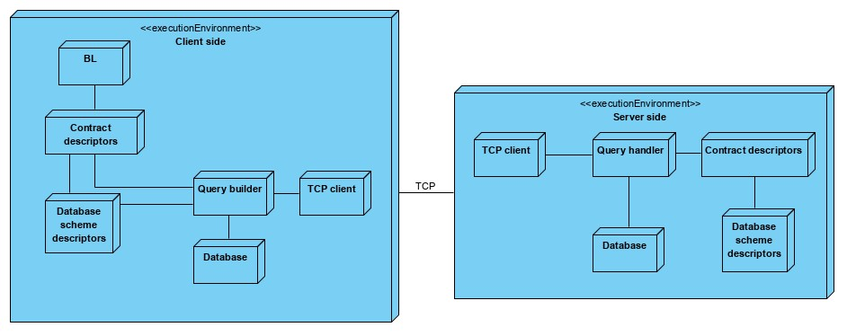
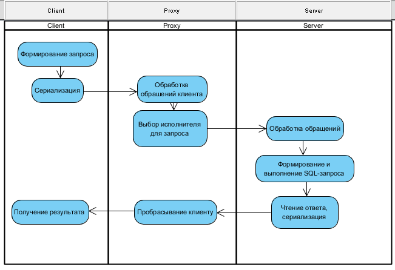
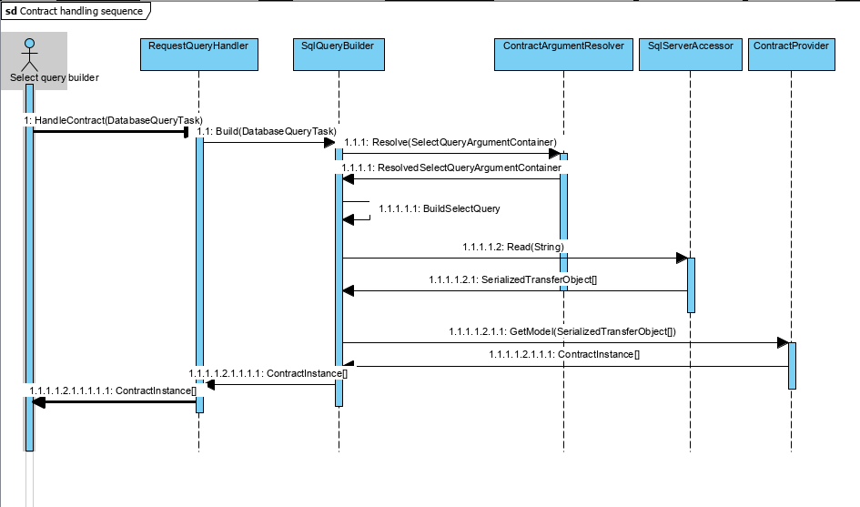
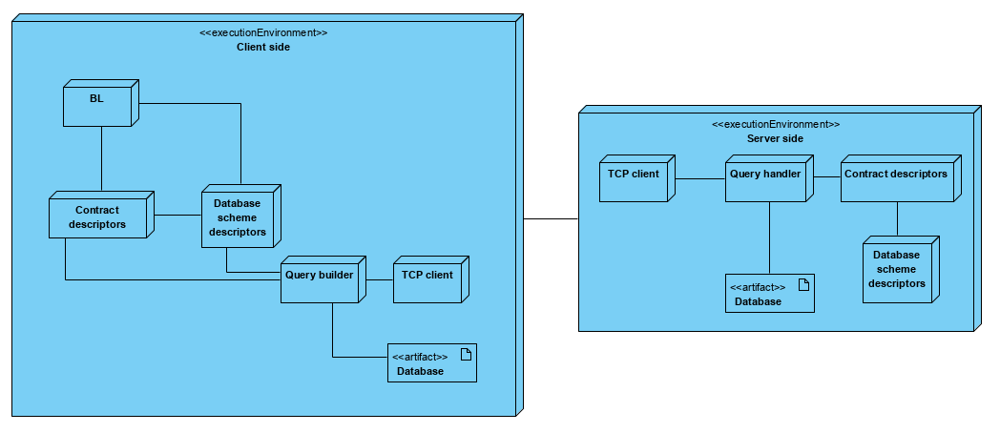

# Аннотация к ВКР

### студент группы M3405, Ивницкий Алексей

1. Предварительная формулировка темы:

Проектирование контрактно-ориентированной модели взаимодействия с базой данных в клиент-серверной архитектуре

2. Компания, в которой осуществляется преддипломная практика:

Veeam

3. Фамилия, имя, отчество и должность консультанта в компании:

[Данные удалены]

4. Цель ВКР:

Разработка библиотеки для реализации контрактно-ориентированной модели архитектуры, реализация соответсвующего модуля для использования в клиент-серверной архитектуре. Интеграция с текущими решениями в продукте Veeam Backup and Replication

5. Краткое описание прикладного процесса, для автоматизации которого будет использован разрабатываемый компонент:

Процесс, который будет автоматизирован компонентом - взаимодействие клиента с данными локальной базы и серверной базой через API. Технологическая платформа - экосистема продуктов Veeam Backup and Replication. Итоговое решение должно предоставляться как библиотеки для других проектов, а также интегрироваться с существующими способами взаимодействия этих же продуктов.

6. В каком объеме предоставлена информация для выполнения ВКР:

Техническое задание от консультанта, техническая документация на платформу и корпоративные стандарты разработки

7. Функциональные требования к разрабатываемому компоненту:

- Создание слоя абстракции для взаимодействия бизнес логики и логикой получения данных с базы данных. Итоговое решение должно разрешить проблему унификации работы с данным в сценариях, когда есть больше одного способа их получения:
  - обращение к локальной базе на стороне клиента
  - запрос данных с внешней базы данных, которая находится на удаленном сервере без написания дополнительной логики
  - отправка запроса серверу через прокси - реализация возможности прокидывать полученный запрос через несколько узлов.
- возможность модификации запроса на стороне сервера. Основная цель данного механизма - принудительно фильтровать только те данные, которые принадлежат клиенту, который запрос отправляет. Например, в случае если это база данных социальной сети, то запрос клиента на получение всех групп должен возвращать только те группы, которые открытые или к которым он имеет доступ.
- Использование трогой типизации при работе между C# и SQL. Обычно, если в проекте не используется ORM, то участки кода где передаются аргументы в запрос или читается ответ от сервера - являются потенциально багоопасными. Частые проблемы, которые нельзя выявить на этапе компиляции, только во время выполнения:
  - аргумент в процедуру передается с неправильным именем. Довольно часто это может быть miss-spell или невнимательность ("objectId" и "object_id").
  - нет проверки на то, какой тип ожидается как аргумент или какой тип вернулся в ответ на запрос.
- Разработка инструментов для кодогенерации инфраструктурного кода на основе уже существующей базы данных.

1. Описание технологий, каркасов, СУБД, библиотек, готовых компонентов, и др., которые будут использованы при разработке:

Используемые языки: C#, T-SQL. Фреймворк - .NET Standard/Framework. Библиотеки - ADO.NET, Roslyn. СУБД - MSSQL.

9. Описание методов тестирования и оценки качества разработанного компонента:

Юнит-тестирование логики компонента, интеграционное тестирование Veeam Backup and Replication с использованием разработанного компонента.

10. Описание ожидаемых результатов работы с обязательным указанием формы их представления:
    1. 
    2. .jpg)
    3. 
    4. 
    5. 