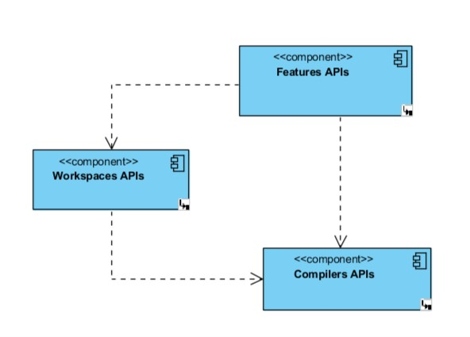
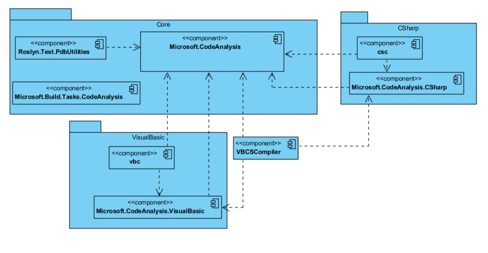
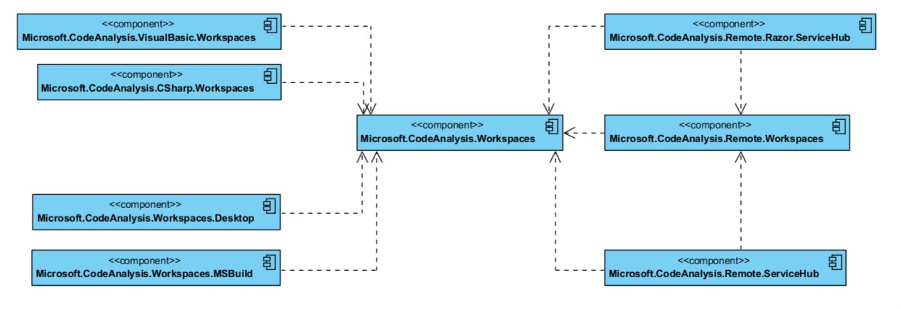
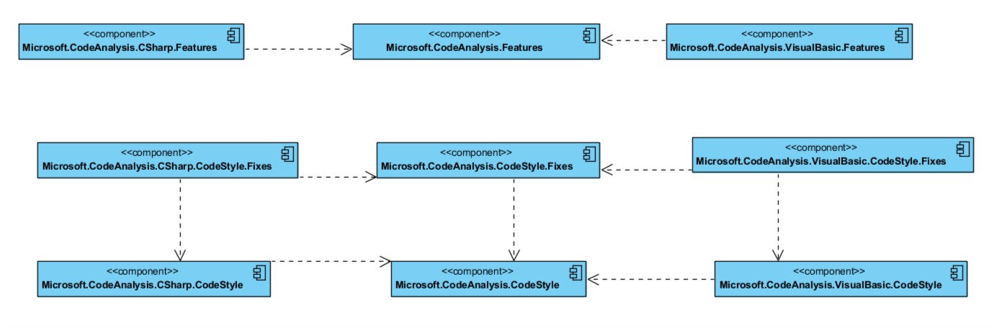

# Теоретический этап

**Солюшен** - иммутабельная модель проектов и документов которая представляет собой экземпляр типа Microsoft.CodeAnalysis.Solution. Ввиду иммутабельности безопасными являются операции работы без использования блокировок. [1, c. 36]

**Проект** - имутабельный экземпляр типа Microsoft.CodeAnalysis.Project. Это коллекция всех исходных документов, assembly references, ссылок между проектами, настройками парсинга и компиляции. С проекта можно получить информацию про компиляцию без необходимости парсинга исходного кода и итерированию по ссылкам на другие проекты. Также, там имеется информация о solution
name, assembly name, version, and output file path. [1, c. 36]

**Документ** представляет единый файл исходного кода и является экземпляром типа Microsoft.CodeAnalysis.Document. Он дает доступ к исходному тексту файла и элементам синтаксического дерева и семантической модели. [1, c. 36]

**Символы**: Program database (.pdb) или файлы символов - соответствие идентификаторов и statements в исходном коде проекта к соответствующим идентификаторам и инструкциям в скомпилированом приложении. [7]

# Анализ и моделирование процессов

Roslyn - компилятор исходного кода .NET, который предоставляется в рамках CaaP (Compiler-as-a-Platform). Является проектом Microsoft с открытым исходным кодом. Таргетными языками являются C# и VB, который используют .NET в качестве среды выполнения.

Основная идея проекта заключалась в раскрытии процесса компиляции, предоставление доступа пользователям к нему.

# TODO: Use-case
# Функциональные требования

# Анализ средств автоматизации ИТ-процессов

## The Compiler APIs [1, с. 35]

Compiler APIs layer предоставляет объектную модель связанную с синтаксической и семантической информацией, которые представлены на каждом шаге пайплайна компилятора.  Этот слой также включает иммутабельные снапшоты каждого вызова компилятора  which includes assembly references, compiler options, and source code files. Существуют два отдельных Compiler APIs для C# и VB, которые очень схожие, но имеют особенности в соответствии каждому языку. Этот слой имеет фундаментальную особенность - в нем нет никаких зависимостей к компонентам Visual Studio, а значит его можно использовать in stand-alone applications.

### Diagnostic APIs [1, с. 35]
Когда компилятор анализирует код с целью иной нежели генерация асемблеровского кода, он может также генерировать набор diagnostics, которые покрывают синтаксис и семантику, сообщать об ошибках, предупреждениях или информации по каждой code issue.
Эти diagnosticsare exposed Compiler APIs с помощью Diagnostic APIs, extensible набором APIs, который позволяет разработчикам интегрировать кастомные analyzers and diagnostics в процесс компиляции alongside compilerdefined diagnostics. Таким образом, этот набор APIs может быть интегрировать с тулзами а-ля MSBuild и Visual Studio, которые используют Diagnostic APIs для демонстрации live squiggles, останавливать сборку на ошибках, предложить code fixes

### Scripting APIs [2, с. 432] + [4] + [6]

Hosting and scripting APIs are part of the compiler layer. You can use them for executing code snippets and accumulating a runtime execution context. The C# interactive REPL (Read-Evaluate-Print Loop) uses these APIs. The REPL enables you to use C# as a scripting language, executing the code interactively as you write it.

## The Workspaces APIs [1, с. 36]

Workspaces APIs представляет собой отправную точку для выполнения анализа кода и рефакторинга по солюшену и проекту. Этот слой organize всю информацию про проекты в солюшене в одну объектную модель и предоставляет прямой доступ к объектной модели компилятора. Таким образом, не нужно парсить файлы исходного кода, настраивать опции компилятора или управлять проектами и их зависимостями.

Этот слой не имеет зависимостей от компонентов VS, но представляет общий набор APIs host environments, которые IDE может использовать  to implement code analysis, code refactoring, code formatting and colorization, and more.

For instance, Visual Studio 2015 uses these APIs to implement the Find All Reference and Document Outline windows, format and colorize source code in the editor, and perform code generation. The .NET Compiler Platform exposes the Workspaces APIs via specific .NET objects, which are described in the next section and reexamined in Chapter 8 with more examples.

## Компоненты Compiler APIs [3, с. 35]
Пайп-лайн процесса компиляции.

Элементы Compiler APIs можно представить в виде пайплайн, упорядоченных по порядку использования в процессе модулей. 
Процесс компиляции:
- По средствам syntax API реализуется взаимодействие с парсером. This will be the main driver for generating
code
- Символы и мета-дата генерируются по средствам Symbol API и предоставляют мета-дату уже скомпилированного кода
- Binding and flow analysis. API exposes the result of the compiler doing the semantic analysis of the code and can be helpful in understanding the inner workings of the code logic and dependencies
- Emit API exposes the error messages if there are any, as well as the IL created for the assembly.

Соответствие фичей и уровням
- Синтаксическое дерево: форматирование, подсветка
- Апи символов: Перейти к, обозреватель объектов
- Биндинг и анализатор потоков: ..
- Эмит апи: edit and continue

### Syntax API [3, с. 48]
Первый этап компиляции - парсинг строки иходного кода в токены таргетного языка. (keywords, identifiers, operators, etc). Эти токены не имеют семантического смысла и d there is no context to understand how these tokens will interact and be used.
# TODO: CSharpSyntaxTree.ParseText + class Walker : CSharpSyntaxWalker

### Symbol API [3, с. 42]
Результат обработки Syntax API является входными данными для Symbol API. В отличии от Syntax API, Symbol API требует некий контекст для понимания различных токенов, которые были спаршены. Контекст, который будет предоставляться включает коллекцию синтаксических деревьев, коллекцию асслемблеровских ссылок, potentially compiler options.

### Binding and Analysis API [3, с. 46]
По аналогии с Symbol API,  Analysis API зависит от предыдущего шага пайп-лайна. Данный слой именуется Binding потому, что на этом этапе учитывается вся информация, которую Roslyn знает о коде над которым работает после биндинга синтаксического дерева к символам.

### Emit API [3, с. 47]
Emit API позволяет emit assembly, которые создаются во время компиляции.

# Список литературы
1. Alessandro Del Sole - Roslyn Succinctly
2. Manish Vasani - Roslyn Cookbook
3. Nick Harrison - Code Generation with Roslyn
4. The .NET Compiler Platform SDK [Электронный ресурс] -
https://docs.microsoft.com/en-us/dotnet/csharp/roslyn-sdk/
5. dotnet/roslyn [Электронный ресурс] - https://github.com/dotnet/roslyn
6. Mark Michaelis - Essential .NET - C# Scripting [Электронный ресурс] - https://msdn.microsoft.com/en-us/magazine/mt614271.aspx
7. Specify symbol (.pdb) and source files in the Visual Studio debugger [Электронный ресурс] - https://docs.microsoft.com/en-us/visualstudio/debugger/specify-symbol-dot-pdb-and-source-files-in-the-visual-studio-debugger