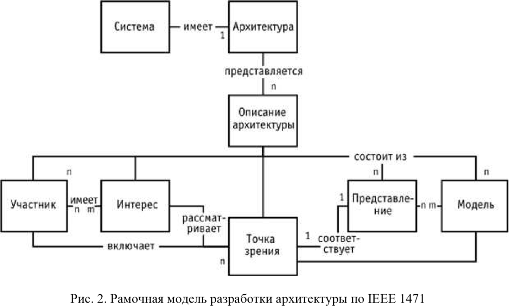

# Глава 1. Основы управления ИС

## 1.1. Основные определения

Проблемы организации при использовании ИС:
- «Зоопарк» информационных систем: использование множества различных информационных систем, иногда дублирующих друг друга
- Проблема «лоскутной» автоматизации: в организации возникают функциональные «островки» автоматизации, которые не связаны между собой
- Отсутствие качественного документирования существующих решений: организации из-за некачественного документирования внедренной информационной системы, то есть невозможности ее качественной поддержки и внесения в нее изменений, через некоторое время отказывались от ее использования и начинали внедрение нового решения. 

**Информация** - сведения об окружающем мире мире которые уменьшают имеющуюся степень неопределенности, неполноты знаний, отчужденные от их создателя и ставшие сообщениями, которые можно воспроизвести путем 
передачи устным, письменным или другим способом.

**Информационные технологии** (ИТ, ИКТ) - приемы, способы и методы применения средств вычислительной техники для сбора, хранения и обработки и использования данных. [прим. ГОСТ 34.003-90]
В более общем понимании - это широкий класс дисциплин и областей деятельности, относящихся к технологиям управления и обработки данных, а также создания данных, в том числе, с применениям вычислительной техники.

**Информационная система**  - среда, обеспечивающая целенаправленную деятельность организации. Т.е. она представляет собой совокупность таких компонентов как информация, процедуры, персонал, аппаратное и программное обеспечение, объединенных регулируемыми взаимоотношениями для формирования организации как единого целого и обеспечения её целенаправленной деятельности.

## 1.2. Применение системного подхода в управлении информацией и информационными технологиями

В настоящее время на первый план выходит умение менеджеров управлять процессами планирования, создания, эксплуатации и мониторинга информационных систем организации в соответствии с ее стратегией:
- Информация - материальный актив
- Компьютеры и электронные коммуникации — это лишь инструменты, помогающие работать с информацией
- Работники, занятые сбором, обработкой и использованием информации, легче распознают дисфункциональность информационного поведения менеджеров, не согласующегося с заявленными целями компании или ее установками и стилем

**Управление информационными системами:**
- применение методов управления процессами планирования, анализа, дизайна, создания, внедрение и эксплуатация ИС организации для достижения ее целей. [ГОСТ РВ 51987-2002].
- структура взаимоотношений и процессов выбора вектора развития предприятия и его управления, направленных на увеличение его стоимости при сбалансированном риске в сфере информационных и смежных технологий. [CobiT]

Для освоения и реализации и реализации системного управления и контроля структуры ИС необходимо:
- ссылаться на бизнес-требования;
- сделать действия по этим требованиям прозрачными;
- свести свои действия к общепринятым моделями процессов;
- определить основные ресурсы, которые следует развивать;
- определить цели администрирования контроля для уточнения.

## 1.3. Основные требования к структуре управления и контроля информационной системы

Структура управления и контроля ИС должна соответствовать следующим требованиям:
- обеспечивать фокус приложения усилий управления ИС таким образом, чтобы постоянно иметь соответствие между целями организации и целями ИТ-сервисов;
- ориентировать процесс таким образом, чтобы определить диапазон и масштаб сферы действия; организовать структуру обеспечивающую простую ориентацию
- соответствовать лучшим практикам ИС и ИТ, а также, стандартам и не зависеть от специфичных технологий
- поддерживать общепринятый язык с терминами и определениями, понятный всем заинтересованным людям
- выполнять нормативные требования в соответствии с общепринятыми корпоративными стандартами управления `(например COSO)` и ИТ-контроля, чего ожидают руководители и внешние аудиторы

**Бизнес требования к информации** (критерии, которым должна соответствовать информация для достижения целей организации):
1. **Результативность** - определяется информацией, которая относится к административному или бизнес процессу и которая представлена своевременно, корректным, приемлемым способом.
2. **Эффективность** - определяется предоставлением информации при оптимальном использовании ресурсов
3. **Конфиденциальность** - определяет защиту информации от неавторизованного доступа
4. **Целостность** имеет отношение к корректности    и полноте информации, а так же к ее достоверности в соответствии с ожиданием бизнеса
5. **Доступность** имеет отношение к доступности информации в случае необходимости для административных и бизнес-процессов. Она также касается защиты необходимых ресурсов и связанных с ними возможностей
6. **Согласованность** - соответствие тем законам, нормам и договорным соглашениям, которым подчиняется организация т.е. внешне наложенным критериям деятельности, а также внутренним политикам
7. **Надежность** определяется предоставлением руководству информации, необходимой для управления объектом и осуществлении его управленческих обязанностей

## 1.4. Управление ресурсами информационной системы 

Для достижения поставленных целей организация должна инвестировать в ресурсы, требуемые для создания соответствующих технических возможностей. 
**ИТ-ресурсы ИС** могут быть описаны следующим образом: 
- приложения – это автоматизированные пользовательские системы, а также ручные процедуры, которые собирают, хранят, обрабатывают и распространяют информацию
- информация – это данные во всех формах ввода, хранения, обработки и вывода с помощью информационных систем, в любых формах, которые используются для принятия управленческих решений и обеспечения операционной деятельности организации
- инфраструктура – это средства (аппаратное обеспечение, операционные системы, системы управления базами данных, сеть, мультимедиа и др., а также среда, в которой все это находится и поддерживается), которые делают возможным работу приложений;
- люди – персонал, имеющий необходимые навыки и мотивацию, требуемый для планирования, организации, проектирования, обеспечения (необходимыми средствами), доставки, поддержки, мониторинга и оценки информационных систем и услуг

Для достижения целей организации, происходит управление вышеперечисленными ресурсами в четырех основных сферах: 
1. Планирование и организация 
    Покрывает стратегию и тактику, а также занимается идентификацией способа, с помощью которого ИС может наилучшим образом содействовать развитию целей организации.
    - Согласованы ли стратегии ИТ и организации?
    - Удается ли организации оптимально использовать свои ресурсы?
    - Все ли в организации понимают цели ИТ?
    - Понимают ли в организации ИТ-риски и управляют ли ими?
    - Соответствует ли качество ИС текущим и будущим потребностям организации?
2. Проектирование и внедрение 
    ИТ-решения должны быть идентифицированы, разработаны и созданы, а также введены в действие и интегрированы в административные или бизнес-процессы.
    - Какова вероятность того, что новые проекты позволят создать решения, соответствующие потребностям организации? 
    - Какова вероятность того, что новые проекты будут выполнены своевременно и в пределах бюджета?
    - Будут ли новые системы работать должным образом после внедрения? 
    - Будут ли вноситься изменения без нарушения текущих операций?
3. Эксплуатация и сопровождение
    Данная область связана с фактическим предоставлением требуемых информационных услуг, которые включают услуги доставки необходимой информации, управления безопасностью и непрерывностью, услуги поддержки пользователей, а также управление данными и операционными средствами.
    - Предоставляются ли информационные услуги в соответствии с приоритетами организации? 
    - Оптимальна ли стоимость используемых ИТ? − Способен ли персонал использовать ИТ-системы продуктивно и безопасно? 
    - В достаточной ли степени обеспечивается конфиденциальность, целостность и доступность информации? 
4. Мониторинг и оценка
    Данная область рассматривает осуществление управления, мониторинга внутреннего контроля, регуляторную согласованность и обеспечение управления.
    - Рассчитана ли работа ИТ на своевременное выявление проблем?
    - Гарантирует ли управление результативность и эффективность внутреннего контроля?
    - Может ли работа ИТ быть связана с целями организации?
    - Измеряются ли риск, контроль, результативность и эффективность и сообщается ли о результатах заинтересованным сторонам? 

### Открытые вопросы:
1. **Информационная система: определения, компоненты**
    **Информационная система** - среда, обеспечивающая целенаправленную деятельность организации.
    - информация
    - процедуры
    - персонал, 
    - аппаратное и программное обеспечение

2. Актуальность изучения и решения проблем развития ИС предприятий
    - «Зоопарк» информационных систем: использование множества различных информационных систем, иногда дублирующих друг друга
    - Проблема «лоскутной» автоматизации: в организации возникают функциональные «островки» автоматизации, которые не связаны между собой
    - Отсутствие качественного документирования существующих решений: организации из-за некачественного документирования внедренной информационной системы, то есть невозможности ее качественной поддержки и внесения в нее изменений, через некоторое время отказывались от ее использования и начинали внедрение нового решения. 

## **TODO**:
***
3. Связь между информационными потребностями бизнеса и возможностями информационных технологий 
***

4. Подходы к управлению информационными системами предприятия
    - Планирование и организация
    - Проектирование и внедрение
    - Эксплуатация и сопровождение
    - Мониторинг и оценка

## Вопросы с вариантами ответа
1. **Целью создания и развития ИС организации должно является:**
2. **Данные:**
    Сведения об окружающем мире мире которые уменьшают имеющуюся степень неопределенности, неполноты знаний, отчужденные от их создателя и ставшие сообщениями, которые можно воспроизвести путем 
передачи устным, письменным или другим способом.
3. **Информационная система организации**
    Взаимосвязанная совокупность средств, методов, человеческих и др. ресурсов, используемых для достижения цели.

## **TODO**:
***
4. **Программное обеспечение, как составляющая ИС, должно быть отнесено**
***

5. **Наибольшие потенциальные выгоды от применения ИТ связаны с:**
    Более качественной информационной поддержкой существующих бизнес-процессов
6.  **Руководитель, оценивая результаты создания системы, ПРЕЖДЕ ВСЕГО, должен обратить внимание на:**
    Степень достижения поставленных целей
7. **Проект внедрения информационной системы может считаться завершенным в момент:**
    Достижения целей внедрения 
8. **При разработке стратегического плана развития (или перспективной архитектуры) информационных систем организации необходимо учитывать, в первую очередь:**
    Выявленные потребности пользователей и особенности имеющейся ИТ-инфраструктуры 
9.  **НАИБОЛЕЕ корректным примером формулировки задачи ИТ отделу от бизнес-подразделения может быть:**
    Выбор оптимального программно - технического решения для поддержки уже оптимизированного бизнес-процесса

# Глава 2. Архитектура информационных систем

**Архитектурный подход** - комплексный подход, применение которого позволяет повысить результативность, эффективность, масштабируемость, управляемость, безопасность проектов создания больших информационных систем и предсказуемость их результатов.
**Архитектура информационной среды** - совокупность описаний всех аспектов и точек зрения информационных систем, которые используются при архитектурном подходе.

## 2.1. Архитектура информационной системы

**Различные аспекты понятия архитектуры ИС:**
- Системная архитектура (архитектура систем – System Architecture)
- программная архитектура (архитектура программного обеспечения – Software Architecture)

Термин **системная архитектура** имеет разные значения:
- Архитектура ИС предприятия (в дополнение к бизнес-архитектуре)
- Технологическая инфраструктура информационной системы
- Архитектура сложного продукта или семейства продуктов, выпускаемых предприятием

Термин **программная архитектура**, в зависимости от контекста, может пониматься как:
- архитектура взаимодействия приложений в рамках информационной системы предприятия (архитектура приложений)
- архитектура программных модулей
- архитектура взаимодействия различных классов в рамках одного приложения

Для программной архитектуры традиционными являются следующие перспективы или уровни описания архитектуры:
- **концептуальная архитектура** определяет компоненты системы и их назначения, обычно в неформальном виде. Это представление часто используется для обсуждения с нетехническими специалистами, такими как руководство, бизнес-менеджеры и конечные пользователи функциональных характеристик системы (что система должна уметь делать, в основном, с точки зрения конечного пользователя);
− **логическая архитектура** выделяет, прежде всего, вопросы взаимодействия компонент системы, интерфейсы и используемые протоколы. Это представление позволяет эффективно организовать параллельную разработку; 
− **физическая реализация** описывает привязку к конкретным узлам размещения, типам оборудования, характеристикам окружения, таким как, например, используемые операционные системы.

## ГОСТ 34.320-96

Описание **архитектуры информационной системы**, которая состоит из трех уровней: внешняя схема, внутренняя схема и уровень концептуальной схемы, информационной базы и информационного процессора.

**Внешняя схема:** Определение форм внешнего представления для возможных совокупностей предложений в пределах представления конкретного пользователя, а также аспектов манипулирования этими формами.  
**Внутренняя схема:** Определение форм внутреннего представления в компьютере совокупностей предложений концептуальной схемы и информационной базы, а также аспектов манипулирования этими формами  
**Концептуальная схема:** непротиворечивая совокупность предложений, выражающих необходимые высказывания, относящиеся к проблемной области.  
**Информационная база:** совокупность предложений, выражающих высказывания, отличные от необходимых высказываний, согласующиеся друг с другом и с концептуальной схемой, а также истинные в некотором пространстве сущностей. 
**Информационный процессор**: процессор, который в ответ на команду выполняет действие над концептуальной схемой и/или информационной базой.

Аспекты понятия «информационная система» или «автоматизированная информационная система»:
- Целевой аспект - реализация процессов сбора, обработки, накопления, хранения, поиска и распространения информации в различных сферах деятельности (управление, проектирование, производство и т.д.) или в их сочетаниях
- Структурный аспект - комплексирование (объединение в комплексы) разнородных компонентов системы: программных, информационных, аппаратных, документов, пользователей
- Функциональный аспект - реализация информационной технологии в виде определенной последовательности информационно связанных функций, задач или процедур, выполняемых в автоматизированном (интерактивном) или автоматическом режимах;

**Автоматизированная информационная система (АИС)** представляет собой организационно-техническую систему, которая:  
1. предназначена для реализации процессов сбора, обработки, накопления, хранения, поиска и распространения информации в какой-либо сфере деятельности (управление, проектирование, производство и т.д.) или в их сочетаниях на основе применения компьютерных информационных технологий;  
2. строится из:  
    - комплекса средств автоматизации (программных, информационных и технических средств)
    - множества правовых, организационных, методических и технических документов
    - пользователей-специалистов, применяющих эти средства и документы в своей профессиональной деятельности
3. выполняет определенное множество информационно связанных функций, задач или процедур (управленческих, проектных, производственных и т.д.) в автоматизированном (интерактивном) или автоматическом режимах

Принципиально важным в стандарте **ISO 15704** является определение архитектур двух типов. «Архитектура — это описание (модель) основной компоновки и взаимодействия частей системы (будь то физический либо абстрактный объект или сущность). Имеется  два типа архитектур, относящихся к интеграции предприятий:
- архитектуры систем, которые имеют дело с конструкцией некоторой системы, например, компьютерной системы управления как части всеобъемлющей системы интеграции предприятия;  
- архитектуры (планы/проекты) предприятия, которые имеют дело с таким проектом, как интеграция всего предприятия, или с иной программой его развития».

## **TODO:**
***
В стандарте рассматриваются требования в первую очередь к архитектурам типа 2, которым соответствуют «референсные архитектуры и методологии».
Что такое "референсные архитектуры и методологии"?
***

## 2.2. Архитектурный подход к реализации информационных систем: понятия и определения
Отечественные стандарты и руководящие документы выделяют:
1. Виды структур ИС:
    - функциональная
    - техническая
    - организационная
    - программная
    - информационная  
2. Основные структурные компоненты ИС
    - пользователи
    - комплекс средств автоматизации
3. Виды обеспечения ИС
    - программное
    - информационное
    - техническое
    - организационное
    - методическое
    - математическое
    - лингвистическое
    - правовое
    - и др.;  
- необходимость выделения структуры функциональных систем и подсистем ИС, описания состава и характеристик автоматизируемых функций и задач ИС.

**COBIT** определяет не определяется и не используется термин «архитектура системы», но определяется и используется термин «ИТ-архитектура». **ИТ-архитектура** – интегрированная структура для развития и поддержки существующих и приобретаемых новых информационных технологий, обеспечивающих выполнение стратегии и достижение бизнес целей предприятия.

Согласно вышеприведенному определению, **ИТ-ресурсы**:
- **Приложения** – пользовательские программные системы, автоматизирующие обработку информации;  
- **Информация** – бизнес-данные в формах ввода, обработки и вывода их информационными системами;  
- **Инфраструктура** – технологии и оборудование (аппаратные вычислительные и коммуникационные средства, операционные системы, системы управления базами данных, средства мультимедиа, сооружения в которых установлены эти средства, инженерное оборудование мест инсталляции этих средств), делающие возможным функционирование приложений;  
- **Персонал** – люди (специалисты), требующиеся для планирования, организации, приобретения, установки, эксплуатации и развития информационных систем и сервисов, нанимаемые по контрактам или используемые как внешний ресурс (аутсорсинг)

