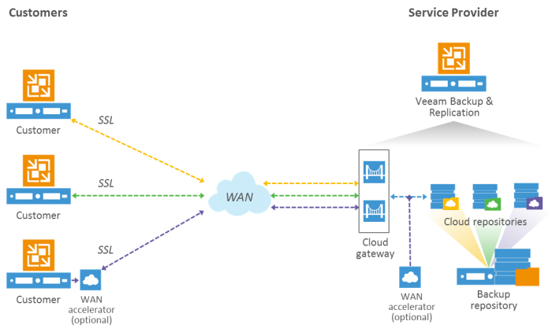
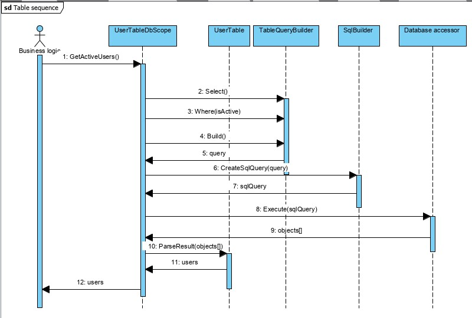
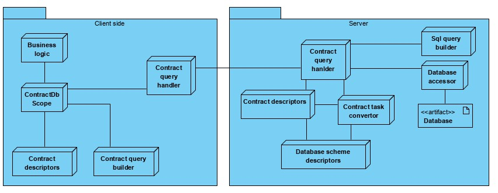
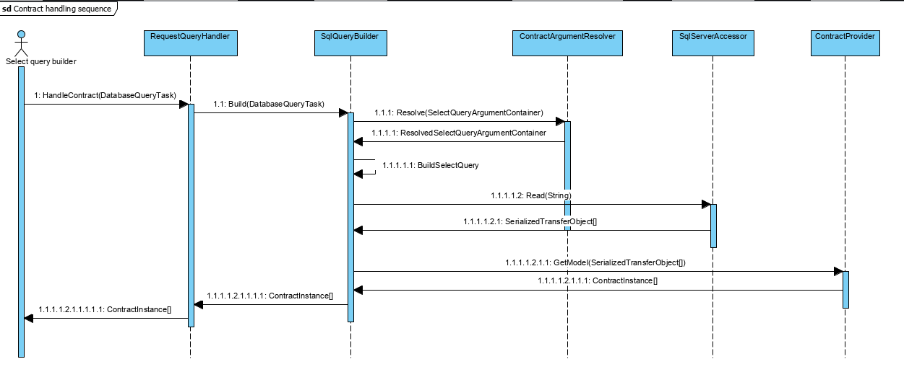
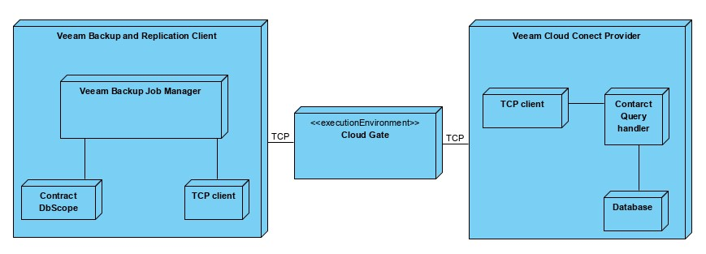

1. RPC
2. Написать где-то, что прокси может быть балансировщиком
3. Написать про сравнение с GraphQL
4. ПОдписать элементы UML
5. Убрать у базы артефакт
6. Описать про TCP и про безопасность
7. Выпилить все упоминания про прокси?
8. Написать что такое билдер

## Дипломная работа студента M3405, Ивницкого Алексея на тему "Разработка библиотеки для реализации контрактно-ориентированной модели взаимодействия с базой данных в клиент-серверной системе"

## План
0. Определения
1. Описание предметной области
   1. Особенности поддержки API в клиент-серверной архитектуре
   2. Модель клиент-серверного взаимодействия в продукте Veeam Backup and Replication
   3. Функциональные и не функциональные требования
   4. Существующие решения
2. Архитектура библиотеки 
   1. Новые компоненты системы
   2. Формат описания запросов
   3. Программная архитектура. Контрактно-ориентированное взаимодействие
   4. Интеграция с инфраструктурой Veeam Cloud Connect
   5. Стек технологий
3. Реализация
   1. Инфраструктурные компоненты модуля
   2. Механизм построения запросов
   3. Формат описания запросов
4. Кодогенерация инфраструктуры
   1. Roslyn
   2. Применение кодогенерации
   3. Использование SQL-скрипта для анализа схемы базы
   4. Использование метаинформация про базу данных для анализа схемы
   5. Кодогенерация инфраструктурных компонент
5. Литература

# Раздел 0. Определения
<!-- > TODO:1 Возможно, в тексте есть много англицизмов. Например - спека. Нужно будет потом вычитать. -->

> TODO: Дописать определения связанные с инфраструктурой Veeam: бекап, джоба, провайдер.

- .NET - платформа для разработки, включающая общеязыковую исполняющую среду (Common Language Runtime, CLR), которая управляет выполнением кода и обеспечивает создателей программ богатыми библиотеками классов для написания приложений. [@ПР, c. 48]
- .NET standard - это спецификация для набора API, который будет реализован всеми платформами .NET. .NET Standard 2.0 реализована в последних версиях .NET Framework, .NET Core и Xamarin. .NET Standard 2.0 добавляет многие из недостающих API, которые требуются разработчикам для портирования старого кода, написанного под .NET Framework, на платформу. [@ПР, с. 50-51]
- API - программный интерфейс приложения; описание способов (набор классов, процедур, функций, структур или констант), которыми одна компьютерная программа может взаимодействовать с другой программой.  
- СУБД
- Visual Studio - интегрированная среда разработки (IDE) предоставляемая Microsoft. Данная IDE разрабатывает во многом для фреймворка .NET и его языков (C++/CLI, C#, F#), но также имеет поддержку и тулзы для работы с SQL, Python, Javascript/Typescript, Java etc.  
- Код-стайл - набор правил и соглашений, используемых при написании исходного кода на некотором языке программирования.  
- Язык программирования - формальный язык, предназначенный для записи компьютерных программ  
- Компиляция – трансляция программы, составленной на исходном языке высокого уровня, в эквивалентную программу на низкоуровневом языке, близком машинному коду  
- VM: Virtual machine
- BaaS: Backup as a Service, as related to Veeam Cloud Connect backup services
- DRaaS: Disaster Recovery as a Service, as related to Veeam Cloud Connect replication services
- VBR: The Veeam Backup & Replication server
- NEA: Network extension appliance, the virtual appliance deployed by Veeam to manage networking for DRaaS
- SOBR: (Veeam) Scale-Out Backup Repository
- SP:


# Раздел 1. Описание предметной области
## 1.1 Особенности поддержки API в клиент-серверной архитектуре

> TODO: Расписать про клиент-серверную архитектуру - что это, особенности.

Несмотря на распространенность клиент-серверного подхода к проектированию систем, не существует общепринятого решения проблемы взаимодействия клиента и базы данных на сервере. Обрастая бизнес логикой, клиентская часть требует все более функционального интерфейса для получения данных - сущностей становится больше, с ложность фильтров повышается для минимизации потока передачи информации и нагрузки на передачу. Создаются ситуации, когда на клиенте нужно запросить какие-то данные, по определенным параметрам, но нужного API нет и все сводится к фильтрации на стороне клиента. Такая ситуация - результат ограничения, клиентская часть ограничена в функционале, она не может отправить оптимальный SQL запрос на сервер и получить нужные данные. Это обусловлено требованиями к безопасности - нельзя давать возможность присылать со стороны клиента произвольный SQL код. Если разрешить выполнять произвольный SQL-скрипт, то это создаст уязвимость системы, нарушение ее корректной работы, а также доступ к закрытым данным.

Из этого следует, что расширение бизнес логики ведет к увеличению количества методов в API. Это создается две проблемы - затруднение поддержки кодовой базы API и переусложненный процесс добавления функционала. Рассмотрим процесс добавления нового метода в типичную клиент-серверную архитектуру:
1. В условиях отсутствия ORM требуется добавить новую SQL-процедуру, которая реализует новую логику обращения к базе
2. Протаскивание вызова процедуры через слои абстракции сервера, добавление нового метода в API
3. Добавление логики обращения к новому методу API, его обработка 

## 1.2 Модель клиент-серверного взаимодействия в продукте Veeam Backup and Replication

<!-- Источник: https://vccbook.io/ -->

Veeam Cloud Connect - одна из технологий Veeam® Backup & Replication™, которая дает возможность сервис-провайдерам создавать и предоставлять удаленные репозитории для бекапов, услуги Backup as a Service (BaaS) и Disaster Recovery as a Service (DRaaS). Veeam Cloud Connect имеет модульную архитектуру и состоит из различных компонентов. Основным является 
Veeam Backup & Replication server, который управляет всеми конфигурациями и сохраняет их в локальных базу Microsoft SQL Server. Cloud Gateways - компоненты системы, которые управляют подключениями пользователей и перебрасыванием данных к VBR по TCP используя защиту SSL-сертификатами. Для хранения бекапов в инфраструктуре также должны быть созданные Backup repository. VBR поддерживает различные виды репозиториев: directly attached storages, network attached storages, ExaGrid, StoreOnce. Особенным видом репозиториев являются Cloud repository - это репозитории, которые регестрируются у пользователей при подключении к SP. Данный тип репозиториев позволяют создавать бекапы клиентам на один из обычных репозиториев на стороне SP. [VCC]



## 1.3 Функциональные и не функциональные требования

> TODO: Если утвердят внедрение PostgreSQL, то нужно добавить функциональное требование - возможность сменить базу с SQL Server на PostgreSQL

> TODO: Написать про UX - интерфейс модуля должен быть привычен пользователю, соотноситься с механизмом LINQ и Fluent interface.

> TODO: Написать про версионирование

<!-- Одним из решений проблемы описанной выше является создание механизма сериализации запроса на получение данных и реализация выполнения на удаленном узле. Иными словами, система должна уметь выражать запросы в виде сериализованного набора параметров. -->

В описанной выше архитектуре можно выделить два сценария: создание бекапа локально и на инфраструктуру SP. Алгоритмы процессинга в них не отличаются и большая часть функционала работает одинаково, за исключением того, что во втором сценарии часть операций выполняются локально, а часть удаленно. Данные про бекапы также хранятся по-разному - в базе на локальной машине с VBR или на сервере SP. А значит все алгоритмы должны уметь запрашивать данные двумя способами. Ввиду ряда ограничений и исторически сложившийся архитектуру такая возможность реализована за счет сильного дублирования кода, количество которого требуется сократить в рамках разработки модуля взаимодействия с базой данных. Можно выделить такие проблемы:
- Для каждого из сценариев нужно писать свою часть кода и добавление каждого нового запроса к данным в алгоритмы сопровождается протаскиванием этого во все реализации нового кода.
- Расширение бизнес-логики чревато очень резким увеличением кол-ва SQL-процедур. Это затрудняет поддержку и добавление поля в таблицу становится довольно затратным действием.
- Система была заточена под MSSQL, написано очень много несовместимого с другими SQL базами кода, но для дальнейшего развития требуется начать подготовку к переходу на разные базы данных, хотя бы на уровне отдельных компонент.

Из этого следует функциональное требование - возможность унифицировать код получения результата из базы данных для сценариев:
- работы VBR с локальным репозиторием и локальной базой данных
- работа VBR с использованием Cloud repository и взаимодействие с базой данных, которая находится на стороне SP.

Для поддержки возможности одновременной работы с SP многим пользователям, обработка запросов должна автоматически фильтровать сущности и позволять пользователю работать только с его бекапами. А значит еще одним функциональным требованием является возможность модификации запроса на стороне SP и добавление неких правил фильтрации.

Ввиду того, что внедрение подобного механизма при условии поддержания типизации в уже существующей системе - это процесс, которые занимает очень много времени, к списку требований добавлен пункт на автоматизацию внедрения. Автоматизация заключается в реализации возможности кодогенерации всего нужного кода на основе уже существующей базы данных.

К нефункциональным требованиям можно отнести требование к безопасности. Это основная причина по которой использование готовых реализаций в виде ORM невозможен - результатом их работы является уже сформированный запрос, который нельзя передавать через API ввиду потенциальных SQL-инъекций.

<!-- 
Одной из проблем, которую должна решать данная система - навязывание строгой типизации при работе между C# и SQL. Обычно, если в проекте не используется ORM, то участки кода где передаются аргументы в запрос или читается ответ от сервера - являются потенциально багоопасными. Частые проблемы, которые нельзя выявить на этапе компиляции, только во время выполнения:
- аргумент в процедуру передается с неправильным именем. Довольно часто это может быть miss-spell или невнимательность ("objectId" и "object_id").
- нет проверки на то, какой тип ожидается как аргумент или какой тип вернулся в ответ на запрос. -->

## 1.4 Существующие решения

> TODO: Написать про GraphQL - частично решает схожую проблему, не подходит по стеку.

> TOOD: ренейм?
# Раздел 2. Программная архитектура

## 2.1. Новые компоненты системы

Для внедрения нового механизма в системе нужно реализовать ряд новых компонент:
- Описание всех таблиц и их столбцов в виде классов
- Механизм формирования запрос к данным
- Транслятор запроса в SQL-запрос
- Конвертор результатов выполнения SQL-запросов в сущности

Для реализации типобезопасного взаимодействия с базой данных требуется объектное описание всех компонентов в коде.

Самыми необходимым типами при работе с базой являются модели базы данных - классы, которые отображают в коде столбцы таблиц как переменные являясь дата-классами. Подобным функционалом, а именно - генерация дата-классов по схеме таблиц базы данных, обладает большинство современных ORM [@Троелсен, с. 843]. Помимо моделей, для таблицы должны быть введены дескрипторы - соответствующие классы, которые описывают:
- название таблицы в SQL
- Описание структуры таблицы - ее колонки
- Связи таблицы с другими таблицами - внешние ключи

Для формирования обращения к данным требуется специальный билдер, который позволяет в одном виде в коде описывать логику. Помимо этого требуется компонент, который будет конвертровать сгенерированный запрос в SQL и выполнять его.

Конечной точкой отправки запроса всегда является база данных, для которой запрос нужно выполнить. Для взаимодействия с базой используется определенный обработчик запросов. Основная логика - создание SQL-запроса по спецификации обращения. Стоит отметить, что для разных баз данных нужно генерировать разные SQL-запросы т.к. синтаксис будет отличаться. Алгоритм обработки спеки:
1. Получаем по id сущность, которую нужно подставить в **FROM**
2. Достаем все JOIN'ы и WHERE.
3. Собираем все колонки для SELECT
4. Отправляем запрос в базу
5. Считывает ответ и парсим его

Смоделируем схему размещения описанных выше компонент:


С учетом новых компонентов смоделируем последовательность выполнения запроса:



## 2.2 Контрактно-ориентированное взаимодействие

> TODO: написать про версионирование контрактов

Описанный ранее способ работы с базой предполагает полный доступ к ее данным и отлично подходит для работы с локальной базы, но совершенно не применим для клиент-серверного взаимодействия. В этом сценарии пользователю нужно предоставить удобный интерфейс, где он работает не с таблицами, а с сущностями, которые могут быть сборными из разных таблиц.

Для реализации подобного механизма вводится дополнительный слой абстракции - контракты. Контракт представляет собой объектную модель описания какой-то бизнес сущности системы, которую можно собрать из данных исходной базы.

Основные сущности:
- Контракт - описание структуры определенной бизнес-сущности в системе, описание ее полей.
- Дескриптор контакта - аналог дескриптора таблицы, описание полей контракта, логики работы с ним.
- Поле контракта - описание объекта, который является частью контракта. Это может быть как простое значение записи из базы так и составное значение, которое собирается после считывания с бд.

Ключевым отличием от обычных оберток над таблицами являются поля контрактов. Их можно разделить на две категории:
- Простые. Это поля, которые мапятся 1 на 1 к определенному столбцу в базе. Стоит отметить, что контракт, скорее всего, будет состоять из полей, которые ссылаются на столбцы разных таблиц.
- Сложные. Покрывают сценарий, когда для получения какого-то значения нужно после считывания выполнять какую-то пост-обработку. Например - подмена значения для совместимости со старым клиентом.
- Комплексные. Покрывают сценарий, когда для получения какого-то значения нужно вытаскивать несколько значений и их агреггировать.

Таким образом, для выполнения обращения с помощью контрактов на сервер должны выполняться такие шаги:
1. Построение запроса для работы с контрактом
2. Сериализация и отправка запроса на сервер
3. Считывание запроса на стороне сервера, десериализация и конвертация его в табличный запрос к данным. На данном этапе могут также выполняться различные модификации исходного запроса, которые определены сервером.
4. Формирование SQL-запроса, его выполнение, считывание ответа.
5. Сериализация полученного результата, отправка ответа клиенту.
6. Считывание ответа сервера, парсинг его в контрактную модель.




>TODO: Можно пофиксить сиквенс или удалить

Процесс обработки запроса контракта на стороне клиента 


## 2.3  Интеграция с инфраструктурой Veeam Cloud Connect

>TODO: вычитать

Рассмотрим пример имплементации описанной выше архитектуры на примере выполнения Backup job на клаудных репозиторий в Veeam Cloud Connect. Шаги выполнения:
1. Взять информацию с локальной базы
2. Подключиться к провайдеру
3. Отправить данные, получить данные, запустить выполнение
4. Синхронизировать данные с кдаудом
5. Обновить информацию в базе
 

 
- Veeam Backup Job Manager - бизнес логика которая покрывает в том числе выполнение бекапных джоб.
- Request builder - часть разработанного компонента, которая на клиентской стороне отвечает на построение запроса.
- TCP-client - часть клиентской логики, которая взаимодействует с провайдером.
- Cloud Gate - физический компонент экосистемы Veeam, который занимается проксированием запросов между клиентом и провайдером.
- TCP-handler - часть логики на стороне провайдера, которая отвечает за чтение TCP-запроса и запуск выполнения нужных команд.
- Request handler - часть разработанного компонента, которая на разбирает спецификацию и генерирует запрос к базе данных.
- Database - база данных со всей нужной информацией для выполнения бизнес-логики.

> TODO: использовать терминогологию тенант

Одним из функциональных требований является возможность модифицировать на стороне сервера исходный запрос. В рамках VCC данный функционал необходим для того, чтобы гарантировать, что все запросы клиентов будут распространяться только на данные этого клиента и никакого другого:

1. Клиент подключается к серверу, устанавливается коннекция.
2. Клиент отправляет запрос к базе по средствам разработанного модуля
3. Сервер принимает запрос, по сессии смотрит идентификатор пользователя
4. Сервер изменяет запрос присоединяя нужную цепочку таблиц, чтобы по запрашиваемой сущности было понятно какому пользователю она принадлежит, добавляется условие WHERE по идентификатору пользователя
5. Выполняется запрос, возвращается результат.

## 2.4 Стек технологий

> TODO: стоит ли сюда добавлять библиотеки с которых брались идеи а-ля SqlKata?

Ключевым аргументом при выборе стека является текущий стек разработки Veeam Backup and Replication посколько практическим применением результата данной работы является внедрение в существующее решение.  Он определен руководством на всем продукте, а поскольку весь продукт - это монолит, реализовать другие компоненты на другом стеке - довольн опроблематично.

Стек:
- Платформа .NET Framework 4.7.2, язык C# (version 7.3) 
- База данных SQL Server

Использованные библиотеки:
- Newtonjson - Библиотека для работы с JSON для C#. Имеет весь нужный функционал для сериализации и десерилазации объектов в системе.
- TSQL_Parser - Библиотека, которая умееет разбивать SQL синтаксис на токены для дальнейшего анализа.
- Roslyn.CSharp.Scripting - Компоненты Roslyn, которые позволяют собирать синтаксическое дерево и генерировать C# код.
- nunit - Одна из самых распространенных баблиотек для написать unit-тестов 
- System.Data.SqlClient / System.Data.SQLite - библиотеки для работы с базами данными. SqlClient - библиотека для работы с базами данных SQL Server, SQLite - для работы с базой Sqlite, которая используется для unit-тестов.

# Раздел 3. Реализация

## 3.1 Инфраструктурные компоненты модуля

> TODO: Заменить примеры из AW на примеры из продукта

Как было указано ранее, для работы модуля требуется ряд инфорструктурных компонетов. В первую очередь это перенесение таблиц из базы с объектно-ориентированные сущности: дескрипторы таблицы и модели, которые получаются при обращении к таблице. В качестве примера взята таблица [Sales].[CreditCard]. Ниже приведен скрипт ее создания:

```SQL
CREATE TABLE [Sales].[CreditCard](
	[CreditCardID] [int] IDENTITY(1,1) NOT NULL,
	[CardType] [nvarchar](50) NOT NULL,
	[CardNumber] [nvarchar](25) NOT NULL,
	[ExpMonth] [tinyint] NOT NULL,
	[ExpYear] [smallint] NOT NULL,
	[ModifiedDate] [datetime] NOT NULL,
 CONSTRAINT [PK_CreditCard_CreditCardID] PRIMARY KEY CLUSTERED 
(
	[CreditCardID] ASC
)WITH (PAD_INDEX = OFF, STATISTICS_NORECOMPUTE = OFF, IGNORE_DUP_KEY = OFF, ALLOW_ROW_LOCKS = ON, ALLOW_PAGE_LOCKS = ON) ON [PRIMARY]
) ON [PRIMARY]
```

Модель получаемую из этой таблицы можно представить ввиде класса:
```CSharp
public class CreditCardModel
{
    public Int32 CreditCardId { get; set; }
    public String CardType { get; set; }
    public String CardNumber { get; set; }
    public Int16 ExpMonth { get; set; }
    public Int16 ExpYear { get; set; }
    public DateTime ModifiedDate { get; set; }
}
```

Помимо самой модели для таблицы нужно еще описать дескриптор. Он описывает информацию про идентификатор таблицы, ее название:
```CSharp
TableDescriptor TableDescriptor { get; } = new TableDescriptor("[Sales]", "[CreditCard]");
IEnumerable<UpdateArgument> Deconstruct(CreditCardModel value) { ... }
CreditCardModel GetModel(SerializedTransferObject transferObject) { ... }
(IColumn, IColumn) GenerateJoinRow(IEntityDescriptor<IColumn> joinedEntityType) { ... }
```

- TableDescriptor - описание таблицы в базе данных к которой привязан данных класс: схема и название
- GetModel() - метод, который описывает, как спарсить ответ базы данных в модель данной таблицы.

Также он описывает все столбцы, которые относятся к данной таблице:
```CSharp
Column<CreditCardTable, Int32> CreditCardId;
Column<CreditCardTable, String> CardType;
Column<CreditCardTable, String> CardNumber;
Column<CreditCardTable, Int16> ExpMonth;
Column<CreditCardTable, Int16> ExpYear;
Column<CreditCardTable, DateTime> ModifiedDate;

public CreditCardTable()
{
    _columnProvider = new ColumnProvider<CreditCardTable>(this);
    CreditCardId = _columnProvider.Add<Int32>("CreditCardID");
    CardType = _columnProvider.Add<String>("CardType");
    CardNumber = _columnProvider.Add<String>("CardNumber");
    ExpMonth = _columnProvider.Add<Int16>("ExpMonth");
    ExpYear = _columnProvider.Add<Int16>("ExpYear");
    ModifiedDate = _columnProvider.Add<DateTime>("ModifiedDate");
}
```

Еще одним компонентом дескриптора таблицы является метод Deconstruct(), который разбирается дата-класс **T** на набор значений, который описывает как разложить модель данной таблицы на список аргументов для Insert-запроса:
```CSharp
public IEnumerable<UpdateArgument> Deconstruct(CreditCardModel value)
{
    yield return UpdateArgument.Create(CreditCardId, value.CreditCardId);
    yield return UpdateArgument.Create(CardType, value.CardType);
    yield return UpdateArgument.Create(CardNumber, value.CardNumber);
    yield return UpdateArgument.Create(ExpMonth, value.ExpMonth);
    yield return UpdateArgument.Create(ExpYear, value.ExpYear);
    yield return UpdateArgument.Create(ModifiedDate, value.ModifiedDate);
}
```

Последнее свойство, которое должно быть отображено - это наличие связи с другими таблицами, существование внешнего ключа между ними. Чтобы обозначить такую связь на уровне типа в языке C# было принято решение использовать интерфейсы. Введена абстракция (интерфейс) **IJoinable<T>**, из имплементации которой следует утверждение, что текущий тип (дескриптор) является связаным с другим типом, типом. По итогу имеем метод, который определяет какие два столбца должны быть использованы для оператора JOIN с указаной в параметре другой таблицей:
```CSharp
public class CreditCardTable : ITable<CreditCardModel>, IJoinable<PersonCreditCardTable>, IJoinable<SalesOrderHeaderTable>
{
    public (IColumn, IColumn) GenerateJoinRow(ITable joinedEntityType)
    {
        switch (joinedEntityType)
        {
            case PersonCreditCardTable _:
                return (SSales.PersonCreditCard.CreditCardId, SSales.CreditCard.CreditCardId);
            case SalesOrderHeaderTable _:
                return (SSales.SalesOrderHeader.CreditCardId, SSales.CreditCard.CreditCardId);
            default:
                throw new NotSupportedException(joinedEntityType.ToString());
        }
    }
}
``` 

> TODO: Написать, что во View тоже умеет

Ввиду того, что предполагается работа с уже существующей базой данных, реализована возможность работать также с уже написанными VIEW. С точки зрения SQL SELECT-запросов, обращения к ним не сильно отличаются от работы с таблицами, а значит есть возможность переиспользовать всю логику и не уточнять делается ли запрос к таблице или представлению.


## 3.2 Механизм построения запросов

> TODO: расписать про имплементацию паттерна билдера, добавить примеры кода

Механизм создания запроса реализован в классе TableQueryBuilder, соответствует паттерну Builder. Builder - порождающий паттерн, отделяет конструирование сложного объекта от его представления, так что в результате одного и того же процесса конструирования могут получаться разные представления. [@Тепляков, с. 160]

> TODO: Написать про Fluet интерфейсы, добавить референс на Скита (это же в у него было?)

> TODO: можно написать про WithIdentifier

Для каждого из 4 типов запроса реализован свой билдер с нужным набором методов. В случае Select'а, это:
- конструктор, который инициализируется таблицей с которой будет начинаться запрос
- Join<T2>(T2 joinedEntity, JoinType joinType = JoinType.Inner) - метод, который указывает, что с запросе нужно выполнить Join с указаной таблицей
- Where - набор методов для указания различными способами как нужно отфильтровать данные, которые будут получены в результате запроса
- OrderBy<TOrderColumn>(TOrderColumn column, OrderType orderType = OrderType.Asc) - метод, который позволяет указывать по какому столбцу нужно отсортировать данные
- WithDistinctFilter() - метод, который указывает, что в результате нужно получить только уникальные данные. Сопоставляется с логикой ключевого слова DISTINCT в SQL.
- TopCount(Int32 count) - метод, который указывает на то, что в ответ нужно получить только какое-то количество первых элементов.

Для Update-запросов есть соответствующий UpdateBuidler с набором методов:
- конструктор, который инициализируется таблицей с которой будет начинаться запрос
- WithArgument<TValue>(IColumn<TValue> column, TValue value) - метод, который позволяет указать какое поле таблицы нужно обновить и каким значением
- Where - набор методов для указания различными способами как нужно отфильтровать данные, которые будут получены в результате запроса

Для Delete-запроса есть соответствующий UpdateBuidler с набором методов:
- конструктор, который инициализируется таблицей с которой будет начинаться запрос
- Where - набор методов для указания различными способами как нужно отфильтровать данные, которые будут получены в результате запроса


По итогу получаем функциональность генерации описанной выше спеки с проверкой типов и уменьшением количества потенциальных багов.

## 3.3 Формат описания запросов

Одной из задач, которую должен решать модуль, является предоставление возможности разделить построение запроса с точки зрения бизнес-логики и его трасляцию в SQL-запрос. Для реализации внедрения нового механизма взаимодействия был сформирован специальный формат описания обращения к данным. Основные требования к спецификации:
- Должна концептуально быть схожа с SQL
- Должна уметь описывать основные элементы SQL запроса

> TODO: на счет сериализации - нужно подумать как об этом написать
<!-- - Должен поддерживать сериализацию и десериализацию -->

Проанализировав самые простые SQL-запросы, было выделено ключевые элементы, которые должны быть отображены в описании:
1. Описание таблицы на которую нацелен запрос. 
2. Условия фильтрации запросов, указанные с помощью ключевого слово WHERE: описание столбца по которому фильтр идет, оператор сравнения и значение, с которым нужно сравнить.
3. Список столбцов, которые нужно достать из базы для выполнения операции SELECT.
4. Поддержка механизма JOIN - перечисление пар таблиц, которые нужно соединить и соответствующие столбцы, которые будут использованы.  
5. Для операций UPDATE и INSERT нужно хранить список пар столбцов и их значений для выполнения соответствующего запроса.

Запрос Delete
```CSharp
public class TableDeleteArgumentContainer
{
    public TableDescriptor Table { get; set; }
    public List<WhereConditionGroup> WhereConditions { get; set; }
}
```
разворачиваются в
```SQL
DELETE <entity descriptor>
WHERE
    <conditions>
```

Запрос Insert
```C#
public class TableInsertArgumentContainer
{
    public TableDescriptor Table { get; set; }
    public List<UpdateArgument> UpdateArguments { get; set; }
}
```
разворачиваются в
```SQL
INSERT INTO <entity descriptor> (<fields>)
VALUES (<values>)
```

Запрос Select
```C#
public class TableSelectArgumentContainer
{
    public TableDescriptor Table { get; set; }
    public List<JoinDescriptor> Joins { get; set; }
    public List<IColumn> Selectors { get; set; }
    public List<WhereConditionGroup> WhereConditions { get; set; }
    public OrderByArgument OrderBy { get; set; }
    public Boolean IsDistinct { get; set; }
    public Int32? TopCount { get; set; }
}
```
разворачиваются в
```SQL
SELECT
    [DISTINCT]
    <selectors list>
FROM
    <entity descriptor>
    JOIN <joinDescriptor table name>
        ON <column for join>
WHERE
    <where conditions>
ORDER BY <order column>
```

Запрос Update
```C#
public class TableUpdateArgumentContainer
{
    public TableDescriptor Table { get; set; }

    public List<UpdateArgument> UpdateArguments { get; set; }
    public List<WhereConditionGroup> WhereConditions { get; set; }
}
```
разворачиваются в
```SQL
UPDATE <entity descriptor>
SET
    <values>
WHERE
    <conditions>
```

Алгоритм построения запросов является довольно очевидным. Более того, он не зависит от остальных компонентов системы, а просто строится на основании переданных параметров. Из этого можно сделать вывод, что при желании можно реализовать подобный генератор запросов не только для SQL Server, а и для других диалектов SQL.

# Раздел 4. Кодогенерация инфраструктуры

## 4.1. Применение кодогенерации

Одним из нефункциональным требованием является кодогенерация нужных для использования Fluda компонентов. Довольно тривиальной проблемой при работе с базой данных является то, что табличные сущности (модели) нужно описывать дважды: в виде SQL-кода создания таблиц и на языке, который используется для бекенда, логика парсинга ответа от базы данных. Обычно, имеется два подхода.
Code first - подход, который заключается в том, чтобы описывать сущности на языке бекенда, а потом использовать различные инструменты для создания базы данных на их основе. Самым популярной реализацией данного подхода в .NET-стеке является EntityFramework. Это библиотека в которой реализовано много функционала для работы с базой данной и один из них - это как раз генерация SQL-запросов для создание таблиц на основании написанных классов-моделей. 

Противопоставить можно другой подход - Db first. Он заключается в том, что сначала описывается база данных, таблицы, а потом генерируются шаблонные модели. В отличии от Code first такой подход можно применить к уже готовой базе, которая ранее использовалась без ORM. Он подразумевает анализ схемы базы данных, выделение ее элементов и генерации соответствующих классов. 

Ввиду того, что основной задачей данного компонента является реализация нового подхода, замена существующего функционала бекенда, ориентиром является именно существующая база, которая не будет изменятся.

## 4.2. Использование SQL-скрипта для анализа схемы базы

> TODO: Написать про SQL особенности генерации запросов. Пояснить, почему это только для Sql Server и почему прикрутить что-то другое - не сложно.

Основой для кодогенерации является база данных, ее схема. Если точнее - информация о том, какие есть сущности, что они из себя представляют (список столбцов) и какие между ними связи. Разные СУБД баз данных используют разный синтаксис для описания, минорные отличия в SQL. Рассмотрим самый популярные из них:
- MS SQL
- SQLite
- MySql
- PostgreSql

> TODO: Расписать про различия в синтаксисе MS SQL / SQLite / PostgreSQL

Входе сравнения выяснили, что отличия хоть и есть, но являются минорными и взаимозаменяемыи. Но ввиду того, что Sql Server является самым распространенной СУБД, именно он будет использоваться как основной. Дополнительно стоит рассмотреть и поддержать синтаксис SQLite т.к. это самый простой способ проверять в дальнейшем работу CSDA.

Рассмотрим основные SQL-конструкции, которые будут использованы для кодогенерации.
Рассмотрим возможные виды команд в SQL-скрипте создания запроса для Sql Server'а. Используя SSMS можно сгененрировать скрипт, где будет описание нужных сущностей бд:
- CREATE TABLE
- CREATE VIEW
- FOREIGN KEY
- Другое

> TODO: расписать про библиотеку TSQL.Parse 


В первую очередь выполняется парсинг SQL скрипта создания базы для Sql Server. Выполняется парсинг на токены с помощью библиотеки TSQL.Parse. После этого выполняется деление на отдельные запросы по ключевому слову GO. Каждый запрос классифицируем в одну из категорий:

Типичный запрос на создание таблицы состоит из:
- **CREATE TABLE [_1_].[_2_]**, где _1_ - это схема, а _2_ - это название таблицы, которое должно быть использовано как название сущностей/моделей
- Список описаний столбцов формата **[ModifiedDate] [datetime] NOT NULL**, где **ModifiedDate** - название столбца, которое должно соответствовать названиям полей класса, **[datetime]** - тип поля, которое должно быть переведено в тип используемого ЯП, **NOT NULL** - указание того, может ли поле не иметь значение, что соответственно должно отобразиться на полях моделей.
- **CONSTRAINT [PK_Person_BusinessEntityID] PRIMARY KEY** - описание ключей, которое не влияет никак на модели и кодогенерацию.

**View** по результату парсинга должны выглядеть также, как и таблицы, хотя имеет совершенно другую структуру:
- **SELECT ...** - перечисление столбцов, которые будут в представлении.
- **FROM table_name** - список таблиц, из которых выбираются столбцы
- **JOIN** - список таблиц, которые джойнятся также для получения столбцов.


<!-- > TODO: Расписать про муки и страдания с парсингом и почему это не очень решение -->


Основная проблема с представлениями - в них явно не указываются типы, а значит, для каждого столбца нужно смапить таблицу с которой он взят и по ней определять тип.

Также, к схеме базы можно отнести **Foreign key** - их можно воспринимать как описание связей между двумя таблицами, явное указание, что эти таблицы можно джоинить. Шаблон такого скрипта:
- **ALTER TABLE [Sales].[SalesPerson]** - указание одной из таблиц, котороя будет джоиниться
- **WITH CHECK ADD  CONSTRAINT [FK_SalesPerson_SalesTerritory_TerritoryID]** - SQL-синтаксис для указания, что это FK, не имеет смысловой нагрузки в данном контексте.
- **FOREIGN KEY([TerritoryID])** - указание столбца первой таблицы, который используется для джоина
- **REFERENCES [Sales].[SalesTerritory] ([TerritoryID])** - указание второй таблицы и ее столбца для джоина

<!-- > Расписать про парсинг -->

## 4.3 Использование метаинформация про базу данных для анализа схемы

Помимо парсинга скрипта создания базы есть другой спосой ознакомится с ее структурой. База данных в Sql server содержит ряд служебных таблиц в которых лежит описание разлиных объектов.

> TODO: Почитать у Виейра "Программирование баз данных Microsoft SQL Server" про sys.Object, расписать подробно

> TODO: Расписать детально как происходит испольхование этой информации для кодогенерации

Используя запрос
```SQL
SELECT
	s.name as TableScheme,
	o.name AS TableName,
	type,
	c.name AS ColumnName,
	t.name AS DataType,
	c.is_nullable AS IsNullable
FROM sys.objects AS o
INNER JOIN sys.columns AS c ON o.object_id = c.object_id
INNER JOIN sys.types AS t ON c.user_type_id = t.user_type_id
INNER JOIN sys.schemas AS s ON o.schema_id = s.schema_id
WHERE type = 'U' OR type = 'V'
```

можно получить информацию о существующих таблицах и предславлениях, их столбцах. Помимо этого, в базе также можно найти инфрмацию о ключах:
```SQL
SELECT  obj.name AS FK_NAME,
    sch.name AS [schema_name],
    tab1.name AS [table],
    col1.name AS [column],
    tab2.name AS [referenced_table],
    col2.name AS [referenced_column],
    sch2.name AS [referenced_schema_name]
FROM sys.foreign_key_columns fkc
INNER JOIN sys.objects obj
    ON obj.object_id = fkc.constraint_object_id
INNER JOIN sys.tables tab1
    ON tab1.object_id = fkc.parent_object_id
INNER JOIN sys.schemas sch
    ON tab1.schema_id = sch.schema_id
INNER JOIN sys.columns col1
    ON col1.column_id = parent_column_id AND col1.object_id = tab1.object_id
INNER JOIN sys.tables tab2
    ON tab2.object_id = fkc.referenced_object_id
INNER JOIN sys.columns col2
    ON col2.column_id = referenced_column_id AND col2.object_id = tab2.object_id
INNER JOIN sys.schemas sch2
    ON tab2.schema_id = sch2.schema_id
```

## 4.4 Roslyn

> TODO: Добавить информацию о том, что из Roslyn используются компоненты для кодогенерации

Roslyn - компилятор исходного кода .NET, который предоставляется как CaaP (Compiler-as-a-Platform). Является проектом Microsoft с открытым исходным кодом. Поддерживаемыми  языками являются C# и VB, который используют .NET в качестве среды выполнения. Основная идея проекта Roslyn заключается в раскрытии процесса компиляции, предоставление доступа пользователям к взаимодействию с различными его этапами.
Гибкость в плане расширений и возможность кастомизации дают возможность применять данный инструмент в качестве внешнего анализатора кода.

Архитектура Roslyn'а имеет ряд особенностей, которые объясняются набором функционал, который данное продукт реализует. В первую очередь, данное средство автоматизации является компилятором и именно логика процессов компиляции лежит в основании всей системы. Остальные компоненты являются функциональными расширениями процесса компиляции и являются зависимыми от компоненты "Compilers". Не смотря на то, что другие компонент группируются на основе какой-то функционала, они взаимодействуют между собой, переиспользуют структуры данных других модулей, используют их  зависимости и расширяют их. Этим обусловлена сильная связанность между ними. На диаграмме представлена модель системы, где элементами являются именно эти компоненты.

Раскрытие «черного ящика» компиляторов дает широкий ряд возможностей для улучшения условий работы с кодом. Программный компонент Roslyn, который является платформой предоставляющей функционал компилятора, как раз таки нацелена на интеграцию этих процессов, их управление и использование в процессе разработки. Часть этих компонент предоставляются как библиотеки для проектов с целью их расширения и имплементации на их основе нового функционала.
При анализе было отмечено, что программный компонент представляется на разных уровнях абстракции – с ним можно интегрироваться как на уровне добавления правил код-стайла, так и внедрить дополнительную логику разбора исходного кода.
Обобщив информацию полученную в ходе работы над Roslyn, можно прийти к заключению, что это современный инструмент, который значительно может упростить работы как с анализом кода, так и его написанием (например, кодогенерацией), а также дает возможность пользователям разрабатывать инструменты, которые решают непосредственно их задачу и настраивать уже существующие под себя.


## 4.5 Кодогенерация инфраструктурных компонент

Поскольку все сущности, столбцы и связи между ними имеют зависимость от базы, было решено реализовать кодогенерацию их описания по SQL-скрипту создания базы, который можно вытащить из существующей.

Рассмотрим генерация основных элементов системы:
1. Entity
2. EntityAccessor (Table/View)
3. Схема
4. Конвертор

Рассмотрим генерацию моделей (Entity). Чтобы представить результат полученный с базы в C#-коде - его нужно спарсить в экземпляр какого-то класса. А значит для каждой таблицы нужно сгенерировать соответствующие дата-классы в которые будут читаться данные. Поля класса заполняются на основании названий столбцов таблицы и их типа:
```CSharp
using System;

namespace AdventureWorkSample.Models
{
    public class ProductInventoryEntity
    {
        public Int32 ProductId { get; set; }
        public Int16 LocationId { get; set; }
        public String Shelf { get; set; }
        public Int16 Bin { get; set; }
        public Int16 Quantity { get; set; }
        public Guid Rowguid { get; set; }
        public DateTime ModifiedDate { get; set; }
    }
}
```

Можно выделить основные элементы этого кода:
- директива подклбчения пространства имен где описаны все примитивные типы
- Объявление пространства в котором находится класс
- Объявление класса
- Объеявление свойства.

Этапы генерации:
1. Сгенерировать свойство для каждого столбца таблицы. Имея описание стоблца и используя Roslyn (Microsoft.CodeAnalysis.CSharp) можно сгенерировать с помощью кода:
```CSharp
PropertyDeclaration(TypeParsers.Parse(columnDescriptor), columnDescriptor.ColumnNameForField())
    .AddModifiers(Token(SyntaxKind.PublicKeyword))
    .AddAccessorListAccessors(
        AccessorDeclaration(SyntaxKind.GetAccessorDeclaration)
            .WithSemicolonToken(
                Token(SyntaxKind.SemicolonToken)),
        AccessorDeclaration(SyntaxKind.SetAccessorDeclaration)
            .WithSemicolonToken(
                Token(SyntaxKind.SemicolonToken)));
```


# Литература

1. Прайс - CSharp 7 и Net Core. Кроссплатформенная разработка [ПР]
2. Троелсен - Язык программирования C# 7 и платформа .NET
3. Виейра Р. Программирование баз данных Microsoft SQL Server 2005. Базовый курс (2007)
4. Тепляков - Паттерны_проектирования_на_платформе_NET
5. https://vccbook.io/ [VCC]