# Системы управления репозиториями

# BitBucket

Битбакет является наименее распространенной системой из всех выше перечисленных. Для работы с репозиторием, его нужно сначала создать. Битбакет, помимо простого создания, умеет импортировать репозиторий с GitHub.  

После создания или добавления репозитория, Битбакет дает доступ к обзору файлов данного репозитория.  
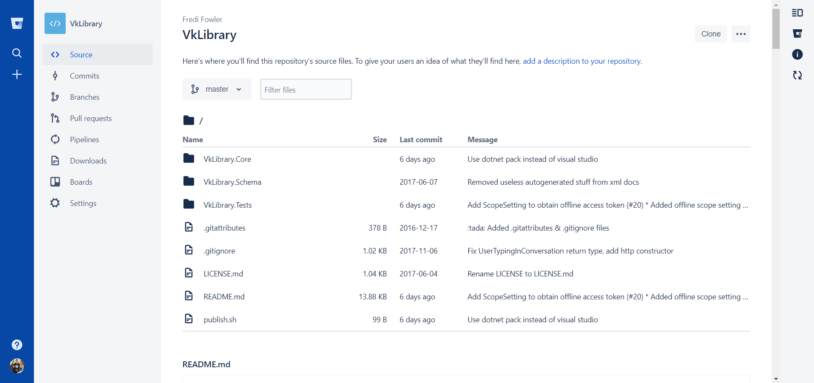

По-умолчанию, файл репозитория `Readme.md` рассматривается как описание проекта и отображается в обозревателе репозитория. По странному стечению обстоятельств, Битбакет не смог в форматирование `md-`файла:  

Одной из важнейших возможностей систем управления репозитория - просмотр файлов, содержимого. Увы, битбакет также не смог в подсветку синтаксиса:  
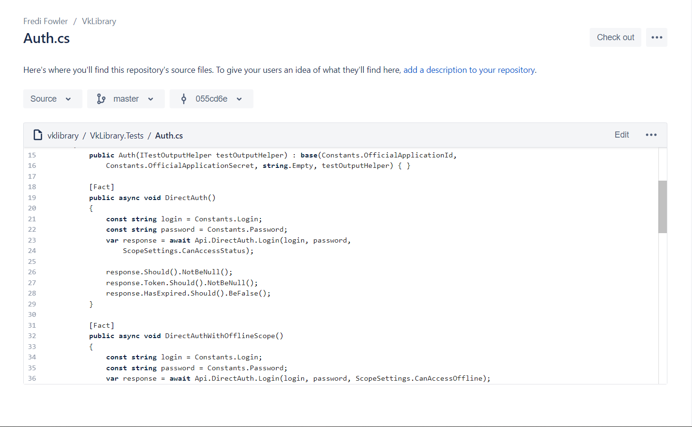

Второй важный пункт: работа с самим гитом.
- Обзор коммитов  
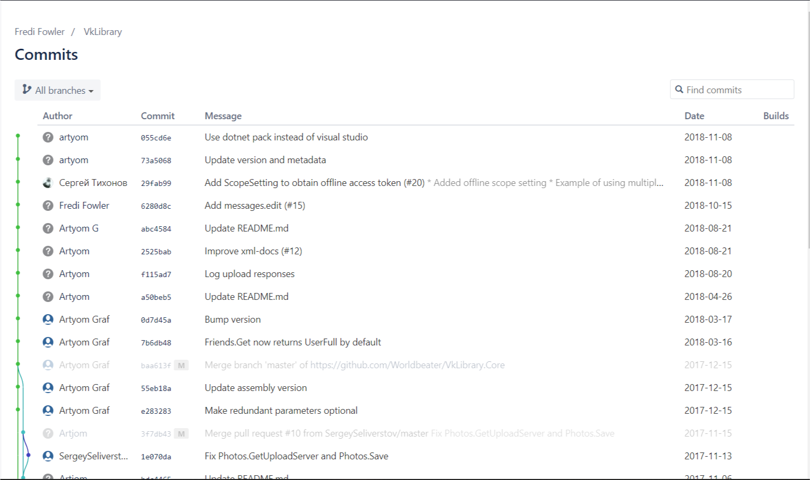
- Просмотр веток  
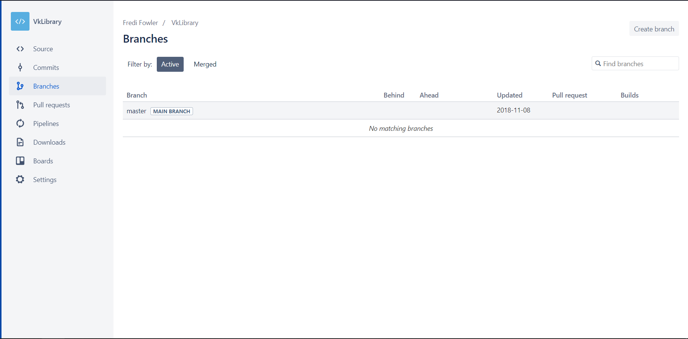
- Просомтри пул-реквестов  
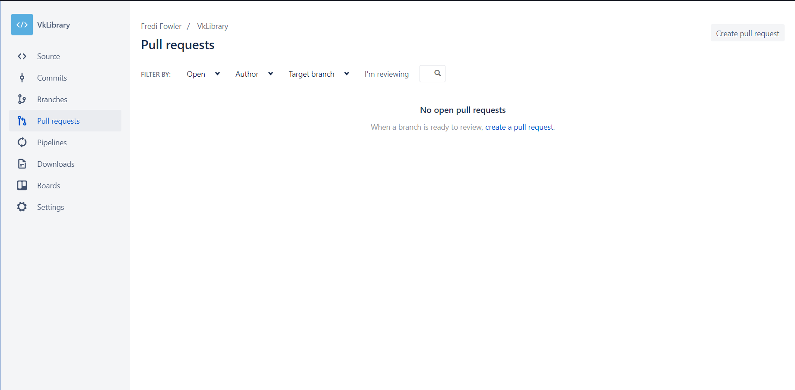
- Создание бордов не реализовано в системе. Вместо этого добавленна интеграция с Trello
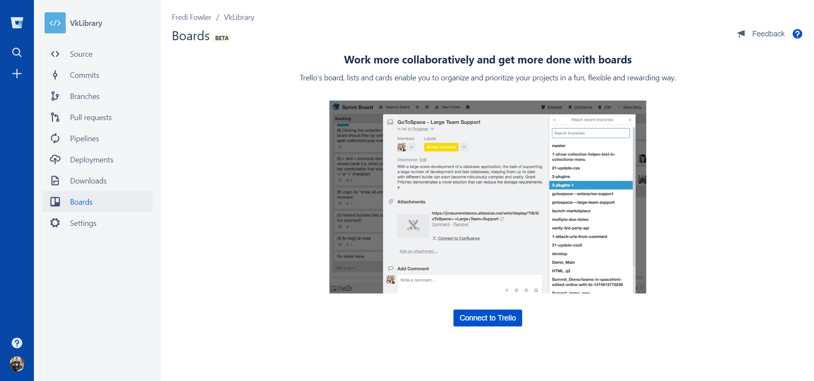

# Gitlab

*что-то о габе написать*

Первой полезной фичей в Gitlab'е, с которой можно столкнуться - возможность залогиниться с помощью GitHub:

Как и у BitBacket'а, в данной системе есть обозреватель проектов, возможность импорта с друних источников:  
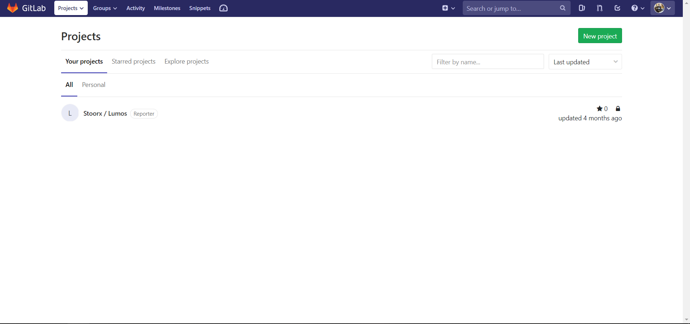  
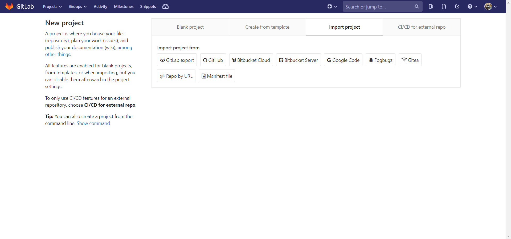

Также, стоит отметить, что Gitlab также не смог справится с парсингов markdown:  
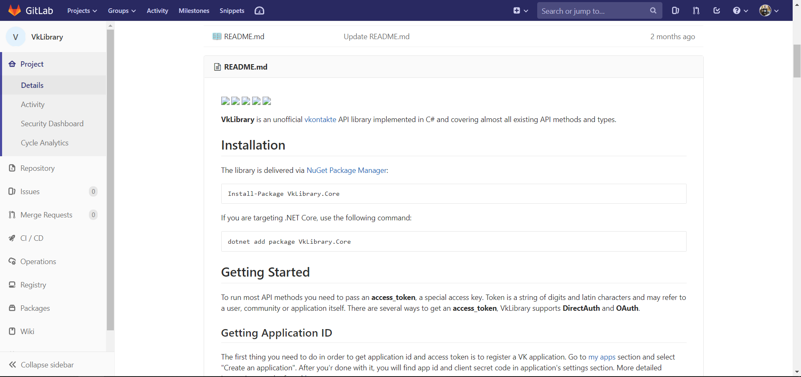

Рассмотрим основной функционал связанный с работой с git'ом:
- Просмотр коммитов и веток  
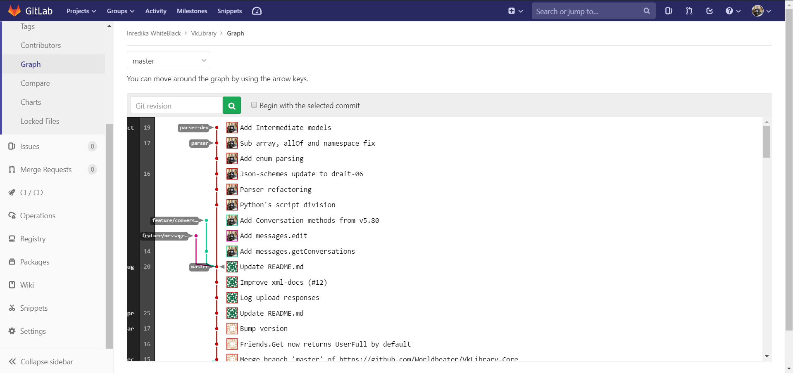
- Метрики репозитория  
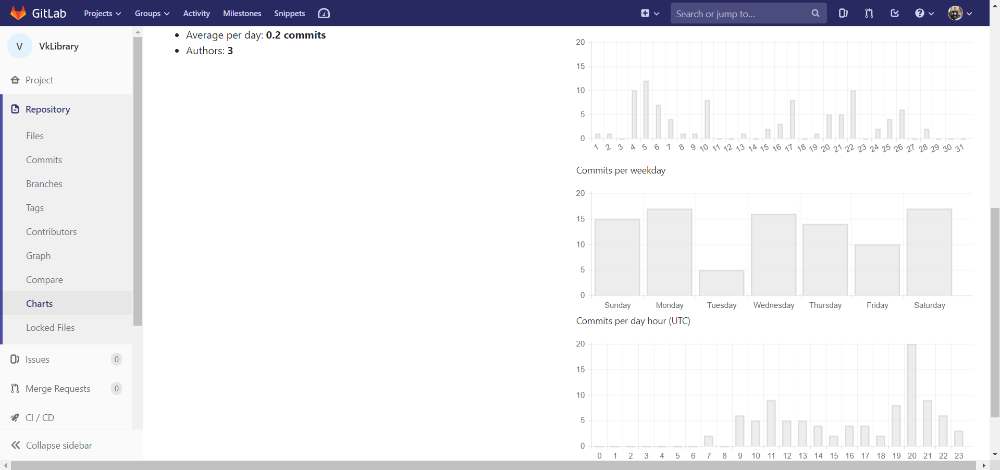

Важной механикой, на основе которой можно организовать как фидбек-систему, так и таск менеджмет, является работа issues. Issue - это *...*

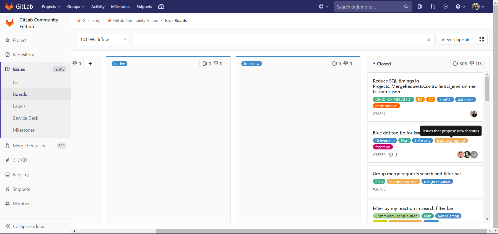

## GitHub

Github - крупнейший веб-сервис для хостинга IT-проектов и их совместной разработки. Теперь он еще и заручился поддержкой Microsoft.  
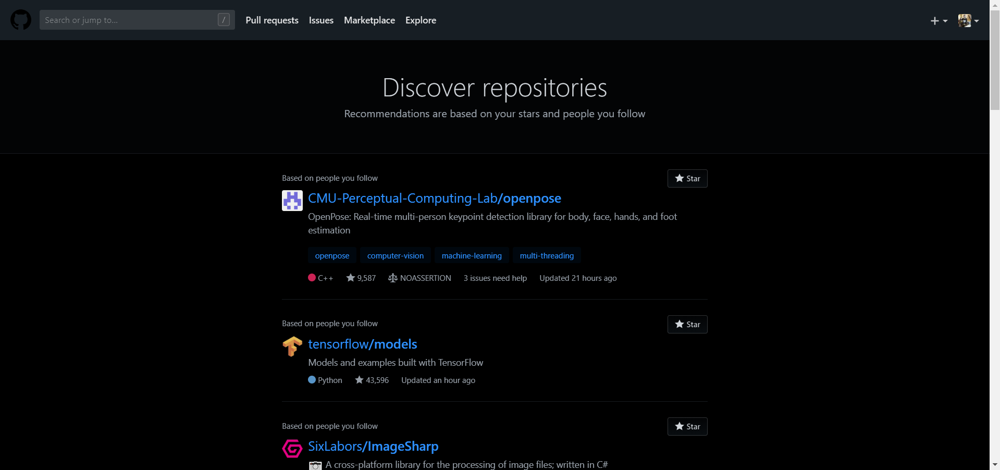  

Основной идеей GitHub'а является позиционирование себя как социальная сеть для кодинга, а также продвижение open-source. Пользователи - не работники конкретного проекта, а контрибуторы всего опенсорса.  
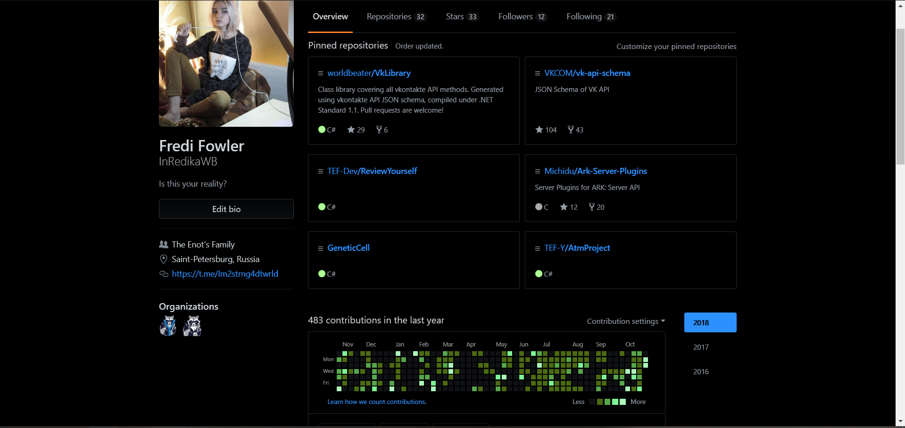  

Проекты на Github'е, как во всех других системах управления репозиториями, имеет интерфейс файлового проводника, отображает все файлы:  
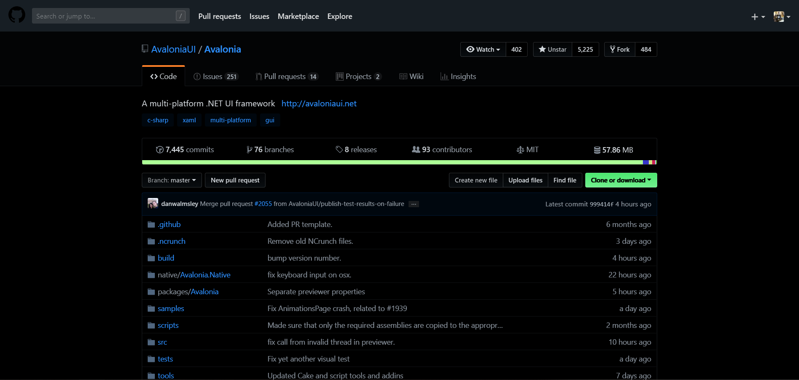  
  

Сервис предоставляет возможность создавать в репозиториях доски с issues тасками
  

В роле баг-трекера выступает система issues. Их может создавать любой пользователь, описывать баги или пожелания. Каждый issue создает тред с возможностью обсуждать, прикрепить пул-реквест решением проблемы.  
  

Есть некий аналог спринтов - просто набор тасков, которые объединили единой целью:  
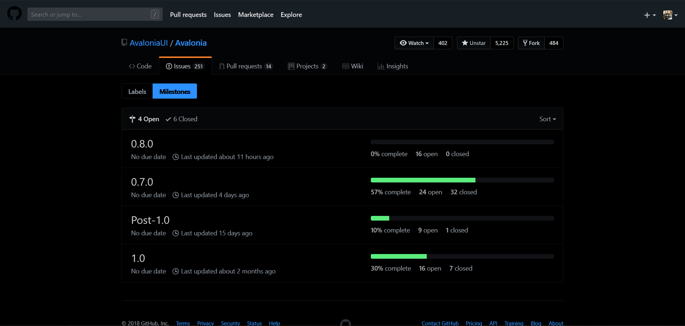  

Важно отметить, что гитхаб имеет множество фичей для взаимодействия между пользователями. Например, лента обновлений аккаунтов, на которые подписан пользователь:  
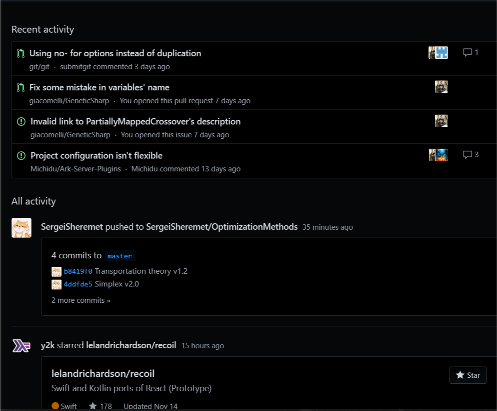  

# Выводы

1. Хостинг: все системы предоставляются ввиде веб-сервиса. BitBucket также можно развернуть на выделенном сервере за определенную плату. GitLab можно развернуть на своем сервере бесплатно.
2. DevOps: по-умолчанию, BitBucket и GitLab предоставляют различные тулзы для CI/CD. GitHub из коробки такого не имеет функционала, но есть расширения.
3. Отображение markdown: GitHub отлично отображает базовый markdown, но не реализован парсинг Katex/Latex/etc. GitLab и BitBucket не смогли отобразить markdown (html-теги в нем, если быть точным)
4. Обозреватель репозиториев: BitBucket нацелен на командную работу с репозиторием. В GitHub и GitLab есть возможность просмотра популярных репозиториев, а также репозитории других пользователей
5. GitHub имеет расширения. Можно подключить расширения дял интеграции таск менеджеров, чатов (slack, gitter), CI, кодревью, прочее.
