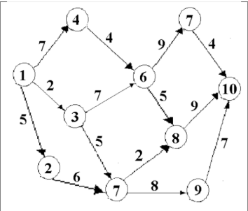

# Динамическое программирование
## Цель работы
Изучить теорию и методы решения задач динамического программирования; приобрести навыки решения задач динамического программирования на ЭВМ.

## Задача
Рассмотрим тривиальную задачу динамического программирования. Пусть требуется перевезти груз из города в город. Сеть дорог, связывающая эти города, изображена в виде графа:  

города – вершины графа, а ребра – дороги между ними.

## Алгоритм решения

Проанализируем входной граф. Зная, что у нас есть строго одна начальная и конечная точка, мы можем реализовать решение используя модифицированный Depth-First search. Начиная с первой точке, делаем проверку: будем выбирать точку, в которую мы можем попасть с текущей ($E[i][j] != 0$, где $i$ - точка, из которой мы идем, $j$ - точка, которую мы проверяем), расстояние через нее будет минимальным, и она уже проверена. Если таких точек нет – значит мы находимся в конечной точке, а значит расстояние от не к конечной точке $dist[i] = 0$, где $dist[i]$ - расстояние от $i$ до конечной точки. Для всех других точек будем находить для точки $i$: $min(E[i][j] + dist[j])$.

## Результат

Результат выполнения кода для данного графа:
10 - end point  
Optimal way from 8 to 10  
Optimal way from 9 to 10  
Optimal way from 5 to 8  
Optimal way from 2 to 5   
Optimal way from 7 to 10  
Optimal way from 6 to 7  
Optimal way from 3 to 5  
Optimal way from 4 to 6  
Optimal way from 1 to 3  
$dist = \{18, 17, 16, 17, 11, 13, 4, 9, 7, 0\}$  

Ручной расчет:  
10 - конечная точка  
dist[9] = E[9, 10] = 7  
dist[8] = E[8, 10] = 9  
dist[7] = E[7, 10] = 4  
dist[6] = min(E[6, 7] + dist[7], E[6, 8] + dist[8]) = min(9 + 4, 5 + 9) = 13  
dist[5] = min(E[5, 8] + dist[8], E[5, 9] + dist[9]) = min(2 + 9, 8 + 7) = 11  
dist[4] = E[4, 6] + dist[6] = 17  
dist[3] = min(E[3, 6] + dist[6], E[3, 5] + dist[5]) = min(7 + 13, 5 + 11) = 16  
dist[2] = E[2,5] + dist[5] = 6 + 11 = 17  
dist[1] = min(E[1, 2] + dist[2], E[1, 3] + dist[3], E[1, 4] + dist[4]) = min (17 + 5, 16 + 2, 17 + 7) = 18