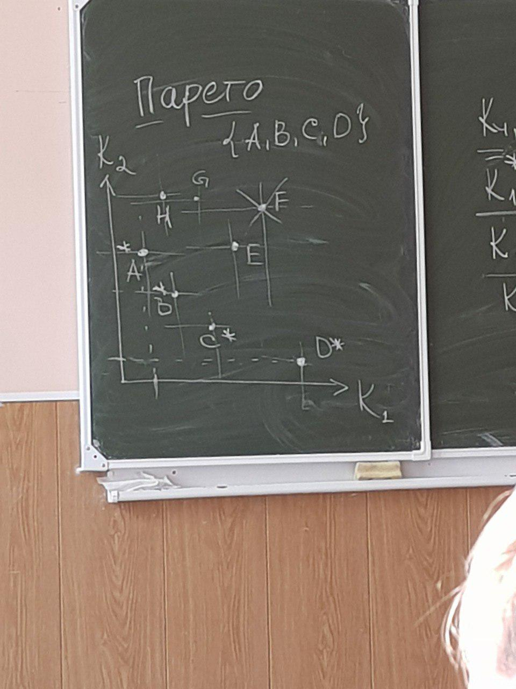

# Лекция 2, 20.09

>Этапы решения?? (многоэтапность решения)

### Оптимальное решение
$K_1 - U_1$  
$K_1 <= K^*_1 + U_1$  
$K^*_2 - U_2$  
$K = \sum^n_{i=1}{v_i \cdot K_i}; \sum{v_i}=1$

### Эффективное решение
**Множество Парето** - множество эффективных решений

**Функция Лагранжа**: $L(X, \lambda) = F(X) + \sum_i\lambda_i\varphi_i$  
$F(X) = 9x_1 + x^2_1 + 6x_2 + x^2_2 + x_1 + x_2 = 150$  
$L(x_1,x_2,\lambda) = 9x_1 + x^2_1+6x_2 + x^2_2 + \lambda(x_1 + x_2 - 150)$

>Марковы процессы

