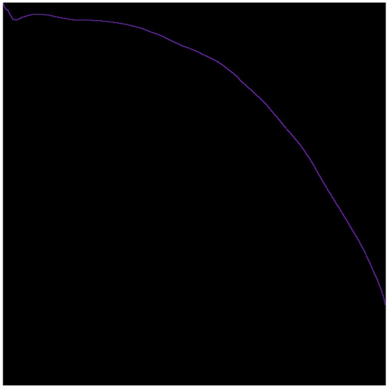
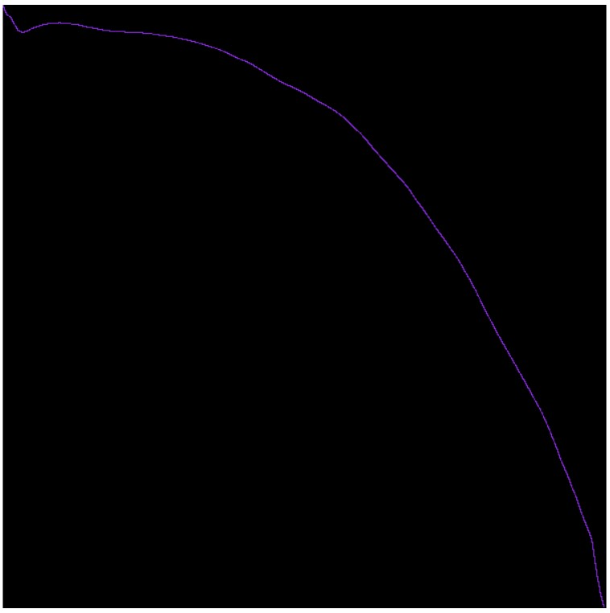
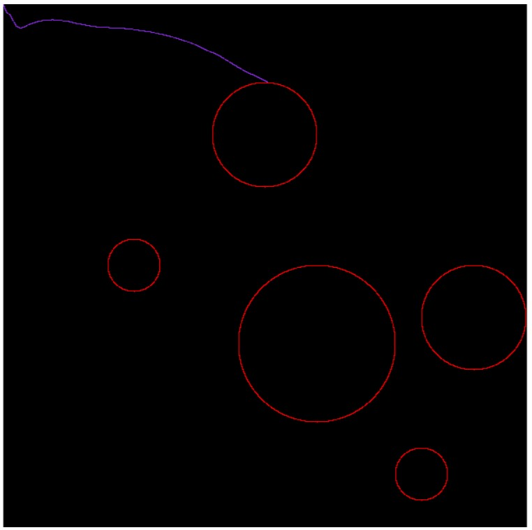
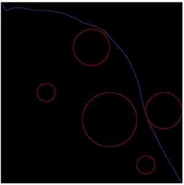
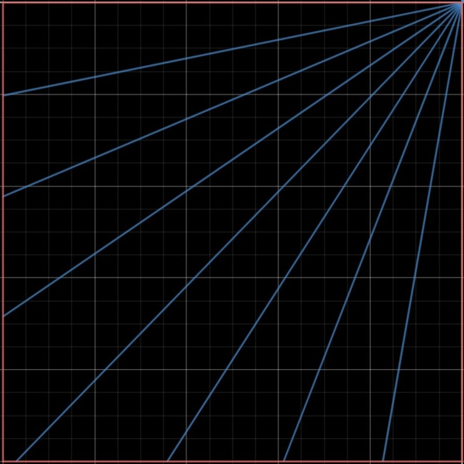

# Проект. Планирование движения материальной точки

В качестве темы для проекта по предмету "Методы оптимизации" был выбран 15-ый вариант: Планирование движения материальной точки с использованием эволюционного программирования (генетический алгоритм с мутациями).

# Постановка задачи

## Теоретическая формулировка

Материальная точка (робот) массы m = 1 покоится в точке A(0,0) плоскости 0xy. Нужно привести робота в точку B(1,1) и остановиться в ней за минимальное время. Роботу запрещается покидать квадрат [0,1] × [0,1], также роботу запрещается заезжать в круги вида $(x − X_j)^2 + (y − Y_j)^2 <= R_j^2$.
На робот действует единственная сила F, величину и направление которой мы можем произвольно изменять $|F| < F_{max}$.

## Данные

Входные данные алгоритма:
- максимальная сила F_{max}
- шаг времени d_t
- центры помех $P_j(X_j, Y_j)$ и радиусы $R_j$.

Выход алгоритма:
- последовательность значений сил в каждый момент времени: $F_{xk}, F_{yk}$.

# Полигон для тестирования

Перед тем как начать разработку алгоритмов, нужно реализовать возможность визуализации результатов выполнения. Во-первых, это упростит работу с восприятием результатов. Во-вторых, графическое представление дает возможность пользователю проанализировать ответ на наличие дефектов, выяснить их источники, что сделать анализатором на уровне программы намного сложнее.

По условию задачи, используется закрытая область $1х1$. Это значит, что все координаты будут вещественными и для отображения нужно вводить ограничения точности.

Отображение результата выполнения выполняется следующим образом:
1. Область пользовательского интерфейса закрашивается черным квадратом (далее - Поле). Допускается, что сторона является единицей измерения.
2. Для каждой зоны генерируется множество точек, которые описывают круг вокруг этой зоны. Эти точки задаются координатой $x,y\in[0;1]$ и в масштабе отображаются на поле.
3. Выбирается интересующий путь, который представлен набором точек и по одно отображается на поле.

# Решение применением только генетического алгоритма

В первом приближении, предполагаем, что можно взять случайный набор команд и оптимизировать его генетическим алгоритмом по средствам мутации. Данное решение будет является достаточно абстрактным и не требовательным к дополнительной логике генерации решения.

Перед выбором способа формализации алгоритма под генетические изменения, нужно определить как алгоритм влияет на решение, какая информация при этом предоставляется. Рассмотрим простой случай: управляемый объект находится в точке $(x_i, y_i)$ и ждет команды алгоритма. Зная все решения, которые были приняты на прошлых шагах, можно посчитать также направление и скорость объекта.

Рассмотрим два подхода к представлению алгоритма в данной задачи:
1. Сгенерируем цепочку команд, которая будет применяться на объект до тех пор, пока алгоритм не закончит выполнение.
2. Создадим зависимость принятого решения от данных, которые предоставляются на каждом шаге $f_i(p_i, v_i)$.

Анализируя первый способ, можно прийти к заключению, что его обучение не является достаточно эффективным: если есть набор принимаемых решений на каждом шаге (в нашем случае $f_i$), то небольшое изменение первого решения может сильно исказить эффективность всех следующих.

Второй способ позволит не зависеть от принятых решений в прошлом, а смотреть только на текущее состояние. Это позволит сделать сделать итоговое решение задачи более устойчивым при изменении одного элемента.

Основные недостатки такого подхода заключаются в том, что для всех пар $(p_i, v_i)$ нужно хранить решение. Т.е. количество генов очень большое и, с большой вероятностью, избыточно для отдельно взятого решения. Помимо расходов памяти для алгоритма, это чревато очень медленным процессом мутации так, как вероятность изменения каждого гена очень мала.

# Формализация задачи к теории генетических алгоритмов

Введем основные понятия [1, с. 126]:
- Ген - атомарный элемент генотипа и/или хромосомы
- Хромосома - упорядоченный набор генов
- Генотип - набор хромосом данной особи
- Аллель - значение конкретного гена, значение его свойства
- Особи - хромосомы с закодированными в них параметрами задачи
- Популяция - множество особей

Стоит отметить, что в классических гены представлены значением {0, 1}, то есть хромосомы - двоичные вектора. Но это не строгое ограничение, в тех же эволюционных алгоритмах используются действительные числа в качестве значений генов [1, с. 207-208].

Для выбранного алгоритма, хромосомой будет набор генов, каждый их которых сопоставляется какому-то набору $(p_i, v_i)$. Для представления данных в программе, значения $p_i$ округляются до какого-то $\epsilon$. Таким образом, хромосома - это закодированный двумерный массив генов. Каждый ген представляет два значения: $(f_x, f_y)$, т.е. вектор силы, который нужно приложить.

В качестве начальной хромосомы берется случайный набор генов.

Одной из ключевых проблем данной задачи является выбор фитнес функции. Ввиду того, что Адамовой хромосомой является набор случайных геной, который почти всегда не является решением, на первом шаге стоит взять такую функцию, чтобы она выбирала в качестве лучших такие хромосомы, что являются максимально близкими к решению. Например, такой функцией является $f(p) = |(1, 1) - p|$, т.е. расстояние последней точки  до таргетной позиции.

Определимся с генетическими операциями, который выполняются над данной популяцией. Так как фитнес функция уже определена, на ее основе можно выделить методы селекции. В данном случае была применена Элитная селекция _(Truncation selection)_. Данный вид селекции подразумевает, что все хромосомы будут упорядоченны по значению фитнес-функции и из них будут выбраны N-лучших.

Для всех полученных хромосом применяется генетический оператор. В нашем случае это простой оператор мутации - их хромосомы выбирается случайный ген и его значение заменяется на случайное подходящее значение. То есть, помимо исходной хромосомы появляются еще ее несколько мутированых потомков. Таким образом из набора хромосом, которые остались после селекции создается новая популяций.

# Процесс вычисления фитнес функции 

Как было указано ранее, в качестве фитнес функции было выбрана функция расстояния до таргетной позиции. Рассмотрим процесс выполнения симуляции.

В начале выполнения объект ставится на начальную позицию (0, 0). На каждом шаге делается проверка - находится ла объект внутри зоны, за пределами поля или в точке (1, 1). Если хотя бы одно условие выполняется - выполнение симуляции заканчивается, возвращается информация о последней посещенной точке. Если же проверка не проходится, то выполняется один шаг. Под шагом подразумевается взятие из хромосомы нужного гена, получение с него информации и применение. Так как хромосома представляет собой зависимость $f(p_x, p_y)$, то по положению объекта в данный момент можем получить вектор силы, который нужно применить. Изменение состояния объекта:  
$$
F = chromosome[p_x, p_y] \\
v = v + a\cdot F\cdot\Delta t \\
p = p + v\cdot v\cdot\Delta t
$$

Таким образом получаем новое положение объекта и для него продолжается выполнение алгоритма. Также стоит отметить наличие верхней границы длительности выполнения т.к. рандомная хромосома может иметь такой набор генов, что построение маршрута по нему будет выполняться бесконечно долго.

# Примеры и результат

При отображении результаты выполнения рандомно сгенерированной хромосомы, скорее всего будет полученная странный маршрут который к тому же может закончится в самом начале. Но выполнение нескольких итерация генетического алгоритма можно получить что-то очень похожое на решение:  

Дальнейший запуск алгоритма можем сгенерировать путь к конечной точке:  

Рассмотрим поведение алгоритма после добавление зон. Если хоть одна зона будет находится на пути объекта до ранее успешный алгоритм начнет показывать очень плохие показатели фитнес функции. Но при существовании не сложных маршрутов к конечной точек, данный алгоритм все же сможет воссоздать такую хромосому, которая сможет обходить зоны:  
  

# Анализ и изменения

Был проведен ряд различных изменений данного способа с целью получить более приспосабливающуюся систему при этом не меняя полностью логику. Можно выделить два основных, которые действительно позитивно сказались на результате. Во-первых, как было определенно вначале, в каждый момент времени при принятии решения известно два значений - позиция и вектор скорости. Было принята попытка построить зависимость  $f(p_x, p_y, |v|)$ используя информацию о скорости. От позволило в одной позиции принимать более правильное решение в зависимости от скорости. Хотя в большинстве случаев данных подход помогал находить решения, а мутации не так часто приводили алгоритм к значительному понижению значения фитнес-функции, ччевидным минусом данного подхода стало значительное удлинение гена и как следствие - замедление обучения.

Второй подход заключался в замене поля поделенного на квадраты на определение полярных координат. Это значит, что в момент принятия решения у объекта определялись два параметра - расстояние до конечной точки и угол между прямой и границей поля. Перед тем как переходит к анализу данного подхода, рассмотрим графическое представление такого деления:  
  
Основная идея заключается в увеличении плотности секторов при приближении к выходу. Ввиду очень больших проблем с остановкой объекта в конечной точности, было выдвинуто предположение, что при упрощенном моделировании именно это и есть основной проблемой алгоритма.

Сравнив эти три подхода (первоначальный, с использованием скорости и с использованием полярных координат) было сделано ряд выводов. Основная проблема использования скорости как параметра - удлинение хромосом и замедление обучения. Полярные координаты являются лишь другим способом представления зависимости принятого решения от координаты и не влечет за собой усложнений процесса обучения. После ряда тестов с использованием небольшого количества зон, именно этот подход показывал более быстрое обучение и лучшие результаты. Основным недостатком является то, что при наличии большого количества зон в начале пути, обучатся алгоритму будет очень трудно 

# Общий вывод по данному подходу

Хотя изложенный ранее алгоритм может находить решения, это не является хорошим решением. Выделим основные недостатки. Во-первых, хромосома представляет собой **довольно большую структуру**, из которой, при построении одного отдельно взятого маршрута, используется лишь некая часть. Следствием этого является не только **медленная мутация**, а также и огромные **расходы памяти**. Также было выявлено, что выбранная **фитнес-функция** лишь на первый взгляд кажется хорошей. Во время обучения были выявлены типичные ситуации, которые обрекали алгоритм на безрезультатные попытки хоь немного исправить ситуацию - это **тупики** созданные зонами. Маршрут, который доходит почти к выходу, но не имеет ни малейшего шанса продвинутся дальше, является более приоритетным в данной модели.

Важным моментом является то, что для оптимизации решения нужно иметь хотя бы какое-то верное. Ввиду того, что за Адамову хромосому в данном подходе выбирался набор раномных генов, первая часть обучения заключалась как раз в построении решения которое удовлетворило условию задачи. При проектировании данного алгоритма была выдвинуто предположение, что это генетический алгоритм мутациями будет быстро справляться  с данной задачей, но на практике оно себя не оправдало.

Из этого можно сделать некоторые выводы.
Мутации данных хромосом проходили очень медленно и не заметно. Наступали моменты, когда да длительном интервале не происходило никаких изменений результата фитнес-функции. На данную ситуацию можно повлиять применив другие алгоритмы мутации. Например, Scramble-мутацию. Основная идея данного способа мутации - брать отрезки хромосомы и каким-то образом их перемешивать или делать реверс.[2, с. 32]

Помимо мутации, можно изменить алгоритм селекции. Основная проблема выбранного способа селекции - очень быстро с популяции исчезают особи, которые хотя бы немного хуже фаворита. Таким образом, весь алгоритм начинает строится вокруг хорошо составленного рандома на первых итерациях. Это плохо сказывает на дальнейшем развитии. Ярким примером тому является невозможность выхода из тупиковой ситуации. Для того, чтобы замедлить процесс отсева менее результативных генотипов, можно использовать алгоритмы селекции на вероятности - "Roulette Wheel"-селекция [3]. Идея заключается в том, чтобы по значениям фитнес-функции давать генотипам шанс попадания в следующую популяцию. Но если если этого будет недостаточно, то можно пойти дальше и использовать пул генотипов - разбивать популяцию на несколько частей, в которых и будет проходить селекция. То есть, это будут независимые наборы генотипов, которые соревнуются между собой. При выявлении пула не способного к дальнейшему развитию - его можно полностью удалять и заполнять случайно взятыми особями из других пулов.

Важно отметить, что в данной реализации не было использовано алгоритмов кросс-овера (скрещивания). Это еще один способ влияния на эффективность обучения. Алгоритмы кросс-овера заключаются в генерации новых хромосом на основе двух или более уже существующих, которые считаются хорошими. Одни из таких алгоритмов является "two point crossover". Описание алгоритма: берутся две хромосомы и два локуса, которые делят хромосому на 3 части. Создаются два потомка, первый будет состоять из первой и третьей частей первого родителя и второй части второго родителя. Второй соответственно наоборот [1, с. 162]. Таким образом можно получить гены двух родителей, которые будут синергировать и в сумме давать результат лучше чем у тех же родителей.

Возможно важнейшим пунктом оптимизации является использование заранее сгенерированного маршрута. Как было сказано ранее, для генетического алгоритма было проблемно случайными изменениями построить валидный путь. Если решить эту проблему за него и запускать мутации на уже готовом но не оптимальном маршруте, можно получить эффективное обучение и улучшение показателей.

# Построение базового решения задачи

Главной особенностью данной задачи является наличие зон. Но именно эти зоны и формируют маршрут объекта. Не сложно доказать, что оптимальный маршрут будет обходить по контурам зон (исключением будет является прямой маршрут по диагонали).

# Использованная литература

1. Рутковская. - Нейронные сети, генетические алгоритмы и нечеткие системы
2. Bence Keresztury - Genetic algorithms and the Traveling Salesman Problem (url: https://web.cs.elte.hu/blobs/diplomamunkak/bsc_alkmat/2017/keresztury_bence.pdf)
3. Daniel W. Dyer - Evolutionary Computation in Java (url: https://watchmaker.uncommons.org/manual/ch03s02.html)