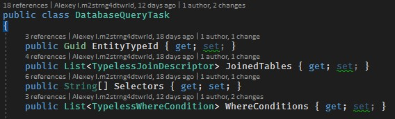

## План
0. [ ] Определения
1. Описание предметной области, проблематики
   1. [x] Описание трехзвенной архитектуры (Выделение основных проблем в подходе с API (+диаграммы))
   2. [x] Функциональные и нефункциональные требования (Проблемы с типами, аргументами и в целом провалом в типизации SQL-C#)
   3. [x] Стек технологий
   4. [x] Roslyn (Рослин и его применение для кодгена)
2. Архитектура компонента (Fluda)
   1. [ ] Описание решение со спекой
   2. [x] Изложение основных сущностей (+Описание решения проблемы с типизацией)
   3. [ ] QueryTaskCreator и интерфейс работы
3. Размещение
   1. [x] Схема размещения (деплой диаграма)
   2. [x] Описание работы системы на стороне клиента
   2. [ ] Описание работы системы на стороне сервера
4. Генерация (SQL-парсер и кодген)
   1. [ ] Применение кодогенерации
   2. [x] SQL (Парсинг скрипта)
   3. [ ] Генерация SQL-запросов (описание нужных, с чего они стоятся)
   4. [ ] Непосренственно кодген
5. [ ] Демо?

> Написать где-то, что прокси может быть балансировщиком
> Если совсем скучно - написать про докер и микросервисы

# Раздел 0. Определения
> Тут будут определения и все такое  
> ЗАменить слово спека  

- .NET – программная платформа для разработки программ предназначенная для языков C# и Visual Basic.  
- API - программный интерфейс приложения; описание способов (набор классов, процедур, функций, структур или констант), которыми одна компьютерная программа может взаимодействовать с другой программой.  
- СУБД


- Visual Studio - интегрированная среда разработки (IDE) предоставляемая Microsoft. Данная IDE разрабатывает во многом для фреймворка **.NET** и его языков (C++/CLI, C#, F#), но также имеет поддержку и тулзы для работы с SQL, Python, Javascript/Typescript, Java etc.  
Код-стайл - набор правил и соглашений, используемых при написании исходного кода на некотором языке программирования.  
Язык программирования - формальный язык, предназначенный для записи компьютерных программ  
Компиляция – трансляция программы, составленной на исходном языке высокого уровня, в эквивалентную программу на низкоуровневом языке, близком машинному коду  


# Раздел 1. Описание предметной области, проблематики
## 1.1 Описание трехзвенной архитектуры
> Трехзвенная архитектура, активити диаграммы

Несмотря на распространенность клиент-серверного подхода к проектиованию систем, не существует общепринятого решения проблемы взаимодействия клиента и базы данных на сервере. Во многом, это обусловлено требованиями к безопасности - нельзя давать возможность присылать со стороны клиента произвольный SQL код. Это обусловлено требованиями к безопасности. Если разрешить выполнять произвольный SQL-скрипт, то это создаст уязвимость системы. К тому же, есть ряд ограничений к тому, какие данные может получить клиент. Например, пользователь имеет доступ только к его данным и любой SQL-скрипт должен дополнятся дополнительным условием проверки.

 Актуальность данной проблемы подчеркивается сложным процессом реализации такого обращения с использованием тривиального сценария с открытым API. Типичный сценарий добавления нового метода API для получения данных:
1.	Написание SQL-процедуры для вытягивания данных, добавление ее в базу
2.	Добавление в репозиторий (или заменяющий его слой абстракции) нового метода, который вызывает написанную процедуру
3.	Добавление метода в API, который будет вызваться с клиента и обращаться к методу репозитория
4.	Добавление на сторону клиента обращение к API

## 1.2 Функциональные и не функциональные требования (Проблемы с типами, аргументами и в целом провалом в типизации SQL-C#)

Одним из решений проблемы описанной выше является создание механизма сериализации запроса на получение данных и реализация выполнения на удаленном узле. Иными словами, система должна уметь выражать запросы в виде сериализованного набора параметров.

Из этого следует функциональное требование - возможность унифицировать код для сценария, когда есть больше одного способа получения данных из базы, а именно:
  - обращение к локальной базе на стороне клиента
  - запрос на сервер с целью получить какие-то данные с внешней базы данных без дополнительной логики
  - отправка запроса через прокси сервис - реализация возможности полученный запрос пробрасывать через несколько узлов.

> Проверить, что пример с сеть - валидный

Также, функциональным требованием является возможность модификации запроса на стороне сервера. Основная цель данного механизма - принудительно фильтровать только те данные, которые принадлежат клиенту, который запрос отправляет. Например, в случае если это база данных социальной сети, то запрос клиента на получение всех групп должен возвращать только те группы, которые открытые или к которым он имеет доступ.

Одной из проблем, которую должна решать данная система - навязывание строгой типизации при работе между C# и SQL. Обычно, если в проекте не используется ORM, то участки кода где передаются аргументы в запрос или читается ответ от сервера - являются потенциально багоопасными. Частые проблемы, которые нельзя выявить на этапе компиляции, только во время выполнения:
- аргумент в процедуру передается с неправильным именем. Довольно часто это может быть miss-spell или невнимательность ("objectId" и "object_id").
- нет проверки на то, какой тип ожидается как аргумент или какой тип вернулся в ответ на запрос.

Ввиду того, что внедрение подобного механизма при условии поддержания типизации в уже существующей системе - это процесс, которые занимает очень много времени, к списку требований добавлен пункт на автоматизацию внедрения. Автоматизация заключается в реализации кодогенерации всего нужного кода на основе уже существующей базы данных.

К нефункциональным требованиям можно отнести требование к безопасности. Это основная причина по которой использование готовых реализаций в виде ORM невозможен - результатом их работы является уже сформированный запрос, который нельзя передавать через API ввиду потенциальных SQL-инъекций.едиться, что система безопасна от SQL-инъекций.


## 1.3 Стек технологий

Посколько одной из основных задач является внедрение механизма взаимодействия в %company name%, то для интеграции нужно взять за таргетный стек:
- Платформа .NET, язык C# 
- База данных SQL Server, T-SQL

Хотя в проекте и используется TCP коннекции и XML-сериализация, это не должно быть столь важно т.к. решение не должно зависить от отранспортного уровня.

Использованные библиотеки:
- Newtonjson - Библиотека для рабоыт с JSON для C#. Имеет весь нужный функционал для сериализации и десерилазации объектов в системе.
- TSQL_Parser - Библиотека, которая умееет разбивать SQL синтаксис на токены для дальнейшего анализа.
- Roslyn.CSharp.Scripting - Компоненты Roslyn, которые позволяют собирать синтаксическое дерево и генерировать C# код.
- nunit - Одна из самых распространенных баблиотек для написать unit-тестов 
- System.Data.SqlClient / System.Data.SQLite - библиотеки для работы с базами данными. SqlClient - библиотека для работы с базами данных SQL Server, SQLite - для работы с базой Sqlite, которая используется для unit-тестов.

## 1.4 Roslyn
> Это куски курсача. Возможно, стоит сделать вычитку

Roslyn - компилятор исходного кода .NET, который предоставляется как CaaP (Compiler-as-a-Platform). Является проектом Microsoft с открытым исходным кодом. Поддерживаемыми  языками являются C# и VB, который используют .NET в качестве среды выполнения. Основная идея проекта Roslyn заключается в раскрытии процесса компиляции, предоставление доступа пользователям к взаимодействию с различными его этапами.
Гибкость в плане расширений и возможность кастомизации дают возможность применять данный инструмент в качестве внешнего анализатора кода.

Архитектура Roslyn'а имеет ряд особенностей, которые объясняются набором функционал, который данное продукт реализует. В первую очередь, данное средство автоматизации является компилятором и именно логика процессов компиляции лежит в основании всей системы. Остальные компоненты являются функциональными расширениями процесса компиляции и являются зависимыми от компоненты "Compilers". Не смотря на то, что другие компонент группируются на основе какой-то функционала, они взаимодействуют между собой, переиспользуют структуры данных других модулей, используют их  зависимости и расширяют их. Этим обусловлена сильная связанность между ними. На диаграмме представлена модель системы, где элементами являются именно эти компоненты.

Раскрытие «черного ящика» компиляторов дает широкий ряд возможностей для улучшения условий работы с кодом. Программный компонент Roslyn, который является платформой предоставляющей функционал компилятора, как раз таки нацелена на интеграцию этих процессов, их управление и использование в процессе разработки. Часть этих компонент предоставляются как библиотеки для проектов с целью их расширения и имплементации на их основе нового функционала.
При анализе было отмечено, что программный компонент представляется на разных уровнях абстракции – с ним можно интегрироваться как на уровне добавления правил код-стайла, так и внедрить дополнительную логику разбора исходного кода.
Обобщив информацию полученную в ходе работы над Roslyn, можно прийти к заключению, что это современный инструмент, который значительно может упростить работы как с анализом кода, так и его написанием (например, кодогенерацией), а также дает возможность пользователям разрабатывать инструменты, которые решают непосредственно их задачу и настраивать уже существующие под себя.

# Раздел 2. Fluda
## 2.1 Описание решения со спекой

Для решения проблемы с передачей запроса от клиента к серверу или прокси, было внедрено промежуточное состояние запроса - сериализованное описание (спека). Идея заключается в том, чтобы предоставлять не готовый запрос, а описание для его генерации. Рассмотри минимально необходимый набор данных, который нужно хранить и передавать для построения запроса на получения данных. Указанные далее описания соответствуют базовым командам из SQL:

1. Идентификатор сущности, которую мы хотим получить. В упрощенной схеме - это просто таблица. Для этого можно использовать GUID. Соответствует указанию названия таблицы после `FROM`.
2. Для фильтрации сущностей нужно поддержать SQL-механизм WHERE. Учитывая, что в спеке уже лежит идентификатор таблицы, достаточно указать название столбца, нужное значение и способ сравнение (=, >, <, !=). Соответствует команде `WHERE`
3. Для реализации возможности указывать нужные столбцы таблицы, нужно в запросе также хранить их список. Соответствует перечислению столбцов после команды `SELECT`
4. Ввиду того, что почти всегда сущности декомпозируются для базы данных, логично предположить, что большая часть запросов будут обращаться к больше чем одной таблице. А значит, нужно поддерживать команду `JOIN` - хранить идентификатор таблицы которую нужно присоединить и пару столбцов, которые для этого будут использованы.



## 2.2 Изложение основных сущностей

Для реализации заявленного функционала, нужно в первую очередь описать сущности базы данных в коде.

Самыми очевидными типами при работе с базой являются модели базы данных - классы, которые отображают в коде столбцы таблиц как переменные являясь дата-классами. Подобным функционалом, а именно - генерация дата-классов по схеме таблиц базы данных, обладает большинство современных ORM [@Троелсен, с. 843]:

```SQL
CREATE TABLE [Sales].[CreditCard](
	[CreditCardID] [int] IDENTITY(1,1) NOT NULL,
	[CardType] [nvarchar](50) NOT NULL,
	[CardNumber] [nvarchar](25) NOT NULL,
	[ExpMonth] [tinyint] NOT NULL,
	[ExpYear] [smallint] NOT NULL,
	[ModifiedDate] [datetime] NOT NULL,
 CONSTRAINT [PK_CreditCard_CreditCardID] PRIMARY KEY CLUSTERED 
(
	[CreditCardID] ASC
)WITH (PAD_INDEX = OFF, STATISTICS_NORECOMPUTE = OFF, IGNORE_DUP_KEY = OFF, ALLOW_ROW_LOCKS = ON, ALLOW_PAGE_LOCKS = ON) ON [PRIMARY]
) ON [PRIMARY]
```

```CSharp
public class CreditCardModel
{
    public Int32 CreditCardId { get; set; }
    public String CardType { get; set; }
    public String CardNumber { get; set; }
    public Int16 ExpMonth { get; set; }
    public Int16 ExpYear { get; set; }
    public DateTime ModifiedDate { get; set; }
}
```

### EntityAccessor

Более сложным типов является генерация EntityAccessor т.к. данная сущность реализует несколько интерфейсов. Основным является IEntityAccessor:
```CSharp
    Guid EntityId { get; } = Guid.Parse("13d9ed7c-76b8-435a-bf1e-790e16315ead");
    TableDescriptor TableDescriptor { get; } = new TableDescriptor("[Production]", "ProductInventory");
    (TypelessColumn, TypelessColumn) GenerateJoinRow(IEntityAccessor baseEntity);
    DatabaseQueryTask ApplyFilter(DatabaseQueryTask queryTask);
    IEnumerable<IColumn> GetColumns();
```

- EntityId - это идентификатор сущности, который используется в сериализаторе запроса чтобы не привязываться к названиям таблицы
- TableDescriptor - описание таблицы к которой привязан EntityAccessor: неймспейс и название
- GenerateJoinRow() - метод, который описывает возвращает пару столбцов по которым джоинятся таблицы
- GetColumns - метод, который возвращает список всех стобцов указаной таблицы. Нужен в том числе для поддержания запроса вида `SELECT * `

<!-- Помимо этого, для каждого такого класса описывается возможность объединить его с другим - возможность выполнить SQL-команду `JOIN` для этих двух таблиц. Для указания этого введет специальный интерфейс `IJoinable<OtherTable>`, который и указывает на то, что таблица может быть использована в команде `JOIN` с другой таблицей - `OtherTable`. Реализация данного интрфейса заключается в добавлении одного метода (`Join`), который возвращает пару столбцов, которые будут использованы в SQL-команде `JOIN`.

Что касается столбцов, указание типов позволяет не только в удобной форме реализовать парсинг ответа сервера, но также реализовать типобезопасность при генерации WHERE-команд. Для класса `Column<TEntityAccessor, TValue>` переопределены операторы сравнения, которые вместо булевого значения возвращают описание этого сравнения, которое можно добавить с спеку. В случае применения оператора для столбца и значения с разными типами, компилятор выдаст ошибку компиляции. -->
> Нужно ли писать про ApplyFilter?

Также генеруются поля для колонок и их создание в конструкторе:
```CSharp
        public readonly Column<ProductInventoryAccessor, Int32> ProductId;
        public readonly Column<ProductInventoryAccessor, Int16> LocationId;
        public readonly Column<ProductInventoryAccessor, String> Shelf;
        public readonly Column<ProductInventoryAccessor, Int16> Bin;
        public readonly Column<ProductInventoryAccessor, Int16> Quantity;
        public readonly Column<ProductInventoryAccessor, Guid> Rowguid;
        public readonly Column<ProductInventoryAccessor, DateTime> ModifiedDate;

        public ProductInventoryAccessor()
        {
            ProductId = new Column<ProductInventoryAccessor, Int32>(TableDescriptor, "ProductId");
            LocationId = new Column<ProductInventoryAccessor, Int16>(TableDescriptor, "LocationId");
            Shelf = new Column<ProductInventoryAccessor, String>(TableDescriptor, "Shelf");
            Bin = new Column<ProductInventoryAccessor, Int16>(TableDescriptor, "Bin");
            Quantity = new Column<ProductInventoryAccessor, Int16>(TableDescriptor, "Quantity");
            Rowguid = new Column<ProductInventoryAccessor, Guid>(TableDescriptor, "Rowguid");
            ModifiedDate = new Column<ProductInventoryAccessor, DateTime>(TableDescriptor, "ModifiedDate");
        }
```

Для чтения результата запроса используется интерфейс `IEntitySelector<T>`. Он представляет из себя два метода: добавления нужных селекторов в спецификацию запроса и метод парсинга ответа непосредственно в модель типа `<T>`. Пример реализации:
```CSharp
public ProductInventoryEntity Parse(SerializedTransferObject transferObject)
        {
            return new ProductInventoryEntity
            {
              ProductId = SProduction.ProductInventory.ProductId.GetFrom(transferObject),
              LocationId = SProduction.ProductInventory.LocationId.GetFrom(transferObject),
              Shelf = SProduction.ProductInventory.Shelf.GetFrom(transferObject),
              //...
            };
        }
``` 

Также, каждый EntityAccessor характеризируется тем, что для него может быть применен `JOIN` с другой таблицей. Подобная связь отображается в системе за счет имплементации интерфейса `IJoinable<T>`. Пример:
```CSharp
    public class ProductInventoryAccessor : IJoinable<LocationAccessor>
    {
        public (TypelessColumn, TypelessColumn) GenerateJoinRow(IEntityAccessor joinedEntityType)
        {
            switch (joinedEntityType)
            {
                case LocationAccessor _:
                    return (SProduction.Location.LocationId.ToTypeless(), SProduction.ProductInventory.LocationId.ToTypeless());
                default:
                    throw new NotSupportedException(joinedEntityType.ToString());
            }
        }
        (TypelessColumn primaryEntityColumn, TypelessColumn joinedEntityColumn) IJoinable<LocationAccessor>.Join<TJoinedEntityAccessor>(TJoinedEntityAccessor joinedAccessor)
        {
            return GenerateJoinRow(SProduction.Location);
        }
    }
``` 

Еще одним компонентом EntityAccesor'а является реализация интерфейса `IInsertDeconstructor<T>`, который имеет один метод `ConvertToColumn`, который разбирается дата-класс `T` на набор значений, которые нужно добавить с скрипт `Insert`:
```CSharp
        public IEnumerable<DatabaseUpdateArgument> ConvertToColumn(ProductInventoryEntity value)
        {
            yield return DatabaseUpdateArgument.Create(ProductId, value.ProductId);
            yield return DatabaseUpdateArgument.Create(LocationId, value.LocationId);
            yield return DatabaseUpdateArgument.Create(Shelf, value.Shelf);
            yield return DatabaseUpdateArgument.Create(Bin, value.Bin);
            yield return DatabaseUpdateArgument.Create(Quantity, value.Quantity);
            yield return DatabaseUpdateArgument.Create(Rowguid, value.Rowguid);
            yield return DatabaseUpdateArgument.Create(ModifiedDate, value.ModifiedDate);
        }
```


> Немного про VIEW
Ввиду того, что предполагается работа с уже существующей базой данных, реализована возможность работать также с уже написанными VIEW. С точки зрения SQL SELECT-запросов, обращения к ним не сильно отличаются от работы с таблицами, а значит есть возможность переиспользовать всю логику и не уточнять делается ли запрос к таблице или представлению.


## 2.3. QueryTaskCreator и интерфейс работы

> Написать про Fluent interface

Механизм создания запроса реализован в классе QueryTaskCreator, соответствует паттерну Builder. Builder - порождающий паттерн, отделяет конструирование сложного объекта от его представления, так что в результате одного и того же процесса конструирования могут получаться разные представления. [@Тепляков, с. 160]

Он содержит набор методов для добавления какой-то информации в спеку:
- From - создает новую команду принимая на вход `EntityAccessor`
> Вот тут с дескриптором что-то такое себе

- `Where<TFieldValue>(WhereCondition<T1, TFieldValue> whereCondition)` - добавляет новое условие для `WHERE`-команды, принимает на вход дескриптор для данного `EntityAccessor`
- `Join<T2>(T2 joinedEntity)` - добавляет информацию о том, что нужно выполнить `JOIN` с таблицей чей `EntityAccessor` был передан в качестве аргумента. На этапе компиляции выполняется проверка, что `joinedEntity` реализует `IJoinable<>` для нужного `EntityAccessor`
- `Select(IEntitySelector selector)` - метод, который принимает описание столбцов, по которым будет делаться выборка для получения определенной сущности базы данных 

По итогу получаем функциональность генерации описанной выше спеки с проверкой типов и уменьшением количества потенциальных багов.


# Раздел 3
## 3.1. Схема размещения (деплой диаграма)

Рассмотрим схему работы системы на транспортном уровне. В общем случае существует клиент, который отправляет спеку и сервер, который обрабатывает ее и возвращает ответ от базы данных.


Рассмотрим три сценария работы. Самый простой случай - работа с локальной базой. В этом кейсе запрос создается и выполняется на одной машине:
1. Формирование запроса
2. Генерация SQL-запроса, выполнение на локальной базе
3. Считывание ответа, формирование результата


Более реальный кейс - это клиент-серверное общение:
1. Формирование запроса
2. Сериализация и отправка запроса на сервер
3. На стороне сервера происходит считывание запроса, выполнение нужных обработок, если нужно, и выполнение на базе, которая находится на стороне сервера
4. Считывание ответа от базы данных, формирование результата и отправка его на сторону клиента
5. Считывание ответа от сервера


Последний кейс, которые заложен в архитектуру приложения - общение Клиент <-> Прокси <-> Сервер. Сценарий обработки не сильно усложняется:
1. Формирование запроса
2. Сериализация и отправка запроса на прокси
3. Прокси определяет, кто должен обработать данных запрос и отправляет соответствующему серверу.
4. На стороне сервера происходит считывание запроса, выполнение нужных обработок, если нужно, и выполнение на базе, которая находится на стороне сервера
5. Считывание ответа от базы данных, формирование результата и отправка его на сторону прокси
6. Прокси пробрасывает ответ клиенту
7. Обрабатываем полученный результат на стороне сервера


## 3.2 Описание работы системы на стороне клиента

Рассмотрим использование и внедрение компонента в разных частях системы. Систему условно можно разделить на три важные  части - клиентская часть, прокси/гейтвей и серверная часть. Клиентская часть - это интерфейс взаимодействия программного решения пользователя с инструментами формирования запроса и механизмом его выполнения.
> Написать что нужена табица и экзекьютор

.jpg)

Конечной точкой отправки запроса всегда является база данных, для которой запрос нужно выполнить. Для взаимодействия с базой используется определенный обработчик запросов. Основная логика - создание SQL-запроса по спецификации обращения. Стоит отметить, что для разных баз данных нужно генерировать разные SQL-запросы т.к. синтаксис будет отличаться. Для прототипа была реализована SQL-генерация совместимая с SQL Server'ом. Алгоритм обработки спеки:
1. Получаем по id сущность, которую нужно подставить в `FROM`
2. Выполняем рекурсивный обход спеки и достаем все JOIN'ы и WHERE.
3. Собираем все колонки для SELECT
4. Отправляем запрос в базу
5. Считывает ответ и сериализуем его
В результате таких действий, по спеке можно получить результат выполнения и спарсить его на стороне клиента. 

Как было сказано ранее, есть несколько сценариев прохождения запроса. Они и определяют поведение между интерфейсом взаимодействия и таргетной базой:
1. Работа с локальной базой. В этом сценарии используется обработчик, который принимается спецификацию, обращается к своей базе, парсит ответ и возвращает его.
2. Работа с сервером. В данном сценарии подразумевается, что сформированный запрос используя нужный метод API сервера отправит его, и выполнятся он будет на серверной базе.
3. Использование гейтвеев или прокси. Расширение сценария клиент-серверного взаимодействия, которое предполагает наличие нод, которые буду проксировать обращения и результаты

<!-- Самым абстрактным уровнем, с которым и будет взаимодействовать основной проект — это репозитории. Основная их задача - сокрытие всей логики и предоставление набора уже реализованных методов, которые будут доступны к использованию.
Для доступа к `EntityAccessor` используется класс `DatabaseScheme`, который отображает содержит в себе инстансы всех `EntityAccessor`. -->

## 3.3 Описание работы системы на стороне сервера


# Раздел 4. Генерация (SQL-парсер и кодген)

## Раздел 4.1. Применение кодогенерации

Одним из нефункциональным требованием является кодогенерация нужных для использования Fluda компонентов. Довольно тривиальной проблемой при работе с базой данных является то, что табличные сущности (модели) нужно описывать дважды: в виде SQL-кода создания таблиц и на языке, который используется для бекенда, логика парсинга ответа от базы данных. Обычно, имеется два подхода.
Code first - подход, который заключается в том, чтобы описывать сущности на языке бекенда, а потом использовать различные инструменты для создания базы данных на их основе. Самым популярной реализацией данного подхода в .NET-стеке является EntityFramework. Это библиотека в которой реализовано много функционала для работы с базой данной и один из них - это как раз генерация SQL-запросов для создание таблиц на основании написанных классов-моделей. 

Противопоставить можно другой подход - Db first. Он заключается в том, что сначала описывается база данных, таблицы, а потом генерируются шаблонные модели. В отличии от Code first такой подход можно применить к уже готовой базе, которая ранее использовалась без ORM. Он подразумевает анализ схемы базы данных, выделение ее элементов и генерации соответствующих классов. 

Ввиду того, что основной задачей Fluda является реализация нового подхода, замена существующего функционала бекенда, ориентиром является именно существующая база, которая не будет изменятся.

## Раздел 4.2. SQL (Парсинг скрипта)

> Написать про SQL особенности генерации запросов. Пояснить, почему это только для Sql Server и почему прикрутить что-то другое - не сложно

Основой для кодогенерации является база данных, ее схема. Если точнее - информация о том, какие есть сущности, что они из себя представляют (список столбцов) и какие между ними связи. Разные СУБД баз данных используют разный синтаксис для описания, минорные отличия в SQL. Рассмотрим самый популярные из них:
- Sql Server
- SQLite
- MySql
- PostgreSql

> Сравнение синтаксиса T-SQL и всякого мусора а-ля MySql PostgreSlq

Входе сравнения выяснили, что отличия хоть и есть, но являются минорными и взаимозаменяемыи. Но ввиду того, что Sql Server является самым распространенной СУБД, именно он будет использоваться как основной. Дополнительно стоит рассмотреть и поддержать синтаксис SQLite т.к. это самый простой способ проверять в дальнейшем работу CSDA.

Рассмотрим основные SQL-конструкции, которые будут использованы для кодогенерации.
Рассмотрим возможные виды команд в SQL-скрипте создания запроса для Sql Server'а. Используя SSMS можно сгененрировать скрипт, где будет описание нужных сущностей бд:
- CREATE TABLE
- CREATE VIEW
- FOREIGN KEY
- Другое

> Написать про парсинг и TSQL.Parse 
<!-- В первую очередь выполняется парсинг SQL скрипта создания базы для Sql Server. Выполняется парсинг на токены с помощью библиотеки TSQL.Parse. После этого выполняется деление на отдельные запросы по ключевому слову GO. Каждый запрос классифицируем в одну из категорий: -->

Типичный запрос на создание таблицы состоит из:
- `CREATE TABLE [_1_].[_2_]`, где _1_ - это схема, а _2_ - это название таблицы, которое должно быть использовано как название сущностей/моделей
- Список описаний столбцов формата `[ModifiedDate] [datetime] NOT NULL`, где `ModifiedDate` - название столбца, которое должно соответствовать названиям полей класса, `[datetime]` - тип поля, которое должно быть переведено в тип используемого ЯП, `NOT NULL` - указание того, может ли поле не иметь значение, что соответственно должно отобразиться на полях моделей.
- `CONSTRAINT [PK_Person_BusinessEntityID] PRIMARY KEY` - описание ключей, которое не влияет никак на модели и кодогенерацию.

`View` по результату парсинга должны выглядеть также, как и таблицы, хотя имеет совершенно другую структуру:
- `SELECT ...` - перечисление столбцов, которые будут в представлении.
- `FROM table_name` - список таблиц, из которых выбираются столбцы
- `JOIN` - список таблиц, которые джойнятся также для получения столбцов.
> Расписать про муки и страдания с парсингом
Основная проблема с представлениями - в них явно не указываются типы, а значит, для каждого столбца нужно смапить таблицу с которой он взят и по ней определять тип.

Также, к схеме базы можно отнести `Foreign key ` - их можно воспринимать как описание связей между двумя таблицами, явное указание, что эти таблицы можно джоинить. Шаблон такого скрипта:
- `ALTER TABLE [Sales].[SalesPerson]` - указание одной из таблиц, котороя будет джоиниться
- `WITH CHECK ADD  CONSTRAINT [FK_SalesPerson_SalesTerritory_TerritoryID]` - SQL-синтаксис для указания, что это FK, не имеет смысловой нагрузки в данном контексте.
- `FOREIGN KEY([TerritoryID])` - указание столбца первой таблицы, который используется для джоина
- `REFERENCES [Sales].[SalesTerritory] ([TerritoryID])` - указание второй таблицы и ее столбца для джоина
> Расписать про парсинг

## Раздел 4.3 Генерация SQL-запросов (описание нужных, с чего они стоятся)

> Добавить бы...

## Раздел 4.4. Непосренственно кодген
<!-- Поскольку все сущности, столбцы и связи между ними имеют зависимость от базы, было решено реализовать кодогенерацию их описания по SQL-скрипту создания базы, который можно вытащить из существующей. -->

Рассмотрим генерация основных элементов системы:
1. Entity
2. EntityAccessor (Table/View)
3. Схема
4. Конвертор

Рассмотрим генерацию моделей (Entity). Чтобы представить результат полученный с базы в C#-коде - его нужно спарсить в экземпляр какого-то класса. А значит для каждой таблицы нужно сгенерировать соответствующие дата-классы в которые будут читаться данные. Поля класса заполняются на основании названий столбцов таблицы и их типа:
```CSharp
    public class ProductInventoryEntity
    {
        public Int32 ProductId { get; set; }
        public Int16 LocationId { get; set; }
        public String Shelf { get; set; }
        public Int16 Bin { get; set; }
        public Int16 Quantity { get; set; }
        public Guid Rowguid { get; set; }
        public DateTime ModifiedDate { get; set; }
    }
```


# Раздел 5. Демо

> Возможно, в конце стоит описать как это вкручено в какой-то опенсорс проект. Или узнать, что по NDA можно рассказать и описать реальные кейсы


# Литература

1. Прайс [ПР]
  ...