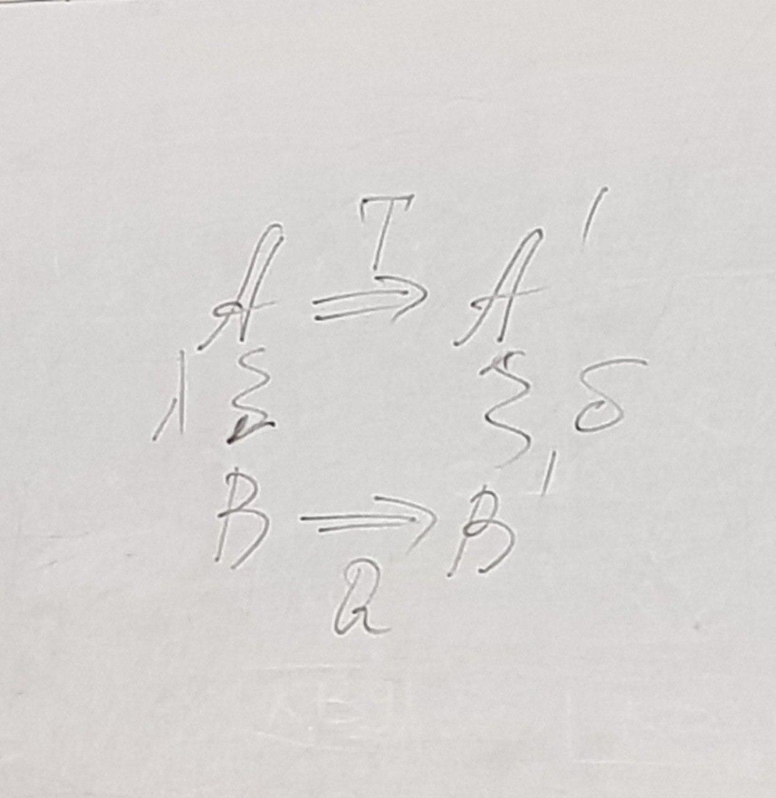

# Лекция 1, 14.09
## Основные части системного анализа
### **Системы**

Если стандартные методы решения проблемы не приводят к желаемому результату, то такое стечение обстоятельств называется **проблемной ситуацией**.

**Цель** - субъективный образ не существующего, но желаемого состояния среды, которое бы решило возникшую проблему.

У системы существует два определения, которые должны выполняться:
- Система есть средство достижения цели;
- Система есть совокупность взаимосвязанных элементов обособленных от среды и взаимодействующей с ней как единое целое.

**Проблемы**:
1. Что включать в систему, что считать ее окружением?
2. В реальной системе должны выполняться оба ее определения. Это получается не всегда.

### Классификация:

#### Открытая/закрытая система
- **Открытая** - все элементы которой взаимодействуют не только внутри, а так же со внешними
- **Закрытая** - все элементы взаимодействуют только внутри системы

Большинство ИТ систем строятся как замкнутые, хотя во многих аспектах являются открытыми

#### Естественные/искусственные системы
- **Искусственные** - систем созданные человеком
- **Естественные** - возникшие в природе без участия человека

Естественные системы являются динамическими (развивающими). Их развитие происходит в результате реализации объективных закономерностей. Будущее реальное состояние системы можно рассматривать как ее возможную цель. Критерий «естественного» структурирования системы: максимизация интенсивности связи внутри объекта и минимизация интенсивности связи между объектами. Этот критерий можно отнести к любой хорошо структурированной системе.

### **По уровню сложности перерабатываемой информации** (Боудинг)
1. Уровень статической структуры - системы, существование которых не подразумевает обработку информации
2. Уровень простой динамической системы с предопределенными движениями. Хотя эти системы являются динамическими, самостоятельно перерабатывать информационные потоки они не могут.
3. Уровень систем с управляемой обратной связью - простейший из всех уровней систем, где информационные потоки и их переработка могут влиять на систему.  

4. Уровень самосохраняющихся структур - уровень зарождения собственного отношения системы к входной информации
5. Уровень растений - имеет место специфическая реакция на возмущающую информацию
6. Уровень животных - наличие подвижности, наличие специализированных приемников информации, что приводит к резкому увеличению перерабатываемого потока, появляется специализированная система управления (нервная система).
7. Уровень отдельного человека, как информационной система - сохраняется все то, что характерно для животных + возникает самосознание, выделение себя из окружающего мира.
8. Уровень социальных институтов помещается выше отдельного человека составляя для последнего законодательную и контролирующую среду (над систему). Он во многом определяет форму организации существования отдельного человека.

Многие современные исследования показывают, что поведение человека в социальные институты по крайне мере отчасти подчиняются коллективным механизмам уровня животных или даже коллективам автомата. Объяснение ситуации: человек сочетает в себе 3 уровня переработки информации:
1. уровень неживой природы (3)
2. уровень живой природы (6)
3. уровень сознания (7)

Какой именно уровень будет доминировать в том или ином поведенческом проявлении зависит от специфики человека и решаемой задачи.

# Лекция 2 (28.09)
## Закономерности системы

### Целостность
- свойство системы как целого, не является суммой свойств элементов или частей
- Свойства системы как целого зависит от свойств элементов или частей.

### Коммуникативность
Любая система представляет собой элемент системы более высокого порядка (надсистема) и является надсистемой для систем низкого порядка.

### Иерархичность
Иерархичность - закономерность целостности проявляется на каждом уровне иерархии. Преимущества:
- с помощью иерархических представлений можно отображать системы с неопределенностью
- построение иерархической структуры зависит от цели моделирования: для многоцелевых ситуаций можно построить несколько иерархических структур для одних и тех же компонентов.
- даже при одной цели в зависимости от опыта и квалификации разработчика получаются разные иерархические структуры, что дает возможность по-разному разрешить качественные изменения на разном уровне иерархии.

### Закон необходимого разнообразия
Чтобы создать систему, способную решить проблему с определенным уровнем разнообразия, нужно, чтобы сама система имела еще больше разнообразия или была способна создать его в себе. Иными словами, множество возможных состояния системы должно сюръективно отображаться на множество средств системы управления.

Следствие: невозможно адекватно описать систему находясь внутри нее.

### Модели систем
Организуя свое поведение на уровне сознания, человек взаимодействует с системой на уровне модельного представления.

Модели (различные определения):
- упрощенное проблемно-ориентированное представление реальности.
- (уровень здравого смысла) объект-заместитель, который в определенных условиях может заменить объект-оригинал, воспроизводя интересующие нас свойства и характеристики оригинала и имея существенные преимущества.
- (уровень теории моделей) результат отображения одной абстрактной математической структура на другую абстрактную.
- (уровень теории систем) средство для отображения одной структуры на другую (стурктуры не обязательно формальной, как в математике); результат такого отображения для конкретного объекта.  
  
$A \to A'$ - преобразование объекта с помощью оператора T  

Чтобы граф можно было считать отношением моделирования:
1. Операторы $T$ и $Q$ должны выполняться согласовано. Согласованность между моделью и оригиналом (то есть между $Q$ и $T$) может задаваться по-разному:
    1. Изоморфизм - полное тождество строения модели и оригинала. Выполнение условий изоморфизма либо затруднительно, либо невозможно.
    2. Гомоморфизм - упрощенный образ моделируемого объекта - сохраняет все определенные на исходной системе свойства и отношения, но некоторые элементы оказываются склеенными.
2. Диаграмма должна быть коммуникативная.

Отношение моделирования является целевым - модель отображает не весь объект-оригинал, а то, что соответствует поставленной цели.
<!-- **Можно ли построить одну модель для всех ситуаций на объекте?**
Модель должна содержать полностью и не противоречивость согласного. Фундаментальным теоремам мета-математики это принципиально невозможно.  
Два пути для ...: 
- создать очень большую и сложную формальную систему, а все проблемы вынести
- создать набор отдельных формальных систем и правильных переходов между ними -->

### Основные классификация моделей

Какие аспекты системы моделируем:
1. Модель черный ящик
2. Модель состава
3. Модель структуры
4. Структурная схема системы

Учитываем ли время:
1. Статические
2. Динамические

Какой аппарат применяем:
- лингвистические модели (модели на естественном языке) 
- теоретико-множественные (система рассматривает как кортеж, т.е. через набор каких-то параметров)
- математические или аналитические модели (функциональные связи внутри системы)
- имитационные модели
- концептуальные модели или модели архитектуры

# Лекция 3 (12.10)
## Основные особенности структурирования систем

1. Объекты-свойства-связи образуют обменное соотношение. С формальной точки зрения сущность и связь как структуры данных не различимы, а вся модель строится на множестве терминальных элементов одного типа (на атрибутах).
2. Свойства можно рассматривать как свернутое отношение. В целом из тройки объекты-свойства-связи один из компонентов можно выбросить.
3. Связи между элементами системы могут иметь различную природу (информационные, энергетические). Хорошо когда в конкретной системе по большинству типов связей структурирование одинаково. В естественных системах это получается засчет фундаментальных постоянных, в искусственных — это проблема разработчика.

Основные особенности модели сущность-связь для БД:
1.	В концептуальной модели объекту предметной области соответствует сущность, а свойство объекта – атрибут. 
2.	С точки зрения математики, сущность – отношение, определенное на декартовом произведении множеств значений атрибутов. 
3.	Связь – отношение, определенное на декартовом произведении сущностей. 
4.	Связь может иметь собственные атрибуты, которые не относятся к исходным сущностям. 

## Иерархия информационных моделей системы

Уровни моделирования:
1. Предметная область - данные из реального мира, данные из которой мы хотим обрабатывать в нашей ИС.
2. Модель предметной области - наши знания о ПО. Могут быть неформальные и формальные (idef, диаграммы потоков данных, UML).
3. Логическая модель (концептуальная, семантическая модель). Средства разработка: er, erp. ЛМ - строится в терминах информационных единиц, но без привязки к конкретной БД. Одну и туже ER-модель можно преобразовать в реляционную модель, пост-реляционную.
4. Физическая модель данных - описывает модель данных средствами конкретной СУБД. Переход от ER к реляционной: отношения в таблицы, атрибуты в столбцы, домены в типы данных.
5. База данных - программно-аппаратная основа.

В домене информационных технологий мы работаем на уровнях 2-3-4. К сожаления, терминология, которой мы пользуемся, разделение на уровни поддерживает плохо.

## Типы связей для реляционных моделей

В реляционной модели по существу предусмотрен один тип связи (а именно её наличие). Факт наличия связи устанавливается содержательно и формализуется при построения модели данных (объекты наделяем аттрибутами) и при написании запросов к базе.

Преимущество такой структуры связи:
1. Строгий алгебраический аппарат (нет проблем организации обхода графа)
2. Нормализация (каждый факт вводится только один раз — растет надежность)

Недостаток:
- такое стурктуры связи — модель не естественна для человека (не обеспечивает достаточных средств для обеспечения смысла данных или семантики предметной обалсти).

## Связи в онтологических моделях
Онтология - формальное явное описание терминов предметной области и отношений меду ними.
Онтология - спецификация концептуализации предметной области.
В онтологии предполагается максимально возможное количество связей. Различные авторы предлагают некоторые ограничения типов связей:
- генеалогия
- таксономия (a kind of)
- структура свойств
- партономия (a part of)
- топологическая связь - любые физические взаимодействия между сущностями (отношения функциональные, причинно-следственные, временные, социальные)

Обычно концептуализация предметной области делается так, чтобы между концептами доминировали иерархические отношения, а все остальные накладывались на них

## Связь управления

Текущее состояние системы зависит от его предыдущего состояния системы и интервала времени.

$S: X \xrightarrow{f} Y \\
\dot{x}=f(x,t) \\
x \in {X,Y}$

В этом уравнении показан характер поведения, но не показано, как можно влиять на это поведение

$u(t) \\
\dot{x} = f(x, u, t)$

В зависимости от того, на что влияем, существуют разные классификации управления
1. Силовое - влияем на выходной параметр системы
2. Параметрическое - внутренние параметры системы
3. Структурное - изменяем структуру

В зависимости от того, какую информацию учитываем при правлении, существуют разные классификации управления:
1. Никакую - программное управление
2. Входную информацию - управление по возмущению
3. Выходную - управление по отклонению
4. Внутреннюю информацию - управление по состоянию (учебное заведение проводится по стандартным правилам)

## Процесс
Процесс - последовательность состояний естественных и искусственных систем, связанность стадий их изменений. Свойства: Направленность и временность существования.

Процесс (в производстве, ГОСТ 3.1109) - часть производственного процесса содержащие целенаправленные действия по изменению или определению состояния предметов труда. Внутри определения есть иерархия: собственного технологический процесс, элементарные технологический процесс (наименьшая часть ТП обладающая всеми его свойствами)

Процесс (в CS) - программа в ходе исполнения и все ее элементы

Процессы (в бизнес-информатике, ISO-9000) - совокупность взаимосвязанных и взаимодействующих видов деятельности 
преобразующие входы в выходы. Делятся на два подпроцесса:
- Производство выхода
- Управление процессом

Бизнес процесс:
- (SAP) завершенное с точки зрения содержания, временной и логической очередности последовательность необходимая для обработки экономически значимого объекта
- (workflow managment) набор из одной или нескольких процедур или действий, которые совместно реализуют цель обычно с помощью организационной структуры определяющую функциональные роли и взаимоотношения. Бизнес процесс может состоять из одной или нескольких. Активность (activity) - описание части работы, который формирует один логический шаг процесса.
- последовательность активностей организованных относительно некоторой цели. Типы целей:
    - по виду или предмету деятельности (БП группируются по сходим функциям)
    - по результату деятельности или продукту
    - по добавленной ценности для клиента
        - первичные процессы - создают ценность для клиента
        - вторичные - обеспечивают инфраструктуру и средства для управления

В обычном бизнесе делается попытка совместить эти подходы. Это называется матричных подход.

## Потоки
Поток:
- () постоянное перемещение чего-либо или кого-либо в определенном направлении.
- (математика) интеграл векторного поля по поверхности.
- (в непрерывном производстве) любая материальная связь между аппаратами объекта.
- (thread) найменьшая единица обработки исполнение которой может быть назначено процессору от операционной системы
- (stream) поток ввода/вывода, абстракция используемая для чтения и записи в единой манере

В аспекте подготовки алгоритма программа расматривается как преобразователь информационного потока, которые состоит из двух потоков (поток данных и поток управления).
Поток управления описывается потоковым графом (вершины - операции, дуги - передача данных)
Командный граф включает в себя узлы реализующих параметрическое управление.
Содержательно, абстракция командного графа эквивалентна абстракции тредов, но адстракция тредов работает в адресном пространстве, а потоки данных - на более высоких уровнях абстракции.
В бизнесс информатике выделяются информационные потоки и потоки работ.
Информационный поток - совокупность информации минимально необходимой для осуществления работы организации
В любом бизнесс процессе, рядом с реальным ..
Для одного бизнес процесса можно моделировать разные информационные потоки в зависимости от цели и моделирования.
Используется несколько трактовок понятия поток.

## Количественное описание моделей системы
Для конкретизации модели используются измерения, которые реализуютсяв процессе эксперемента.
Отношение между эксперементом и моделью как между курицей и яйцом.
Для .. для уточнения модели необходим эксперемент, но это непорочный круг, а постепенное уточнение модели
Эксперементы:
- пассивный - наблюдение, регистрация события на выбранных входах и выходах
- активный - направленное воздействие на неоторые входы и выходы

Измерение - алгоритмическая операция, которая данному наблюдаемому состоянию объекта ставит соответсвие определенное обозначение. Сегодня понятие измерение расширено, а именно включаются не только количественные, но и качественные данные, а также точные нечеткие статистические результаты эксперемента.

## Теоретико-множественное отношение - базис количественного описания модели
Измерение - один из вариантов заданий бинарного отношения между множеством наблюдаемых состояний и множеством его обозначения.
Наиболее важными являются?
- отношения эквивалентности
- порядка
- толлерантности

Все они задаются комбинацией определяющих свойств.:
- рефлексивность
- транзитивность
- симетричность

Эквивалентность - рефликсивность + транзитиность + сим
Отношение порядка - (строгого) транз + анти-сим; (не строгого) транз + анти-сим + рефл
Толерантность - рефлекс + не транз + анти-сим
Толерантность - любые два подмножества имеют какие-то общие признаки.
 
 Класичские измерения прелполагают, что на множестве состояний объекта, а так же на множестве наблюдений может быть построенно уравнение эквивалентности.
 
 @@@

Рассматриваются только такие алгоритмы, котрые разным состояния сопоставляют разные значения, а не разлечимым состояниям - одинаковые объекты
Отношение эквивалентности является ограничительным. В большинстве оно не выполняется и предложен набор подходов к разрешению этого противоречия.

## Шкалирование, как способ описания ситуации
В общем случае, шкалирование применимо для систем в которых возможно описать разбиение. В зависимости от того, как реализуются аксиомы тождества и какие условия к ним добавлются, получаются различные измерительные шкалы:
- номинальная шкала, порядковая шкала
- порядковая шкала
- шкала интервалов
- шкала разницы
- шкала отношений
- абсолютная шкала