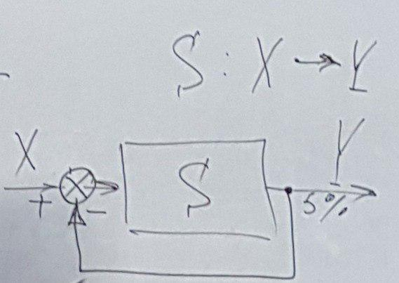

# Лекция 1, 14.09
## Основные части системного анализа
### **Системы**

Если стандартные методы решения проблемы не приводят к желаемому результату, то такое стечение обстоятельств называется **проблемной ситуацией**.

**Цель** - субъективный образ не существующего но желаемого состояния среды, которое бы решило возникшую проблему.

У системы существует два определения, которые должны выполняться:
- Системы есть средство достижения цели;
- Система есть совокупность взаимосвязанных элементов обособленных от среды и взаимодействующей с ней как единое целое.

Проблемы:
1. Что включать в систему, что считать ее окружением?
2. В реальной системе должны выполняться оба ее определения. Это получается не всегда.

Классификация:
### **Открытая/закрытая система**

**Открытая** - все элементы которой взаимодействуют не только внутри, а так же со внешними

**Закрытая** - все элементы взаимодействуют только внутри системы

Большинство ИТ систем строятся как замкнутые, хотя во многих аспектах являются открытыми

### **Естественные/искусственные системы**
**Искусственные** - систем созданные человеком

**Естественные** - возникшие в природе без участия человека

Естественные системы являются динамическими (развивающими). Их развитие происходит в результате реализации объективных закономерностей. Будущее реальное состояние системы можно рассматривать как ее возможную цель

Можно структурировать естественного структурирования: максимизация интенсивности связи внутри объекта и минимизация интенсивности связи между объектами. Этот критерий можно отнести к любой хорошо структурированной системе.

### **По уровню сложности перерабатываемой информации** (Боудинг)
1. Уровень статической структуры - системы, существование которых не подразумевает обработку информации
2. Уровень простой динамической системы с предопределенными движениями. Хотя эти системы являются динамическими, самостоятельно перерабатывать информационные потоки они не могут.
3. Уровень систем с управляемой обратной связью - простейший из всех уровней систем, где информационные потоки и их переработка могут влиять на систему.

В любой системе есть много контуров (параметров) обратной связи.

4. Уровень само сохраняющихся структур - уровень зарождения собственного 
5. Уровень растений - имеет место специфическая реакция на возмущающую информацию
6. Наличие подвижности, наличие специализированных приемников информации, что приводит к резкому увеличению перерабатываемого потока, появляется специализированная система управления (нервная система).
7. Сохраняется все то, что характерно для животных + возникает самосознание, выделение себя из окружающего мира.